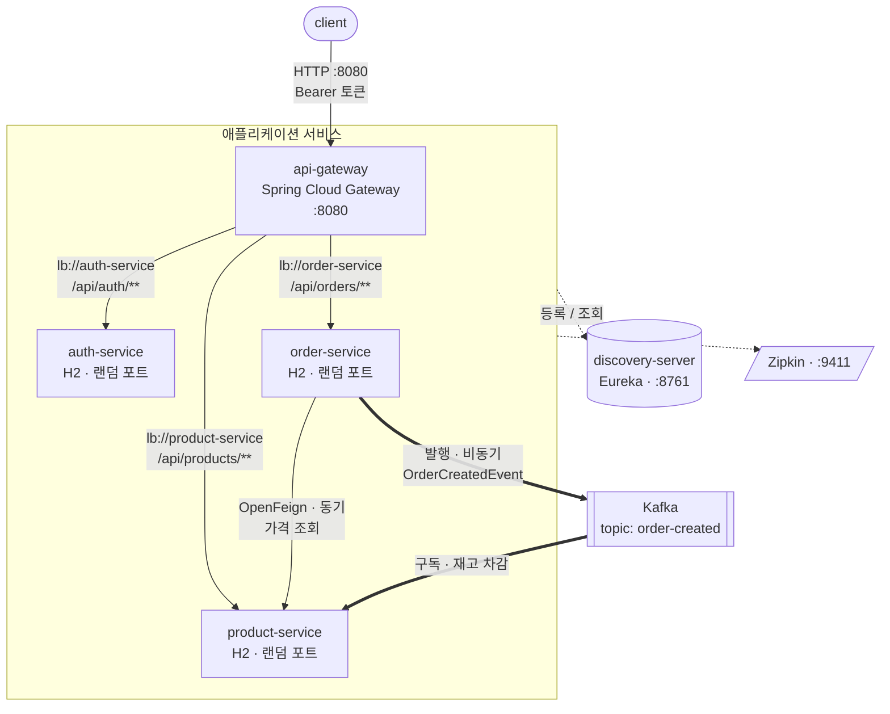
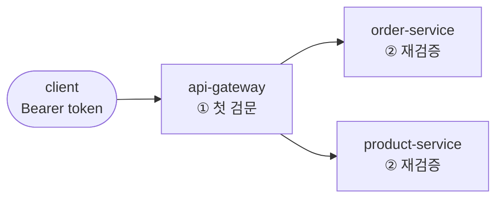
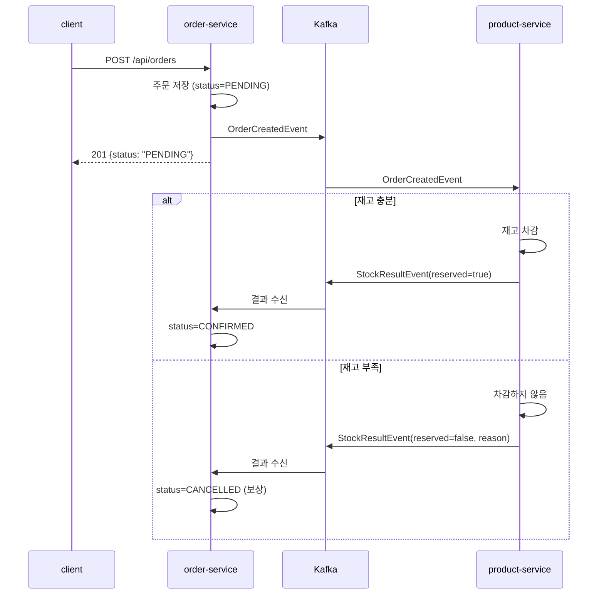

# springboot-simple-msa

Spring Boot 기반 마이크로서비스 아키텍처(MSA)를 **인프라 관점에서 이해하기 위한 학습용 프로젝트**입니다.

> **학습 노트: [docs/msa-learning-note.md](docs/msa-learning-note.md)** — 각 구성 요소가 어떤 문제를 풀기 위해 존재하는지를 코드와 다이어그램으로 정리한 문서입니다. 이 README가 "무엇을 어떻게 실행하는가"를 다룬다면, 학습 노트는 "왜 이 조각이 필요한가"를 다룹니다.

비즈니스 로직은 의도적으로 최소한만 담습니다. 이 저장소의 목적은 "주문을 어떻게 잘 처리할 것인가"가 아니라, **서비스가 여러 개로 쪼개졌을 때 서로를 어떻게 찾고, 어떻게 부르고, 어떻게 한 번에 띄우는가**를 손으로 만들어 보는 것입니다.

---

## 1. 무엇을 배우는가

MSA는 하나의 큰 애플리케이션(모놀리식)을 독립 배포 가능한 여러 서비스로 나눈 구조입니다. 나누는 순간 모놀리식에는 없던 문제가 생깁니다.

| 새로 생기는 문제 | 이 프로젝트에서 다루는 해법 |
|---|---|
| 서비스 A가 서비스 B의 주소를 어떻게 아는가 | 서비스 디스커버리 (Eureka) |
| 클라이언트가 서비스마다 다른 주소로 호출해야 하는가 | API Gateway |
| 서비스 간 HTTP 호출을 매번 손으로 짜야 하는가 | OpenFeign |
| 서비스가 여러 개인데 어떻게 한 번에 띄우는가 | Docker Compose |
| 같은 서비스를 여러 개 띄우면 요청은 누가 나누는가 | 클라이언트 사이드 로드밸런싱 |
| 상대가 죽어 있어도 진행되어야 하는 일은 어떻게 하는가 | 비동기 이벤트 (Kafka) |
| 여러 서비스를 거친 요청 하나를 어떻게 추적하는가 | 분산 추적 (Micrometer + Zipkin) |
| 죽은 상대를 계속 두드려 나까지 느려지는 것을 어떻게 막는가 | 서킷 브레이커 (Resilience4j) |
| 세션을 공유하지 않는 서비스들이 로그인 상태를 어떻게 아는가 | JWT 기반 인증·인가 (Spring Security) |
| 한 트랜잭션으로 묶을 수 없는 일을 어떻게 되돌리는가 | Saga 보상 트랜잭션 |

---

## 2. 아키텍처



- 얇은 실선: 응답을 기다리는 **동기** 호출
- 굵은 실선: 응답을 기다리지 않는 **비동기** 이벤트 (Phase 4)
- 점선: 네 서비스가 공통으로 주고받는 인프라 트래픽 — Eureka 등록·조회와 Zipkin span 전송 (Phase 5)

**외부에 열린 포트는 셋뿐입니다.** 8080(게이트웨이), 8761(Eureka 대시보드), 9411(Zipkin UI). auth·order·product는 호스트 포트를 갖지 않으므로 게이트웨이를 우회할 방법이 없습니다.

### 설계 원칙: 주소를 하드코딩하지 않는다

이 구조의 핵심은 **어떤 서비스도 다른 서비스의 IP나 포트를 알지 못한다**는 점입니다.

- 게이트웨이는 `http://localhost:8081`이 아니라 `lb://order-service`로 라우팅합니다.
- order-service는 Feign 인터페이스에 `product-service`라는 **이름만** 적습니다.
- 실제 IP와 포트는 Eureka가 런타임에 채워 넣습니다.

이를 강제하기 위해 **게이트웨이를 제외한 세 서비스(auth·product·order)의 포트를 `0`(랜덤 할당)으로 둡니다.** 포트를 미리 알 수 없으므로 하드코딩 자체가 불가능해지고, 디스커버리가 실제로 동작하는지 확인할 수밖에 없게 됩니다.

### 모듈 구성

| 모듈 | 포트 | 역할 |
|---|---|---|
| `discovery-server` | 8761 | Eureka 서버. 서비스들이 자신의 주소를 등록하고 서로를 조회하는 전화번호부 |
| `api-gateway` | 8080 | 외부로 열리는 유일한 진입점. 라우팅 + 첫 번째 토큰 검문 |
| `auth-service` | 0 (랜덤) | 로그인과 JWT 발급 (Phase 6) |
| `product-service` | 0 (랜덤) | 상품 조회·등록, 주문 이벤트를 받아 재고 차감 |
| `order-service` | 0 (랜덤) | 주문 생성. product-service를 호출해 가격을 조회하고 이벤트를 발행 |

**공통(common) 모듈은 만들지 않습니다.** DTO를 공유하면 편하지만, 그 순간 두 서비스는 함께 배포해야 하는 하나의 덩어리가 됩니다. DTO 중복은 MSA에서 독립 배포를 얻기 위해 지불하는 의도된 비용입니다.

### 데이터베이스는 서비스마다 따로

각 서비스가 자신의 H2 인메모리 DB를 내장합니다. 서비스 간에 DB를 공유하지 않는 것이 원칙(Database per Service)입니다. DB를 공유하면 한쪽의 스키마 변경이 다른 쪽을 깨뜨려서, 서비스를 나눈 의미가 사라집니다.

인메모리이므로 재시작하면 데이터는 사라집니다. 학습 목적상 기동 속도를 택한 선택입니다.

---

## 3. 도메인 (의도적으로 최소)

```
AppUser { id, username, password(BCrypt), role }
Product { id, name, price, stock }
Order   { id, userId, productId, quantity, totalPrice, status, cancelReason }
```

| 엔드포인트 | 권한 |
|---|---|
| `POST /api/auth/login` | 공개 |
| `GET  /api/products`, `GET /api/products/{id}` | 공개 |
| `POST /api/products` | ADMIN |
| `POST /api/orders` | 인증 필요 |
| `GET  /api/orders`, `GET /api/orders/{id}` | 인증 필요 + 본인 것만 |

주문 생성 흐름은 다음과 같습니다.

1. 클라이언트가 `POST /api/auth/login`으로 토큰을 받습니다.
2. 토큰을 실어 게이트웨이로 `POST /api/orders`를 보냅니다.
3. 게이트웨이가 토큰 서명을 검증하고, Eureka에서 order-service 주소를 찾아 넘깁니다.
4. order-service가 토큰을 **다시** 검증하고 `uid` 클레임에서 사용자를 확인합니다.
5. Feign으로 product-service를 호출해 가격을 조회합니다(동기).
6. `price × quantity`를 계산해 주문을 저장하고 **응답합니다**.
7. 주문 생성 이벤트를 Kafka에 발행합니다. 이 시점의 주문 상태는 **PENDING**입니다.
8. product-service가 재고 차감을 시도하고 **결과를 다시 이벤트로 알립니다**.
9. order-service가 그 결과를 듣고 주문을 **CONFIRMED** 또는 **CANCELLED**로 마무리합니다.

비즈니스 로직은 6번의 곱셈 하나가 전부입니다. 그 곱셈 한 번이 서비스 경계를 몇 번 건너가고, 무엇을 검증해야 하며, 실패하면 어떻게 되돌려야 하는지가 학습 대상입니다.

---

## 4. 단계별 로드맵

한 번에 전부 만들지 않고, 단계마다 **"이게 왜 필요한가"를 체감한 뒤 다음을 얹습니다.** 각 단계는 커밋 하나에 대응하며, 검증 기준을 통과해야 다음으로 넘어갑니다.

| Phase | 추가하는 것 | 검증 기준 | 상태 |
|---|---|---|---|
| **1** | 멀티모듈 골격, Eureka, 서비스 2개, Gateway, Feign | Eureka 대시보드에 3개 등록 확인 + `POST /api/orders` 성공 | **완료** |
| **2** | Dockerfile, Docker Compose | `docker compose up` 한 번으로 Phase 1과 동일한 결과 | **완료** |
| **3** | product-service 인스턴스 2개로 스케일 아웃 | 두 인스턴스 로그에 요청이 번갈아 들어오는지 확인 | **완료** |
| **4** | Kafka 기반 비동기 이벤트 (주문 생성 → 재고 차감) | 주문 응답 이후에 재고가 차감됨 + product-service가 죽어 있는 동안 발행된 이벤트가 복구 후 처리됨 | **완료** |
| **5** | Zipkin 분산 추적, Resilience4j 서킷 브레이커 | Zipkin에서 gateway→order→product가 한 줄로 보임 + 장애 시 즉시 실패 | **완료** |
| **6** | JWT 인증·인가 (auth-service 추가, RBAC) | 토큰 없이 401, 권한 부족 시 403, 남의 주문은 조회 불가 | **완료** |
| **7** | Saga 보상 트랜잭션 (주문 상태 + 재고 결과 이벤트) | 재고 부족 주문이 CANCELLED 로 되돌려지고 재고는 그대로 | **완료** |

Phase 1~2가 "MSA 인프라 이해"의 대부분을 차지합니다. Phase 3 이후는 필요할 때 이어서 진행합니다.

---

## 5. 실행 방법

### 사전 요구사항

- JDK 21 (Gradle toolchain으로 고정)
- Docker / Docker Compose (Phase 2부터)

### Phase 1 — 로컬에서 개별 실행

기동 순서가 중요합니다. Eureka가 먼저 떠 있어야 나머지가 자신을 등록할 수 있습니다.

```bash
./gradlew :discovery-server:bootRun    # 1. 가장 먼저
./gradlew :auth-service:bootRun        # 2.
./gradlew :product-service:bootRun     # 3.
./gradlew :order-service:bootRun       # 4.
./gradlew :api-gateway:bootRun         # 5.
```

Kafka와 Zipkin은 로컬 개별 실행에서는 띄우지 않아도 됩니다. 없으면 이벤트 발행과 span 전송이 실패 로그를 남길 뿐, 주문 생성 자체는 동작합니다. 전부 갖춘 상태로 보려면 Docker Compose 쪽을 쓰는 편이 낫습니다.

등록 확인은 브라우저에서 http://localhost:8761 을 열어 인스턴스 4개(`API-GATEWAY`, `AUTH-SERVICE`, `ORDER-SERVICE`, `PRODUCT-SERVICE`)가 보이는지로 합니다.

> **기동 직후 첫 요청은 실패할 수 있습니다.** Eureka 클라이언트는 기본적으로 30초 주기로 레지스트리를 갱신하므로, 서비스가 떠 있어도 호출하는 쪽이 그 사실을 알기까지 시간이 걸립니다. 1분 정도 기다린 뒤 다시 시도하면 됩니다.
>
> 이때 order-service 로그에 다음이 찍힙니다.
>
> ```
> No servers available for service: product-service
> RetryableFeignBlockingLoadBalancerClient : Service instance was not resolved, executing the original request
> ```
>
> 인스턴스를 못 찾았을 때 Feign은 깔끔하게 실패하지 않고 **서비스 이름을 그대로 호스트명으로 삼아**(`http://product-service/`, 즉 80번 포트) 요청을 보냅니다. 그래서 최종 에러가 `Connection refused`로 나타나 원인을 오해하기 쉽습니다. 앞의 두 줄까지 함께 봐야 진짜 원인이 보입니다.

동작 확인:

```bash
# 상품 조회는 공개 경로라 토큰이 필요 없다
curl http://localhost:8080/api/products/1
# {"id":1,"name":"키보드","price":89000.00,"stock":30}

# 주문은 인증이 필요하다 (Phase 6 이후)
TOKEN=$(curl -s -X POST http://localhost:8080/api/auth/login \
  -H 'Content-Type: application/json' \
  -d '{"username":"user","password":"user123"}' | jq -r .accessToken)

curl -X POST http://localhost:8080/api/orders \
  -H "Authorization: Bearer $TOKEN" \
  -H 'Content-Type: application/json' \
  -d '{"productId": 1, "quantity": 3}'
# {"id":1,"userId":1,"productId":1,"quantity":3,"totalPrice":267000.00}
```

### Phase 2 — Docker Compose로 한 번에

```bash
./gradlew clean build      # 실행 가능한 jar 를 먼저 만든다
docker compose up --build
```

동작 확인은 Phase 1과 동일한 `curl`을 씁니다(토큰 발급 포함). 종료는 `docker compose down`입니다.

컨테이너로 옮기면서 새로 부딪히는 문제가 셋 있고, 각각을 이렇게 해결했습니다.

**1. `localhost:8761`이 통하지 않는다**

컨테이너 안에서 `localhost`는 호스트가 아니라 자기 자신입니다. 그래서 Eureka 주소를 환경변수로 주입 가능하게 바꿨습니다.

```yaml
defaultZone: ${EUREKA_SERVER_URL:http://localhost:8761/eureka}
```

`${변수:기본값}` 형태이므로 로컬 실행(Phase 1)은 그대로 동작하고, Compose에서는 `EUREKA_SERVER_URL=http://discovery-server:8761/eureka`로 덮어씁니다. 여기서 `discovery-server`는 Compose가 서비스 이름을 DNS 이름으로 등록해 준 것입니다.

**2. `depends_on`은 "준비 완료"를 기다리지 않는다**

`depends_on`만 쓰면 Compose는 컨테이너가 **시작**된 것까지만 보장합니다. Eureka가 아직 포트를 열기 전에 나머지가 등록을 시도하면 실패 스택트레이스가 쌓입니다(재시도로 결국 복구되지만 약 30초가 걸립니다). 그래서 헬스체크를 붙이고 `condition: service_healthy`로 실제 준비 완료를 기다립니다.

```yaml
healthcheck:
  test: ["CMD", "bash", "-c", "exec 3<>/dev/tcp/localhost/8761"]
```

`curl`을 설치하는 대신 bash의 `/dev/tcp` 기능으로 포트만 확인합니다. 이미지에 추가로 설치할 것이 없습니다.

**3. `-plain.jar`이 같이 만들어진다**

Gradle의 `java` 플러그인은 라이브러리용 `*-plain.jar`를, Spring Boot 플러그인은 실행 가능한 `*.jar`를 각각 만듭니다. Dockerfile이 `*.jar`로 복사하면 두 개가 잡혀 빌드가 실패하므로, 루트 `build.gradle`에서 `jar` 태스크를 꺼 뒀습니다.

**Dockerfile은 하나만 둡니다.** Spring Boot 실행 가능 jar는 어느 서비스든 실행 방법이 같기 때문입니다. 어떤 모듈을 담을지는 Compose가 `SERVICE` 빌드 인자로 전달합니다.

**포트는 게이트웨이(8080)와 Eureka(8761)만 엽니다.** product-service와 order-service는 호스트 포트를 열지 않으므로 외부에서 직접 접근할 방법이 없고, 반드시 게이트웨이를 거쳐야 합니다.

### Phase 3 — 인스턴스를 늘려 부하 분산 확인하기

```bash
docker compose up -d --build --scale product-service=2
```

**코드 변경은 로그 한 줄뿐입니다.** 부하 분산은 이미 Phase 1에서 완성되어 있었습니다. `lb://product-service`와 `@FeignClient(name = "product-service")`는 처음부터 "이 이름으로 등록된 인스턴스들 중 하나를 골라라"라는 뜻이었고, 그동안 후보가 하나뿐이었을 뿐입니다.

이 옵션이 그냥 통하는 이유는 **product-service에 호스트 포트를 매핑하지 않았기 때문**입니다. 호스트 포트를 고정해 두면 두 번째 컨테이너가 같은 포트를 잡지 못해 스케일이 실패합니다. 서비스 포트를 `0`으로 둔 선택이 여기서 값을 합니다.

확인:

```bash
# Eureka 에 인스턴스가 2개 등록됐는지
curl -s -H 'Accept: application/json' \
  http://localhost:8761/eureka/apps/PRODUCT-SERVICE | grep -o '"instanceId":"[^"]*"'

# 여러 번 호출한 뒤 인스턴스별 처리 건수 세기
for i in $(seq 1 10); do curl -s -o /dev/null http://localhost:8080/api/products/1; done
docker compose logs product-service | grep "상품 조회 요청" | sed 's/ *|.*//' | sort | uniq -c
```

실제 측정 결과는 다음과 같았습니다(총 17회 = 게이트웨이 직접 호출 10 + order-service의 Feign 호출 6 + 최초 확인 1).

```
   8 product-service-1
   9 product-service-2
```

게이트웨이 경로와 Feign 경로가 **각각 따로** 부하를 나눕니다. 중앙에 로드밸런서 장비가 있는 것이 아니라, 호출하는 쪽이 인스턴스 목록을 받아 스스로 고르기 때문입니다. 이를 클라이언트 사이드 로드밸런싱이라고 합니다.

> 인스턴스를 늘린 직후 몇십 초 동안은 새 인스턴스로 요청이 가지 않을 수 있습니다. Eureka 클라이언트가 레지스트리를 주기적으로만 갱신하고(Compose에서 5초로 설정), Spring Cloud LoadBalancer도 인스턴스 목록을 자체 캐시(기본 35초)에 두기 때문입니다. 스케일 아웃이 즉시 반영되지 않는다는 점 자체가 이 구조의 특성입니다.

### Phase 4 — Kafka로 재고 차감을 비동기화

Kafka는 `docker compose up`에 이미 포함되어 있으므로 실행 방법은 Phase 2와 같습니다.

**한 번의 주문 생성 안에 성격이 다른 두 통신이 공존합니다.**

| | 가격 조회 | 재고 차감 |
|---|---|---|
| 방식 | 동기 (OpenFeign) | 비동기 (Kafka) |
| 이유 | 총액을 응답에 담아야 하므로 답을 기다려야 함 | 응답에 재고를 담을 필요가 없음 |
| 대가 | product-service가 죽으면 주문도 실패 | 재고가 즉시 반영되지 않음 |

같은 요청 안에서 둘을 나란히 놓고 비교하는 것이 이 단계의 목적입니다. 어느 한쪽이 우월한 것이 아니라, **응답에 그 답이 필요한가**로 갈립니다.

**이벤트 이름이 `DecreaseStockCommand`가 아니라 `OrderCreatedEvent`인 이유**

order-service는 "재고를 깎아라"라고 지시하지 않고 "주문이 생겼다"는 사실만 알립니다. 그 사실을 듣고 무엇을 할지는 듣는 쪽이 정합니다. 덕분에 나중에 알림 서비스나 통계 서비스가 같은 이벤트를 구독해도 order-service는 손댈 필요가 없습니다. 지시(command)로 이름 짓는 순간 보내는 쪽이 받는 쪽의 일을 알게 되어 결합이 생깁니다.

**두 서비스가 합의한 것은 자바 클래스가 아니라 JSON 필드 이름입니다.** `OrderCreatedEvent` record가 order-service와 product-service에 각각 따로 선언되어 있습니다. 발행할 때 메시지 헤더에 자바 클래스 이름을 넣지 않도록(`spring.json.add.type.headers: false`) 설정했기 때문에, 수신측은 자기 패키지의 자기 클래스로 읽습니다. 서로 다른 언어로 짜여 있어도 통하는 구조입니다.

#### 확인 절차

**1) 결과적 일관성 — 주문 응답 직후에는 재고가 아직 그대로입니다**

```bash
curl -s http://localhost:8080/api/products/1
# {"id":1,"name":"키보드","price":89000.00,"stock":30}

curl -s -X POST http://localhost:8080/api/orders \
  -H 'Content-Type: application/json' -d '{"productId": 1, "quantity": 4}'
# {"id":1,"productId":1,"quantity":4,"totalPrice":356000.00}

curl -s http://localhost:8080/api/products/1   # 바로 조회하면
# {"id":1,"name":"키보드","price":89000.00,"stock":30}   ← 아직 30

curl -s http://localhost:8080/api/products/1   # 잠시 뒤 다시 조회하면
# {"id":1,"name":"키보드","price":89000.00,"stock":26}   ← 26으로 반영
```

이 지연은 버그가 아니라 비동기를 선택한 대가입니다. "주문은 이미 성공했지만 재고는 아직"인 구간이 존재한다는 것을 받아들여야 합니다.

**2) product-service가 죽어 있는 동안 발행된 이벤트는 유실되지 않습니다**

```bash
docker compose stop product-service

# 동기 호출은 함께 죽는다
curl -s -o /dev/null -w "%{http_code}\n" -X POST http://localhost:8080/api/orders \
  -H 'Content-Type: application/json' -d '{"productId": 1, "quantity": 5}'
# 500

# 구독자가 없어도 브로커에는 쌓인다 (콘솔 프로듀서로 직접 발행)
echo '{"orderId":999,"productId":1,"quantity":5}' | \
  docker compose exec -T kafka /opt/kafka/bin/kafka-console-producer.sh \
  --bootstrap-server localhost:9092 --topic order-created

docker compose start product-service
docker compose logs product-service | grep "재고 차감"
```

실제 결과는 다음과 같았습니다.

```
재고 차감: productId=1, 주문수량=4, 남은재고=26 (orderId=1)     ← 중지 전에 처리됨
재고 차감: productId=1, 주문수량=5, 남은재고=25 (orderId=999)   ← 재기동 후 처리됨
```

여기서 두 가지를 더 읽을 수 있습니다.

- **이미 처리한 `orderId=1` 이벤트는 재처리되지 않았습니다.** 컨슈머 그룹의 오프셋(어디까지 읽었는지)이 브로커에 커밋되어 있어, 재기동 시 그 다음부터 이어서 읽기 때문입니다. `auto-offset-reset: earliest`는 그룹이 **처음 만들어질 때**만 적용됩니다.
- **남은 재고가 21이 아니라 25입니다.** product-service의 H2가 인메모리이므로 컨테이너를 재시작하면 초기 데이터(재고 30)로 돌아갔고, 거기서 5를 뺀 값이기 때문입니다. 이벤트는 브로커에 안전하게 남아 있었지만 **서비스가 들고 있던 상태는 사라졌다**는 뜻입니다. 메시지의 내구성과 서비스 상태의 내구성은 별개의 문제이며, 후자는 영속 DB(Phase 1에서 학습 속도를 위해 인메모리를 선택)의 몫입니다.

**재고 부족 이벤트는 로그만 남기고 버립니다.** 예외를 던지면 Kafka가 같은 메시지를 무한 재시도하면서 뒤의 정상 이벤트까지 막습니다(poison message). 실제로 다루려면 DLQ(Dead Letter Queue)와 보상 트랜잭션이 필요한데, 이는 이 프로젝트의 범위를 넘어섭니다.

### Phase 5-1 — Zipkin으로 요청 흐름 추적하기

Zipkin도 `docker compose up`에 포함되어 있습니다. 브라우저에서 http://localhost:9411 을 엽니다.

**서비스를 나누면 요청 하나가 어디서 느려졌는지 알 수 없게 됩니다.** 모놀리식에서는 스택 트레이스 하나로 끝나던 것이, 이제는 게이트웨이 로그와 order 로그와 product 로그를 각각 열어 시각을 대조해야 합니다. 분산 추적은 요청 하나에 **trace id**를 붙이고 그것을 서비스 경계 너머로 전파해, 흩어진 기록을 하나로 다시 꿰맵니다.

추가한 것은 라이브러리 셋과 설정 한 덩어리입니다.

| 추가 | 역할 |
|---|---|
| `spring-boot-starter-actuator` | 관측(Observation) 기반 설정을 켠다 |
| `micrometer-tracing-bridge-brave` | trace id를 만들고 전파한다 |
| `zipkin-reporter-brave` | 만들어진 span을 Zipkin으로 보낸다 |
| `feign-micrometer` (order만) | **Feign 호출에 추적 헤더를 싣는다** |
| `spring.kafka.*.observation-enabled` | **Kafka 메시지 헤더에 추적 정보를 싣는다** |

굵게 표시한 둘이 핵심입니다. 이것이 없으면 각 서비스가 자기 몫의 span은 남기지만 **서로 연결되지 않아** 별개의 요청으로 보입니다. 추적은 "기록을 남기는 일"이 아니라 "경계 너머로 id를 전달하는 일"입니다.

실제로 수집된 trace는 다음과 같습니다.

```
[api-gateway]        SERVER    http post                      41.9ms
  [api-gateway]      CLIENT    http post                      34.8ms
    [order-service]  SERVER    http post /orders              31.0ms
      [order-service]          circuit-breaker                15.4ms
        [order-service] CLIENT http get                       13.4ms
          [product-service] SERVER http get /products/{id}     5.7ms
      [order-service] PRODUCER order-created send             13.4ms
        [product-service] CONSUMER order-created receive       4.5ms
```

**Kafka를 건너간 구간까지 같은 trace에 들어옵니다.** 비동기 이벤트는 응답을 기다리지 않으므로 호출 스택으로는 절대 이어지지 않는데, 메시지 헤더에 실린 trace id 덕분에 인과 관계가 보존됩니다.

로그에도 trace id가 함께 찍히므로, Zipkin에서 느린 요청을 찾은 뒤 그 id로 각 서비스 로그를 검색하는 흐름이 가능해집니다.

```
2026-08-05T07:23:01.581Z WARN [order-service] [o-auto-1-exec-1] [6a72e4d5...-8c77ff1a...] ...
                                                                 └ trace id ─┘ └ span id ┘
```

> 샘플링 비율을 `1.0`(100%)으로 두었습니다. 학습용이라 모든 요청을 남기지만, 운영에서는 부하와 저장 비용 때문에 보통 0.1 이하로 낮춥니다.

### Phase 5-2 — 서킷 브레이커로 빠르게 실패하기

Phase 4에서 확인했듯, product-service가 죽으면 주문도 500으로 함께 실패했습니다. 문제는 실패한다는 사실이 아니라 **느리게 실패한다**는 점입니다. 타임아웃이 날 때까지 order-service의 스레드가 묶여 있고, 그 사이 들어온 다른 요청까지 밀립니다. 상대 하나가 죽었을 뿐인데 우리까지 같이 죽는 구조입니다.

서킷 브레이커는 두꺼비집과 같습니다. 실패가 일정 비율을 넘으면 회로를 열어(OPEN) **호출을 시도조차 하지 않고** 즉시 실패시킵니다.

```java
.slidingWindowSize(5)              // 최근 5건으로 실패율 계산
.minimumNumberOfCalls(3)           // 최소 3건은 모여야 판단
.failureRateThreshold(50.0f)       // 실패율 50% 초과 시 OPEN
.waitDurationInOpenState(10초)      // 10초 뒤 HALF_OPEN 으로 전환해 재시도
```

#### 측정 결과

```bash
docker compose stop product-service
# 주문을 연달아 시도하며 소요 시간 측정
```

| 시점 | 응답 | 소요 시간 | fallback이 받은 실패 원인 |
|---|---|---|---|
| 정상 | 201 | 0.53s | — |
| 중지 직후 (회로 CLOSED) | 503 | **2.03s** | `TimeoutException` — 실제로 시도했다가 타임아웃 |
| 회로 OPEN 이후 | 503 | **0.015s** | `CallNotPermittedException` — 시도조차 하지 않음 |

**약 135배 빨라졌습니다.** 응답 코드는 똑같이 실패지만, 스레드를 2초씩 붙잡아 두지 않는다는 것이 차이입니다.

fallback이 받은 실패 원인이 바뀌는 지점을 로그에서 그대로 볼 수 있습니다.

```
주문 거절. 원인: java.util.concurrent.TimeoutException: TimeLimiter ... recorded a timeout exception.
주문 거절. 원인: io.github.resilience4j.circuitbreaker.CallNotPermittedException: CircuitBreaker ... is OPEN and does not permit further calls
```

product-service를 다시 띄우면 10초 뒤 HALF_OPEN으로 전환해 시험 호출을 보내고, 성공하면 회로가 닫혀 정상으로 돌아옵니다.

#### fallback이 가짜 가격을 만들지 않는 이유

**모든 호출에 의미 있는 대체값이 있는 것은 아닙니다.** "추천 상품 목록"이라면 빈 목록을 돌려주고 화면을 그리는 편이 낫습니다. 하지만 여기서 필요한 것은 **가격**이고, 가격은 지어낼 수 없습니다. 0원으로 주문을 받으면 잘못된 데이터가 DB에 영구히 남습니다.

그래서 이 프로젝트의 fallback은 대체값을 만들지 않고 503으로 명확히 거절합니다. **서킷 브레이커의 가치는 "그럴듯한 가짜 응답"이 아니라 "빠르고 정직한 실패"에 있습니다.**

#### 함정: 타임아웃이 두 겹입니다

Feign 자체의 `connectTimeout`/`readTimeout`과 별개로, Spring Cloud CircuitBreaker가 `TimeLimiter`를 한 겹 더 씌웁니다. **그 기본값이 1초**여서, 명시하지 않으면 Feign에 설정한 2초가 아무 의미 없이 무시됩니다. 처음 측정했을 때 알 수 없는 1.03초가 나온 원인이 이것이었습니다. 이 프로젝트에서는 두 값을 2초로 맞춰 두었습니다.

### Phase 6 — JWT 인증·인가

다섯 번째 서비스 `auth-service`가 로그인과 토큰 발급을 담당합니다.

```bash
TOKEN=$(curl -s -X POST http://localhost:8080/api/auth/login \
  -H 'Content-Type: application/json' \
  -d '{"username":"user","password":"user123"}' | jq -r .accessToken)

curl -X POST http://localhost:8080/api/orders \
  -H "Authorization: Bearer $TOKEN" \
  -H 'Content-Type: application/json' -d '{"productId":1,"quantity":1}'
```

초기 계정은 `user`/`user123` (ROLE_USER), `admin`/`admin123` (ROLE_ADMIN) 둘입니다.

**세션 대신 JWT를 쓰는 이유**는 서비스가 여러 개이기 때문입니다. 세션 방식은 로그인 상태를 서버가 들고 있어야 하고, 서비스와 인스턴스가 늘어날수록 그 저장소를 공유해야 합니다. JWT는 상태를 토큰 안에 담고 서명으로 위조를 막으므로, 각 서비스가 **서명만 검증하면** 됩니다. 공유할 것은 세션 저장소가 아니라 열쇠 하나입니다.

#### 접근 제어 (실측 결과)

```
GET  /api/products/1   토큰없음  → 200   공개 카탈로그
POST /api/orders       토큰없음  → 401   누구인지 모름
POST /api/orders       USER     → 201
POST /api/products     토큰없음  → 401
POST /api/products     USER     → 403   누구인지는 알지만 권한 부족
POST /api/products     ADMIN    → 201
```

**401과 403은 다릅니다.** 401(Unauthorized)은 "누구인지 모르겠다", 403(Forbidden)은 "누구인지는 알지만 그 일은 안 된다"입니다.

#### 검증은 게이트웨이와 각 서비스 양쪽에서



게이트웨이에서 이미 막았는데 내부 서비스가 또 검증하는 것은 중복처럼 보입니다. 그러나 **검증은 데이터를 실제로 가지고 있는 쪽에서 해야 합니다.** 게이트웨이만 믿는 구조에서는 내부 네트워크에 접근하게 된 공격자나 잘못 열린 경로 하나가 곧바로 전체 데이터 접근으로 이어집니다.

#### 역할(RBAC)만으로는 부족합니다

Phase 6 이전의 `GET /orders`는 **모든 사람의 주문을 반환**했습니다. 실제 취약점입니다.

역할 검사는 **무엇을 할 수 있는가**만 봅니다. **누구의 데이터인가**는 보지 않습니다. 그래서 `Order`에 `userId`를 추가하고 토큰의 `uid` 클레임으로 걸러 냅니다.

```
user  의 목록 → [id 1,2,3,4]  (userId=1)
admin 의 목록 → [id 5]         (userId=2)  ← ADMIN 이어도 남의 주문은 안 보인다
admin 이 /api/orders/1 조회 → 404
```

두 가지가 의도된 설계입니다.

- **ADMIN이라도 남의 주문은 보이지 않습니다.** 관리자 권한은 "상품을 등록할 수 있다"이지 "모든 주문을 볼 수 있다"가 아닙니다. 필요하다면 별도의 관리자 전용 엔드포인트를 만들어야 합니다.
- **남의 주문 조회는 403이 아니라 404입니다.** 403은 "그 주문은 존재하지만 네 것이 아니다"라는 정보를 흘립니다.

**사용자 id를 요청 파라미터로 받지 않는 것**도 핵심입니다. `?userId=2`처럼 클라이언트가 보낸 값을 믿으면 그 값을 바꿔 남의 데이터를 볼 수 있습니다. 반드시 서명이 검증된 토큰에서 꺼내야 합니다.

#### JWT는 서명될 뿐 암호화되지 않습니다

토큰의 페이로드는 누구나 열어볼 수 있습니다.

```json
{"iss":"auth-service","sub":"user","uid":1,"exp":1785919786,"roles":["ROLE_USER"]}
```

변조는 막지만 열람은 막지 못하므로, **비밀번호나 개인정보를 클레임에 담아서는 안 됩니다.** 변조 시도는 다음과 같이 거부됩니다.

```
페이로드를 ROLE_ADMIN 으로 위조 (서명은 원본)  → 401
서명부를 다른 값으로 교체                      → 401
```

#### 보안 한계 (의도적으로 남긴 것)

| 항목 | 현재 | 실무에서는 |
|---|---|---|
| 열쇠 관리 | `JWT_SECRET` 기본값이 저장소에 있음 | Secrets Manager / Vault에서 주입. **저장소에 올라간 열쇠는 이미 유출된 열쇠** |
| 서명 알고리즘 | HS256 (대칭키) — 열쇠를 아는 모든 서비스가 **토큰을 발급할 수도** 있음 | RS256 (비대칭키). auth-service만 개인키로 서명, 나머지는 공개키로 검증만 |
| 토큰 만료 | 1시간, 갱신 수단 없음 | 짧은 액세스 토큰 + 리프레시 토큰 |
| 로그아웃 | 없음 (발급된 토큰은 만료까지 유효) | 블랙리스트 또는 짧은 만료 |
| Kafka 이벤트 | 인증 정보 없음 | 이벤트에도 발행 주체를 남기고 컨슈머가 검증 |

### Phase 7 — Saga 보상 트랜잭션

Phase 4의 재고 차감에는 결함이 있었습니다. **재고가 부족하면 로그만 남기고 이벤트를 버려서, 주문은 "성공"으로 남고 재고는 그대로인 어긋난 상태**가 되었습니다.

모놀리식이라면 하나의 트랜잭션으로 묶어 함께 롤백하면 됩니다. 그러나 서비스마다 DB가 분리되어 있으므로 그럴 수 없습니다. 대신 **결과를 알리고, 듣는 쪽이 스스로 되돌립니다.** 이것이 Saga입니다.



**PENDING이라는 중간 상태가 생기는 것이 핵심입니다.** 나누기 전에는 주문이 성공 아니면 실패 둘 중 하나였지만, 이제 "주문은 받았지만 아직 확정되지 않은" 구간이 반드시 존재합니다. `201 Created`의 의미도 "확정됐다"가 아니라 **"접수했다"**로 바뀝니다.

#### 실측 결과

```bash
# 상품 2번 재고: 12
curl ... -d '{"productId":2,"quantity":5}'    # 재고 안
curl ... -d '{"productId":2,"quantity":100}'  # 재고 초과
```

응답 직후에는 둘 다 PENDING입니다.

```json
{"id":2,"quantity":5,"status":"PENDING"}
{"id":3,"quantity":100,"status":"PENDING"}
```

잠시 뒤 Saga가 끝나면 갈립니다.

```json
{"id":2,"quantity":5,  "status":"CONFIRMED","cancelReason":null}
{"id":3,"quantity":100,"status":"CANCELLED","cancelReason":"재고 부족 (요청 100, 남은 재고 7)"}
```

재고는 `12 - 5 = 7`로, **취소된 주문의 100은 차감되지 않았습니다.**

#### 보상은 "롤백"이 아닙니다

이미 커밋된 트랜잭션은 되돌릴 수 없습니다. 보상은 **되돌리는 효과를 내는 새로운 작업**입니다.

여기서는 주문 상태를 CANCELLED로 바꾸는 것으로 끝나지만, 결제가 있었다면 환불을, 쿠폰을 썼다면 쿠폰 복구를 함께 해야 합니다. 그리고 **취소된 주문을 삭제하지 않고 사유와 함께 남깁니다** — 왜 취소됐는지가 사용자에게도 운영자에게도 필요한 정보이기 때문입니다.

#### 코레오그래피 방식

주문을 시작한 서비스가 결과도 받아 마무리합니다. 중앙에 흐름을 지시하는 조정자를 두는 오케스트레이션 방식도 있지만, 참여 서비스가 둘뿐인 지금은 조정자를 둘 이유가 없습니다. 참여자가 늘어 흐름을 한눈에 보기 어려워지면 그때 조정자를 도입합니다.

#### 남은 문제 (코드에 `ponytail:` 주석으로 표시)

| 문제 | 내용 | 해법 |
|---|---|---|
| **멱등성** | 같은 이벤트가 두 번 오면 재고가 두 번 깎입니다. Kafka는 at-least-once입니다 | 처리한 `orderId`를 기록해 두고 건너뛰기 |
| **dual write** | DB 저장과 이벤트 발행이 한 트랜잭션이 아닙니다. 저장 직후 죽으면 재고는 깎였는데 결과가 발행되지 않아 주문이 PENDING으로 영원히 남습니다 | Transactional Outbox 패턴 |
| **타임아웃** | 결과가 영영 오지 않는 PENDING 주문을 정리하는 장치가 없습니다 | 일정 시간 뒤 자동 취소하는 배치 |

주문 상태 변경 쪽은 같은 값을 두 번 써도 결과가 같아(멱등) 문제가 없습니다. 위험한 것은 **재고 차감처럼 누적되는 연산**입니다.

---

## 6. 기술 스택

| 항목 | 선택 | 이유 |
|---|---|---|
| Java | 21 (LTS) | Spring Cloud 생태계가 LTS 기준으로 가장 안정적입니다 |
| Spring Boot | 3.5.x | |
| Spring Cloud | 2025.0.x | Boot 3.5와 짝을 이루는 릴리스 트레인입니다 |
| 빌드 | Gradle 멀티모듈 (Groovy DSL) | 서브프로젝트 4개를 한 저장소에서 버전 통합 관리합니다 |
| 서비스 디스커버리 | Netflix Eureka | 등록/해제 과정을 대시보드로 직접 볼 수 있어 학습에 유리합니다 |
| 게이트웨이 | Spring Cloud Gateway | |
| 서비스 간 통신(동기) | OpenFeign | 인터페이스 선언만으로 HTTP 클라이언트가 생성되며, 서킷 브레이커를 붙이기 쉽습니다 |
| 서비스 간 통신(비동기) | Apache Kafka 4.3 (KRaft) | KRaft 모드라 ZooKeeper 컨테이너가 따로 필요 없습니다 |
| 분산 추적 | Micrometer Tracing + Zipkin 3.6 | Spring Boot 3의 기본 추적 스택이며, 별도 에이전트 없이 라이브러리만으로 동작합니다 |
| 서킷 브레이커 | Resilience4j | Spring Cloud CircuitBreaker의 기본 구현이고 Feign에 선언만으로 붙습니다 |
| 저장소 | H2 (인메모리, 서비스별 분리) | 기동이 빠르고 Database per Service 원칙은 그대로 체감됩니다 |

---

## 7. 테스트 방침

서비스당 통합 테스트 1개씩만 둡니다 (`@SpringBootTest`, Eureka와 Feign을 비활성화한 테스트 프로파일 사용). 학습 프로젝트이므로 커버리지가 아니라 **"단계별 검증 기준이 실제로 통과하는가"** 를 확인하는 용도입니다.

Kafka를 도입하는 Phase 4 시점에 Testcontainers 도입 여부를 다시 판단합니다.
