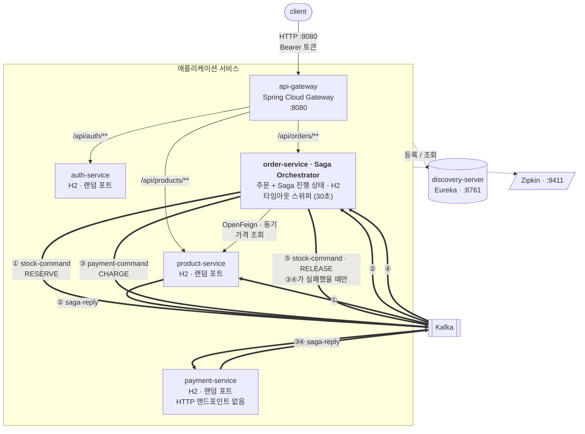

# springboot-simple-msa

Spring Boot 기반 마이크로서비스 아키텍처(MSA)를 **인프라 관점에서 이해하기 위한 학습용 프로젝트**입니다.

비즈니스 로직은 의도적으로 최소한만 담습니다. 이 저장소의 목적은 "주문을 어떻게 잘 처리할 것인가"가 아니라, **서비스가 여러 개로 쪼개졌을 때 서로를 어떻게 찾고, 어떻게 부르고, 실패하면 어떻게 되돌리는가**를 손으로 만들어 보는 것입니다.

> ## 📘 [docs/msa-learning-note.md](docs/msa-learning-note.md)
>
> **각 구성 요소가 왜 필요한지, 어떤 문제를 푸는지는 학습 노트에 정리되어 있습니다.**
> 이 README는 "무엇을 어떻게 실행하는가"만 다룹니다. 개념·설계 근거·실측 결과는 전부 학습 노트에 있습니다.

---

## 다루는 것

| 서비스를 나눠서 생긴 문제 | 해법 | 학습 노트 |
|---|---|---|
| 상대 주소를 어떻게 아는가 | 서비스 디스커버리 (Eureka) | [2절](docs/msa-learning-note.md#2-서비스-디스커버리--상대의-주소를-어떻게-아는가) |
| 클라이언트가 서비스마다 다른 주소를 알아야 하는가 | API Gateway | [3절](docs/msa-learning-note.md#3-api-gateway--클라이언트가-알아야-할-주소를-하나로) |
| 여러 개면 요청은 누가 나누는가 | 클라이언트 사이드 로드밸런싱 | [4절](docs/msa-learning-note.md#4-클라이언트-사이드-로드밸런싱--여러-개면-누가-나누는가) |
| 서비스 간 HTTP 호출을 매번 짜야 하는가 | OpenFeign | [5절](docs/msa-learning-note.md#5-동기-통신--openfeign) |
| 상대가 죽어 있어도 진행돼야 하는 일은 | 비동기 이벤트 (Kafka) | [6절](docs/msa-learning-note.md#6-비동기-통신--kafka) |
| 여러 서비스를 거친 요청을 어떻게 추적하는가 | 분산 추적 (Zipkin) | [7절](docs/msa-learning-note.md#7-분산-추적--어디서-느려졌는가) |
| 죽은 상대를 계속 두드려 나까지 느려지는 것 | 서킷 브레이커 (Resilience4j) | [8절](docs/msa-learning-note.md#8-서킷-브레이커--상대의-장애가-나에게-번지는-것을-막는다) |
| 세션을 공유하지 않고 로그인 상태를 어떻게 아는가 | JWT 인증·인가 (Spring Security) | [9절](docs/msa-learning-note.md#9-인증인가--세션-없이-로그인-상태를-다루기) |
| 한 트랜잭션으로 묶을 수 없는 일을 어떻게 되돌리는가 | Saga 보상 트랜잭션 | [10절](docs/msa-learning-note.md#10-saga--롤백할-수-없을-때-되돌리는-법) |
| 흐름이 여러 서비스에 흩어져 어디서 멈췄는지 모르는 것 | Saga 오케스트레이션 | [11절](docs/msa-learning-note.md#11-오케스트레이션--흐름을-한-곳으로-모으기) |
| 여러 개를 어떻게 한 번에 띄우는가 | Docker Compose | [부록 A](docs/msa-learning-note.md#부록-a-컨테이너로-묶을-때-부딪히는-것들) |

---

## 아키텍처



- 얇은 실선: 응답을 기다리는 **동기** 호출
- 굵은 실선: 응답을 기다리지 않는 **비동기 명령·응답**
- 점선: Eureka 등록·조회와 Zipkin span 전송

**번호가 요점입니다.** ③은 ②가 도착한 뒤에 나갑니다. 오케스트레이터가 한 단계씩 결과를 보고 다음을 정하기 때문입니다. 그래서 아래로 향하는 화살표가 **전부 order-service에서 나갑니다** — `product-service`는 자기 다음에 결제가 있다는 것을 모르고, `payment-service`는 앞에 재고 단계가 있었다는 것을 모릅니다.

②나 ④가 오지 않으면 타임아웃 스위퍼가 30초 뒤 ⑤를 대신 발행합니다. 이것이 가능한 이유는 진행 상태가 order-service의 DB 한 곳에 모여 있기 때문입니다. 자세한 것은 [학습 노트 11절](docs/msa-learning-note.md#11-오케스트레이션--흐름을-한-곳으로-모으기)에 있습니다.

### 모듈

| 모듈 | 포트 | 역할 |
|---|---|---|
| `discovery-server` | 8761 | Eureka 서버 |
| `api-gateway` | 8080 | 외부로 열리는 유일한 진입점. 라우팅 + 첫 토큰 검문 |
| `auth-service` | 0 (랜덤) | 로그인과 JWT 발급 |
| `product-service` | 0 (랜덤) | 상품 조회·등록. 재고 확보와 복구 명령 처리 |
| `payment-service` | 0 (랜덤) | 결제 명령 처리. HTTP 엔드포인트 없음 |
| `order-service` | 0 (랜덤) | 주문 생성, 가격 조회, **Saga 오케스트레이션** |

**외부에 열린 포트는 8080·8761·9411 셋뿐입니다.** auth·order·product·payment는 호스트 포트가 없어 게이트웨이를 우회할 수 없습니다.

---

## API

```
AppUser { id, username, password(BCrypt), role }
Product { id, name, price, stock }
Account { userId, balance }
Order   { id, userId, productId, quantity, totalPrice, status, cancelReason }
```

| 엔드포인트 | 권한 |
|---|---|
| `POST /api/auth/login` | 공개 |
| `GET  /api/products`, `GET /api/products/{id}` | 공개 |
| `POST /api/products` | ADMIN |
| `POST /api/orders` | 인증 필요 |
| `GET  /api/orders`, `GET /api/orders/{id}` | 인증 필요 + 본인 것만 |

초기 계정: `user`/`user123` (ROLE_USER), `admin`/`admin123` (ROLE_ADMIN)

주문은 `PENDING`으로 생성된 뒤 **재고 확보 → 결제** 순으로 진행되며, 둘 다 성공하면 `CONFIRMED`, 어느 한쪽이라도 실패하면 앞 단계를 되돌린 뒤 `CANCELLED`가 됩니다. 초기 계좌 잔액은 사용자당 100만 원입니다. 자세한 이유는 [학습 노트 11절](docs/msa-learning-note.md#11-오케스트레이션--흐름을-한-곳으로-모으기)을 참고하십시오.

---

## 실행

### 사전 요구사항

- JDK 21 (Gradle toolchain으로 고정)
- Docker / Docker Compose
- `jq` (아래 예시에서 토큰을 뽑는 데 사용)

### Docker Compose로 전체 기동 (권장)

```bash
./gradlew clean build      # 실행 가능한 jar 를 먼저 만든다
docker compose up -d --build
```

종료는 `docker compose down`, 데이터까지 지우려면 `docker compose down -v`입니다.

| 화면 | 주소 |
|---|---|
| Eureka 대시보드 | http://localhost:8761 |
| Zipkin (분산 추적) | http://localhost:9411 |

### 동작 확인

```bash
# 상품 조회는 공개 경로라 토큰이 필요 없다
curl -s http://localhost:8080/api/products/1
# {"id":1,"name":"키보드","price":89000.00,"stock":30}

# 주문에는 토큰이 필요하다
TOKEN=$(curl -s -X POST http://localhost:8080/api/auth/login \
  -H 'Content-Type: application/json' \
  -d '{"username":"user","password":"user123"}' | jq -r .accessToken)

curl -s -X POST http://localhost:8080/api/orders \
  -H "Authorization: Bearer $TOKEN" \
  -H 'Content-Type: application/json' \
  -d '{"productId": 1, "quantity": 3}'
# {"id":1,...,"totalPrice":267000.00,"status":"PENDING"}

# 응답은 PENDING 이다. 재고 확보와 결제가 그 뒤에 순서대로 일어난다.
# 잠시 뒤 다시 조회하면 CONFIRMED 로 바뀌어 있다.
curl -s http://localhost:8080/api/orders -H "Authorization: Bearer $TOKEN"
```

> **기동 직후 첫 요청은 실패할 수 있습니다.** Eureka 클라이언트가 레지스트리를 주기적으로만 갱신하므로, 서비스가 떠 있어도 호출하는 쪽이 그 사실을 알기까지 시간이 걸립니다. 서킷 브레이커가 열려 503이 날 수도 있습니다. 1분 정도 기다린 뒤 다시 시도하면 됩니다. 자세한 내용은 [학습 노트 4절](docs/msa-learning-note.md#4-클라이언트-사이드-로드밸런싱--여러-개면-누가-나누는가)에 있습니다.

### 인스턴스를 늘려 부하 분산 보기

product-service는 모든 응답에 자기 식별자를 `X-Instance-Id` 헤더로 실어 보냅니다. 이 헤더만 세면 되므로 컨테이너 로그를 파싱할 필요가 없습니다.

```bash
docker compose up -d --build --scale product-service=2

# 어느 인스턴스가 응답했는지 한 번에 확인
curl -s -D - -o /dev/null http://localhost:8080/api/products/1 | grep -i x-instance-id
# X-Instance-Id: e11bf3383a34-4770a1

# 20회 요청 후 분포 집계
for i in $(seq 1 20); do
  curl -s -o /dev/null -D - http://localhost:8080/api/products/1 | grep -i '^x-instance-id'
done | sort | uniq -c
```

실측 결과입니다.

```
  10 X-Instance-Id: 8a2a06f3a842-0cb259
  10 X-Instance-Id: e11bf3383a34-4770a1
```

앞부분은 호스트명이고, 도커에서는 **컨테이너 ID와 같으므로** 어느 컨테이너인지 바로 대조됩니다.

```bash
docker compose ps --format '{{.Name}}\t{{.ID}}' | grep product
# springboot-simple-msa-product-service-1	8a2a06f3a842
# springboot-simple-msa-product-service-2	e11bf3383a34
```

### 부하 테스트 (Gatling)

시나리오는 `load-test/src/gatling/java` 에 자바 코드로 있습니다. XML 이 아니라 코드라 Git 에 남고 리뷰됩니다.

```bash
docker compose up -d --build --scale product-service=2
./gradlew :load-test:gatlingRun
```

10초 램프업으로 50명까지 올린 뒤 20초간 초당 30건을 유지합니다. 실측 결과입니다.

```
> request count                    650  (KO 0)
> mean response time (ms)           10
> response time 95th percentile     19
> response time 99th percentile     31
> mean throughput (rps)          21.67

=== 인스턴스별 처리 건수 (총 650건) ===
  526ad169bfd6-7c7264   325  (50.0%)
  5058505857ac-4a9acc   325  (50.0%)
```

**Gatling 은 어느 인스턴스가 응답했는지 모릅니다.** 그래서 시뮬레이션이 `X-Instance-Id` 헤더를 직접 받아 셉니다. 이 조합 덕분에 처리량·지연과 분배를 한 번에 볼 수 있습니다.

HTML 리포트(백분위 그래프, 시간대별 응답 분포)는 실행 후 출력되는 경로에서 열 수 있습니다.

```
load-test/build/reports/gatling/productbrowsesimulation-<timestamp>/index.html
```

`-DbaseUrl=...` 으로 대상 주소를 바꿀 수 있습니다.

### 장애 상황 만들어 보기

```bash
# 서킷 브레이커 — 응답 시간을 함께 측정한다
docker compose stop product-service
curl -s -o /dev/null -w "%{http_code} %{time_total}s\n" -X POST http://localhost:8080/api/orders \
  -H "Authorization: Bearer $TOKEN" -H 'Content-Type: application/json' \
  -d '{"productId":1,"quantity":1}'

docker compose start product-service

# Saga 1단계 실패 — 재고를 넘는 주문은 되돌릴 것 없이 CANCELLED
curl -s -X POST http://localhost:8080/api/orders -H "Authorization: Bearer $TOKEN" \
  -H 'Content-Type: application/json' -d '{"productId":2,"quantity":9999}'

# Saga 2단계 실패 + 보상 — 잔액(100만)을 넘는 주문은 재고를 되돌린 뒤 CANCELLED
curl -s http://localhost:8080/api/products/2 | jq .stock      # 주문 전 재고
curl -s -X POST http://localhost:8080/api/orders -H "Authorization: Bearer $TOKEN" \
  -H 'Content-Type: application/json' -d '{"productId":2,"quantity":4}'   # 128만원
sleep 5
curl -s http://localhost:8080/api/products/2 | jq .stock      # 같은 값으로 돌아온다
docker compose logs product-service | grep '재고 복구(보상)'

# 타임아웃 보상 — 참여자가 죽어 응답이 없으면 30초 뒤 스스로 되돌린다
docker compose stop payment-service
curl -s -X POST http://localhost:8080/api/orders -H "Authorization: Bearer $TOKEN" \
  -H 'Content-Type: application/json' -d '{"productId":3,"quantity":2}'
sleep 45
docker compose logs order-service | grep '응답이 없는 사가'

# 아래 재시작이 학습 노트 11절의 REFUND 구멍을 그대로 재현한다.
# 밀려 있던 CHARGE 가 이미 CANCELLED 된 주문에서 실제로 돈을 빼 간다.
docker compose start payment-service
docker compose logs payment-service | grep '결제 완료'

# 멱등성 — 같은 명령을 3번 보내도 재고는 한 번만 깎인다
for i in 1 2 3; do
  echo '{"orderId":777,"productId":1,"quantity":5,"action":"RESERVE"}' | \
    docker compose exec -T kafka /opt/kafka/bin/kafka-console-producer.sh \
    --bootstrap-server localhost:9092 --topic stock-command
done
curl -s http://localhost:8080/api/products/1
```

각 실행의 **실측 결과와 그 의미**는 학습 노트의 해당 절에 정리되어 있습니다.

### 로컬에서 개별 실행

Kafka와 Zipkin 없이도 주문 생성까지는 동작합니다(이벤트 발행과 span 전송이 실패 로그를 남길 뿐입니다). Eureka가 먼저 떠 있어야 나머지가 등록할 수 있습니다.

```bash
./gradlew :discovery-server:bootRun    # 1. 가장 먼저
./gradlew :auth-service:bootRun        # 2.
./gradlew :product-service:bootRun     # 3.
./gradlew :payment-service:bootRun     # 4.
./gradlew :order-service:bootRun       # 5.
./gradlew :api-gateway:bootRun         # 6.
```

---

## 단계별 로드맵

한 번에 전부 만들지 않고, 단계마다 **"이게 왜 필요한가"를 체감한 뒤 다음을 얹었습니다.** Phase 1~7은 각각 커밋 하나에 대응하고, Phase 8은 참여 서비스가 늘어 여러 커밋에 걸쳐 있습니다.

| Phase | 추가한 것 | 검증 기준 |
|---|---|---|
| **1** | 멀티모듈 골격, Eureka, 서비스 2개, Gateway, Feign | Eureka에 등록 확인 + `POST /api/orders` 성공 |
| **2** | Dockerfile, Docker Compose | `docker compose up` 한 번으로 동일한 결과 |
| **3** | product-service 스케일 아웃 | 두 인스턴스에 요청이 번갈아 들어옴 |
| **4** | Kafka 비동기 이벤트 (재고 차감) | 응답 이후 재고가 차감됨 + 중지 중 발행된 이벤트가 복구 후 처리됨 |
| **5** | Zipkin 분산 추적, Resilience4j 서킷 브레이커 | 한 요청이 하나의 trace로 보임 + 장애 시 즉시 실패 |
| **6** | JWT 인증·인가 (auth-service, RBAC) | 토큰 없이 401, 권한 부족 시 403, 남의 주문 조회 불가 |
| **7** | Saga 보상 트랜잭션 + 멱등 소비 | 재고 부족 주문이 CANCELLED로 되돌아감 + 중복 이벤트에도 재고는 한 번만 차감 |
| **8** | Saga 오케스트레이션 전환 + payment-service | 결제 실패 시 재고가 되돌아감 + 참여자가 죽어도 30초 뒤 스스로 취소됨 |

Phase 8까지 완료된 상태입니다.

### 앞으로 (예정)

여기서부터는 **"DB를 나누었기 때문에 조인이 사라졌다"**는 하나의 문제를 세 단계로 다룹니다. 셋을 한 덩어리로 도입하는 경우가 많은데, 앞 단계가 뒤 단계의 필요를 없애거나 전제가 되므로 순서가 곧 내용입니다.

| Phase | 다룰 것 | 검증 기준 |
|---|---|---|
| **9** | 주문 스냅샷 — 주문 시점의 상품명을 `Order`에 함께 저장 | 상품명을 바꿔도 **과거 주문 내역의 상품명은 그대로** + 주문 목록 조회에 product-service 호출이 사라짐 |
| **10** | Transactional Outbox | 발행 직후 프로세스를 죽여도 **메시지가 유실되지 않음** |
| **11** | CQRS 읽기 모델 | 비정규화된 조회 전용 저장소에서 정렬·페이징이 동작 + 이벤트 재생으로 재구축 가능 |

**Phase 9는 성능 최적화가 아니라 도메인 정확성 문제입니다.** "상품명이 바뀌면 3년 전 주문 내역의 상품명도 함께 바뀌어야 하는가?"에 답이 '아니오'라면, 상품명은 조인해 올 값이 아니라 **거래 시점에 박제할 값**입니다. 이미 `totalPrice`를 그렇게 다루고 있습니다. MSA에서 겪는 조인 통증의 상당 부분은 **애초에 조인하면 안 되는 것을 조인하려다** 생기며, DB를 나눈 것이 그 사실을 드러냈을 뿐입니다.

**Phase 10이 11보다 먼저인 데도 이유가 있습니다.** 재고는 다음 명령으로 자기 교정되지만 읽기 모델은 다릅니다 — **이벤트를 한 번 놓치면 영원히 모른 채 조용히 틀린 값을 내놓습니다.** 현재 발행 경로는 커밋 직후 죽으면 메시지를 잃으므로, Outbox 없이 읽기 모델을 올리면 그 결함을 그대로 물려받습니다.

아직 다루지 않은 주제와 그 이유는 [학습 노트 13절](docs/msa-learning-note.md#13-이-프로젝트가-다루지-않은-것)에 있습니다.

---

## 기술 스택

| 항목 | 선택 | 이유 |
|---|---|---|
| Java | 21 (LTS) | Spring Cloud 생태계가 LTS 기준으로 가장 안정적입니다 |
| Spring Boot | 3.5.3 | |
| Spring Cloud | 2025.0.0 | Boot 3.5와 짝을 이루는 릴리스 트레인입니다 |
| 빌드 | Gradle 멀티모듈 (Groovy DSL) | 서브프로젝트 6개를 한 저장소에서 버전 통합 관리합니다 |
| 서비스 디스커버리 | Netflix Eureka | 등록/해제를 대시보드로 직접 볼 수 있어 학습에 유리합니다 |
| 게이트웨이 | Spring Cloud Gateway (WebFlux) | |
| 동기 통신 | OpenFeign | 인터페이스 선언만으로 클라이언트가 생성되고 서킷 브레이커를 붙이기 쉽습니다 |
| 비동기 통신 | Apache Kafka 4.3 (KRaft) | ZooKeeper 컨테이너가 따로 필요 없습니다 |
| 분산 추적 | Micrometer Tracing + Zipkin 3.6 | Spring Boot 3의 기본 추적 스택이며 별도 에이전트가 필요 없습니다 |
| 서킷 브레이커 | Resilience4j | Spring Cloud CircuitBreaker의 기본 구현이고 Feign에 선언만으로 붙습니다 |
| 인증 | Spring Security + JWT (HS256) | `jjwt` 등 외부 라이브러리 없이 표준 스택으로 발급·검증합니다 |
| 부하 테스트 | Gatling 3.15 (Java DSL) | 시나리오를 자바 코드로 관리해 Git 리뷰와 CI 실행이 가능합니다 |
| 저장소 | H2 (인메모리, 서비스별 분리) | 기동이 빠르고 Database per Service 원칙은 그대로 체감됩니다 |
| Saga 방식 | 오케스트레이션 (코레오그래피에서 전환) | 흐름이 한 클래스에 모여 추적이 쉽고, 진행 상태를 저장한 덕에 타임아웃 보상이 가능해집니다 |

> **버전 주의**: Spring Cloud 2025.0.0부터 게이트웨이 의존성이 `spring-cloud-starter-gateway-server-webflux`로, 설정 키가 `spring.cloud.gateway.server.webflux.*`로 바뀌었습니다. 검색되는 자료 대부분이 옛 이름 기준입니다.

---

## 테스트

```bash
./gradlew build      # 컴파일 + 전체 테스트
```

서비스별로 통합 테스트를 둡니다(`@SpringBootTest`, Eureka·Kafka·추적을 끈 테스트 속성 사용). 커버리지가 아니라 **단계별 검증 기준이 실제로 통과하는가**를 확인하는 용도입니다.

---

## 보안 관련 주의

이 저장소는 학습용이며, 다음은 **실제 서비스에 그대로 쓰면 안 됩니다.**

| 항목 | 현재 | 실무에서는 |
|---|---|---|
| JWT 서명 열쇠 | `JWT_SECRET` 기본값이 저장소에 있음 | Secrets Manager / Vault에서 주입. **저장소에 올라간 열쇠는 이미 유출된 열쇠입니다** |
| 서명 알고리즘 | HS256 (대칭키) — 검증만 하는 서비스도 토큰을 발급할 수 있음 | RS256 (비대칭키) |
| 토큰 만료·로그아웃 | 1시간 만료, 갱신·무효화 수단 없음 | 짧은 액세스 토큰 + 리프레시 토큰 |
| 서비스 간 통신 | 평문 HTTP | mTLS 또는 서비스 메시 |
| 타임아웃 뒤 늦은 결제 | 취소된 주문인데 **돈이 빠져나갑니다.** 늦게 도착한 성공 응답을 버리기만 하고 `REFUND`를 보내지 않습니다 | 늦은 성공 응답에 보상을 발행하거나, 보상 전에 참여자에게 처리 여부를 되묻기 |

`JWT_SECRET=... docker compose up`으로 덮어쓸 수 있습니다. 자세한 논의는 [학습 노트 9절](docs/msa-learning-note.md#9-인증인가--세션-없이-로그인-상태를-다루기)에 있습니다.
