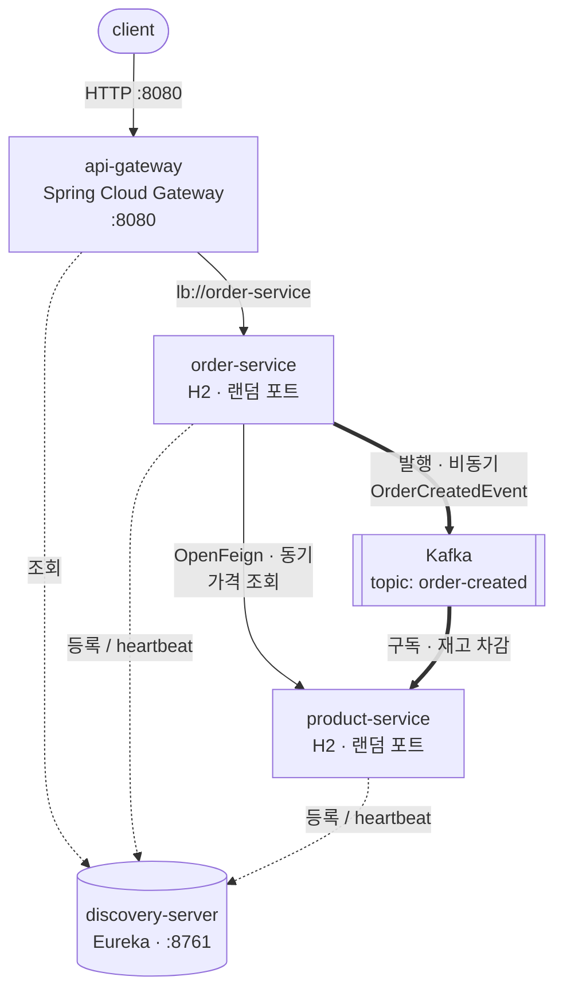

# springboot-simple-msa

Spring Boot 기반 마이크로서비스 아키텍처(MSA)를 **인프라 관점에서 이해하기 위한 학습용 프로젝트**입니다.

비즈니스 로직은 의도적으로 최소한만 담습니다. 이 저장소의 목적은 "주문을 어떻게 잘 처리할 것인가"가 아니라, **서비스가 여러 개로 쪼개졌을 때 서로를 어떻게 찾고, 어떻게 부르고, 어떻게 한 번에 띄우는가**를 손으로 만들어 보는 것입니다.

---

## 1. 무엇을 배우는가

MSA는 하나의 큰 애플리케이션(모놀리식)을 독립 배포 가능한 여러 서비스로 나눈 구조입니다. 나누는 순간 모놀리식에는 없던 문제가 생깁니다.

| 새로 생기는 문제 | 이 프로젝트에서 다루는 해법 |
|---|---|
| 서비스 A가 서비스 B의 주소를 어떻게 아는가 | 서비스 디스커버리 (Eureka) |
| 클라이언트가 서비스마다 다른 주소로 호출해야 하는가 | API Gateway |
| 서비스 간 HTTP 호출을 매번 손으로 짜야 하는가 | OpenFeign |
| 서비스가 여러 개인데 어떻게 한 번에 띄우는가 | Docker Compose |
| 같은 서비스를 여러 개 띄우면 요청은 누가 나누는가 | 클라이언트 사이드 로드밸런싱 |
| 상대가 죽어 있어도 진행되어야 하는 일은 어떻게 하는가 | 비동기 이벤트 (Kafka) |

---

## 2. 아키텍처



- 얇은 실선: 응답을 기다리는 **동기** 호출
- 굵은 실선: 응답을 기다리지 않는 **비동기** 이벤트 (Phase 4에서 추가)
- 점선: Eureka와 주고받는 등록·조회 트래픽

### 설계 원칙: 주소를 하드코딩하지 않는다

이 구조의 핵심은 **어떤 서비스도 다른 서비스의 IP나 포트를 알지 못한다**는 점입니다.

- 게이트웨이는 `http://localhost:8081`이 아니라 `lb://order-service`로 라우팅합니다.
- order-service는 Feign 인터페이스에 `product-service`라는 **이름만** 적습니다.
- 실제 IP와 포트는 Eureka가 런타임에 채워 넣습니다.

이를 강제하기 위해 **product-service와 order-service의 포트를 `0`(랜덤 할당)으로 둡니다.** 포트를 미리 알 수 없으므로 하드코딩 자체가 불가능해지고, 디스커버리가 실제로 동작하는지 확인할 수밖에 없게 됩니다.

### 모듈 구성

| 모듈 | 포트 | 역할 |
|---|---|---|
| `discovery-server` | 8761 | Eureka 서버. 서비스들이 자신의 주소를 등록하고 서로를 조회하는 전화번호부 |
| `api-gateway` | 8080 | 외부로 열리는 유일한 진입점. 경로에 따라 내부 서비스로 라우팅 |
| `product-service` | 0 (랜덤) | 상품 조회 |
| `order-service` | 0 (랜덤) | 주문 생성. 생성 시 product-service를 호출해 가격을 조회 |

**공통(common) 모듈은 만들지 않습니다.** DTO를 공유하면 편하지만, 그 순간 두 서비스는 함께 배포해야 하는 하나의 덩어리가 됩니다. DTO 중복은 MSA에서 독립 배포를 얻기 위해 지불하는 의도된 비용입니다.

### 데이터베이스는 서비스마다 따로

각 서비스가 자신의 H2 인메모리 DB를 내장합니다. 서비스 간에 DB를 공유하지 않는 것이 원칙(Database per Service)입니다. DB를 공유하면 한쪽의 스키마 변경이 다른 쪽을 깨뜨려서, 서비스를 나눈 의미가 사라집니다.

인메모리이므로 재시작하면 데이터는 사라집니다. 학습 목적상 기동 속도를 택한 선택입니다.

---

## 3. 도메인 (의도적으로 최소)

```
Product { id, name, price, stock }      GET  /products/{id}
Order   { id, productId, quantity, totalPrice }   POST /orders
```

주문 생성 흐름은 다음과 같습니다.

1. 클라이언트가 게이트웨이로 `POST /api/orders`를 보냅니다.
2. 게이트웨이가 Eureka에서 order-service의 실제 주소를 찾아 요청을 넘깁니다.
3. order-service가 Feign으로 product-service를 호출해 가격을 조회합니다.
4. `price × quantity`를 계산해 주문을 저장하고 응답합니다.

로직은 이게 전부입니다. 곱셈 한 번이 서비스 두 개를 건너간다는 사실 자체가 학습 대상입니다.

---

## 4. 단계별 로드맵

한 번에 전부 만들지 않고, 단계마다 **"이게 왜 필요한가"를 체감한 뒤 다음을 얹습니다.** 각 단계는 커밋 하나에 대응하며, 검증 기준을 통과해야 다음으로 넘어갑니다.

| Phase | 추가하는 것 | 검증 기준 | 상태 |
|---|---|---|---|
| **1** | 멀티모듈 골격, Eureka, 서비스 2개, Gateway, Feign | Eureka 대시보드에 3개 등록 확인 + `POST /api/orders` 성공 | **완료** |
| **2** | Dockerfile, Docker Compose | `docker compose up` 한 번으로 Phase 1과 동일한 결과 | **완료** |
| **3** | product-service 인스턴스 2개로 스케일 아웃 | 두 인스턴스 로그에 요청이 번갈아 들어오는지 확인 | **완료** |
| **4** | Kafka 기반 비동기 이벤트 (주문 생성 → 재고 차감) | 주문 응답 이후에 재고가 차감됨 + product-service가 죽어 있는 동안 발행된 이벤트가 복구 후 처리됨 | **완료** |
| **5** | Zipkin 분산 추적, Resilience4j 서킷 브레이커 | Zipkin에서 gateway→order→product가 한 줄로 보임 + 장애 시 fallback 응답 | 예정 |

Phase 1~2가 "MSA 인프라 이해"의 대부분을 차지합니다. Phase 3 이후는 필요할 때 이어서 진행합니다.

---

## 5. 실행 방법

### 사전 요구사항

- JDK 21 (Gradle toolchain으로 고정)
- Docker / Docker Compose (Phase 2부터)

### Phase 1 — 로컬에서 개별 실행

기동 순서가 중요합니다. Eureka가 먼저 떠 있어야 나머지가 자신을 등록할 수 있습니다.

```bash
./gradlew :discovery-server:bootRun    # 1. 가장 먼저
./gradlew :product-service:bootRun     # 2.
./gradlew :order-service:bootRun       # 3.
./gradlew :api-gateway:bootRun         # 4.
```

등록 확인은 브라우저에서 http://localhost:8761 을 열어 인스턴스 3개(`API-GATEWAY`, `ORDER-SERVICE`, `PRODUCT-SERVICE`)가 보이는지로 합니다.

> 기동 직후에는 호출이 실패할 수 있습니다. Eureka 클라이언트는 기본적으로 30초 주기로 레지스트리를 갱신하므로, 서비스가 떠 있어도 게이트웨이가 그 사실을 알기까지 시간이 걸립니다. 1분 정도 기다린 뒤 다시 시도하면 됩니다.

동작 확인:

```bash
curl -X POST http://localhost:8080/api/orders \
  -H 'Content-Type: application/json' \
  -d '{"productId": 1, "quantity": 3}'
# {"id":1,"productId":1,"quantity":3,"totalPrice":267000.00}

curl http://localhost:8080/api/products/1
# {"id":1,"name":"키보드","price":89000.00,"stock":30}
```

### Phase 2 — Docker Compose로 한 번에

```bash
./gradlew clean build      # 실행 가능한 jar 를 먼저 만든다
docker compose up --build
```

동작 확인은 Phase 1과 동일한 `curl`을 씁니다. 종료는 `docker compose down`입니다.

컨테이너로 옮기면서 새로 부딪히는 문제가 셋 있고, 각각을 이렇게 해결했습니다.

**1. `localhost:8761`이 통하지 않는다**

컨테이너 안에서 `localhost`는 호스트가 아니라 자기 자신입니다. 그래서 Eureka 주소를 환경변수로 주입 가능하게 바꿨습니다.

```yaml
defaultZone: ${EUREKA_SERVER_URL:http://localhost:8761/eureka}
```

`${변수:기본값}` 형태이므로 로컬 실행(Phase 1)은 그대로 동작하고, Compose에서는 `EUREKA_SERVER_URL=http://discovery-server:8761/eureka`로 덮어씁니다. 여기서 `discovery-server`는 Compose가 서비스 이름을 DNS 이름으로 등록해 준 것입니다.

**2. `depends_on`은 "준비 완료"를 기다리지 않는다**

`depends_on`만 쓰면 Compose는 컨테이너가 **시작**된 것까지만 보장합니다. Eureka가 아직 포트를 열기 전에 나머지가 등록을 시도하면 실패 스택트레이스가 쌓입니다(재시도로 결국 복구되지만 약 30초가 걸립니다). 그래서 헬스체크를 붙이고 `condition: service_healthy`로 실제 준비 완료를 기다립니다.

```yaml
healthcheck:
  test: ["CMD", "bash", "-c", "exec 3<>/dev/tcp/localhost/8761"]
```

`curl`을 설치하는 대신 bash의 `/dev/tcp` 기능으로 포트만 확인합니다. 이미지에 추가로 설치할 것이 없습니다.

**3. `-plain.jar`이 같이 만들어진다**

Gradle의 `java` 플러그인은 라이브러리용 `*-plain.jar`를, Spring Boot 플러그인은 실행 가능한 `*.jar`를 각각 만듭니다. Dockerfile이 `*.jar`로 복사하면 두 개가 잡혀 빌드가 실패하므로, 루트 `build.gradle`에서 `jar` 태스크를 꺼 뒀습니다.

**Dockerfile은 하나만 둡니다.** Spring Boot 실행 가능 jar는 어느 서비스든 실행 방법이 같기 때문입니다. 어떤 모듈을 담을지는 Compose가 `SERVICE` 빌드 인자로 전달합니다.

**포트는 게이트웨이(8080)와 Eureka(8761)만 엽니다.** product-service와 order-service는 호스트 포트를 열지 않으므로 외부에서 직접 접근할 방법이 없고, 반드시 게이트웨이를 거쳐야 합니다.

### Phase 3 — 인스턴스를 늘려 부하 분산 확인하기

```bash
docker compose up -d --build --scale product-service=2
```

**코드 변경은 로그 한 줄뿐입니다.** 부하 분산은 이미 Phase 1에서 완성되어 있었습니다. `lb://product-service`와 `@FeignClient(name = "product-service")`는 처음부터 "이 이름으로 등록된 인스턴스들 중 하나를 골라라"라는 뜻이었고, 그동안 후보가 하나뿐이었을 뿐입니다.

이 옵션이 그냥 통하는 이유는 **product-service에 호스트 포트를 매핑하지 않았기 때문**입니다. 호스트 포트를 고정해 두면 두 번째 컨테이너가 같은 포트를 잡지 못해 스케일이 실패합니다. 서비스 포트를 `0`으로 둔 선택이 여기서 값을 합니다.

확인:

```bash
# Eureka 에 인스턴스가 2개 등록됐는지
curl -s -H 'Accept: application/json' \
  http://localhost:8761/eureka/apps/PRODUCT-SERVICE | grep -o '"instanceId":"[^"]*"'

# 여러 번 호출한 뒤 인스턴스별 처리 건수 세기
for i in $(seq 1 10); do curl -s -o /dev/null http://localhost:8080/api/products/1; done
docker compose logs product-service | grep "상품 조회 요청" | sed 's/ *|.*//' | sort | uniq -c
```

실제 측정 결과는 다음과 같았습니다(총 17회 = 게이트웨이 직접 호출 10 + order-service의 Feign 호출 6 + 최초 확인 1).

```
   8 product-service-1
   9 product-service-2
```

게이트웨이 경로와 Feign 경로가 **각각 따로** 부하를 나눕니다. 중앙에 로드밸런서 장비가 있는 것이 아니라, 호출하는 쪽이 인스턴스 목록을 받아 스스로 고르기 때문입니다. 이를 클라이언트 사이드 로드밸런싱이라고 합니다.

> 인스턴스를 늘린 직후 몇십 초 동안은 새 인스턴스로 요청이 가지 않을 수 있습니다. Eureka 클라이언트가 레지스트리를 주기적으로만 갱신하고(Compose에서 5초로 설정), Spring Cloud LoadBalancer도 인스턴스 목록을 자체 캐시(기본 35초)에 두기 때문입니다. 스케일 아웃이 즉시 반영되지 않는다는 점 자체가 이 구조의 특성입니다.

### Phase 4 — Kafka로 재고 차감을 비동기화

Kafka는 `docker compose up`에 이미 포함되어 있으므로 실행 방법은 Phase 2와 같습니다.

**한 번의 주문 생성 안에 성격이 다른 두 통신이 공존합니다.**

| | 가격 조회 | 재고 차감 |
|---|---|---|
| 방식 | 동기 (OpenFeign) | 비동기 (Kafka) |
| 이유 | 총액을 응답에 담아야 하므로 답을 기다려야 함 | 응답에 재고를 담을 필요가 없음 |
| 대가 | product-service가 죽으면 주문도 실패 | 재고가 즉시 반영되지 않음 |

같은 요청 안에서 둘을 나란히 놓고 비교하는 것이 이 단계의 목적입니다. 어느 한쪽이 우월한 것이 아니라, **응답에 그 답이 필요한가**로 갈립니다.

**이벤트 이름이 `DecreaseStockCommand`가 아니라 `OrderCreatedEvent`인 이유**

order-service는 "재고를 깎아라"라고 지시하지 않고 "주문이 생겼다"는 사실만 알립니다. 그 사실을 듣고 무엇을 할지는 듣는 쪽이 정합니다. 덕분에 나중에 알림 서비스나 통계 서비스가 같은 이벤트를 구독해도 order-service는 손댈 필요가 없습니다. 지시(command)로 이름 짓는 순간 보내는 쪽이 받는 쪽의 일을 알게 되어 결합이 생깁니다.

**두 서비스가 합의한 것은 자바 클래스가 아니라 JSON 필드 이름입니다.** `OrderCreatedEvent` record가 order-service와 product-service에 각각 따로 선언되어 있습니다. 발행할 때 메시지 헤더에 자바 클래스 이름을 넣지 않도록(`spring.json.add.type.headers: false`) 설정했기 때문에, 수신측은 자기 패키지의 자기 클래스로 읽습니다. 서로 다른 언어로 짜여 있어도 통하는 구조입니다.

#### 확인 절차

**1) 결과적 일관성 — 주문 응답 직후에는 재고가 아직 그대로입니다**

```bash
curl -s http://localhost:8080/api/products/1
# {"id":1,"name":"키보드","price":89000.00,"stock":30}

curl -s -X POST http://localhost:8080/api/orders \
  -H 'Content-Type: application/json' -d '{"productId": 1, "quantity": 4}'
# {"id":1,"productId":1,"quantity":4,"totalPrice":356000.00}

curl -s http://localhost:8080/api/products/1   # 바로 조회하면
# {"id":1,"name":"키보드","price":89000.00,"stock":30}   ← 아직 30

curl -s http://localhost:8080/api/products/1   # 잠시 뒤 다시 조회하면
# {"id":1,"name":"키보드","price":89000.00,"stock":26}   ← 26으로 반영
```

이 지연은 버그가 아니라 비동기를 선택한 대가입니다. "주문은 이미 성공했지만 재고는 아직"인 구간이 존재한다는 것을 받아들여야 합니다.

**2) product-service가 죽어 있는 동안 발행된 이벤트는 유실되지 않습니다**

```bash
docker compose stop product-service

# 동기 호출은 함께 죽는다
curl -s -o /dev/null -w "%{http_code}\n" -X POST http://localhost:8080/api/orders \
  -H 'Content-Type: application/json' -d '{"productId": 1, "quantity": 5}'
# 500

# 구독자가 없어도 브로커에는 쌓인다 (콘솔 프로듀서로 직접 발행)
echo '{"orderId":999,"productId":1,"quantity":5}' | \
  docker compose exec -T kafka /opt/kafka/bin/kafka-console-producer.sh \
  --bootstrap-server localhost:9092 --topic order-created

docker compose start product-service
docker compose logs product-service | grep "재고 차감"
```

실제 결과는 다음과 같았습니다.

```
재고 차감: productId=1, 주문수량=4, 남은재고=26 (orderId=1)     ← 중지 전에 처리됨
재고 차감: productId=1, 주문수량=5, 남은재고=25 (orderId=999)   ← 재기동 후 처리됨
```

여기서 두 가지를 더 읽을 수 있습니다.

- **이미 처리한 `orderId=1` 이벤트는 재처리되지 않았습니다.** 컨슈머 그룹의 오프셋(어디까지 읽었는지)이 브로커에 커밋되어 있어, 재기동 시 그 다음부터 이어서 읽기 때문입니다. `auto-offset-reset: earliest`는 그룹이 **처음 만들어질 때**만 적용됩니다.
- **남은 재고가 21이 아니라 25입니다.** product-service의 H2가 인메모리이므로 컨테이너를 재시작하면 초기 데이터(재고 30)로 돌아갔고, 거기서 5를 뺀 값이기 때문입니다. 이벤트는 브로커에 안전하게 남아 있었지만 **서비스가 들고 있던 상태는 사라졌다**는 뜻입니다. 메시지의 내구성과 서비스 상태의 내구성은 별개의 문제이며, 후자는 영속 DB(Phase 1에서 학습 속도를 위해 인메모리를 선택)의 몫입니다.

**재고 부족 이벤트는 로그만 남기고 버립니다.** 예외를 던지면 Kafka가 같은 메시지를 무한 재시도하면서 뒤의 정상 이벤트까지 막습니다(poison message). 실제로 다루려면 DLQ(Dead Letter Queue)와 보상 트랜잭션이 필요한데, 이는 이 프로젝트의 범위를 넘어섭니다.

---

## 6. 기술 스택

| 항목 | 선택 | 이유 |
|---|---|---|
| Java | 21 (LTS) | Spring Cloud 생태계가 LTS 기준으로 가장 안정적입니다 |
| Spring Boot | 3.5.x | |
| Spring Cloud | 2025.0.x | Boot 3.5와 짝을 이루는 릴리스 트레인입니다 |
| 빌드 | Gradle 멀티모듈 (Groovy DSL) | 서브프로젝트 4개를 한 저장소에서 버전 통합 관리합니다 |
| 서비스 디스커버리 | Netflix Eureka | 등록/해제 과정을 대시보드로 직접 볼 수 있어 학습에 유리합니다 |
| 게이트웨이 | Spring Cloud Gateway | |
| 서비스 간 통신(동기) | OpenFeign | 인터페이스 선언만으로 HTTP 클라이언트가 생성되며, 서킷 브레이커를 붙이기 쉽습니다 |
| 서비스 간 통신(비동기) | Apache Kafka 4.3 (KRaft) | KRaft 모드라 ZooKeeper 컨테이너가 따로 필요 없습니다 |
| 저장소 | H2 (인메모리, 서비스별 분리) | 기동이 빠르고 Database per Service 원칙은 그대로 체감됩니다 |

---

## 7. 테스트 방침

서비스당 통합 테스트 1개씩만 둡니다 (`@SpringBootTest`, Eureka와 Feign을 비활성화한 테스트 프로파일 사용). 학습 프로젝트이므로 커버리지가 아니라 **"단계별 검증 기준이 실제로 통과하는가"** 를 확인하는 용도입니다.

Kafka를 도입하는 Phase 4 시점에 Testcontainers 도입 여부를 다시 판단합니다.
