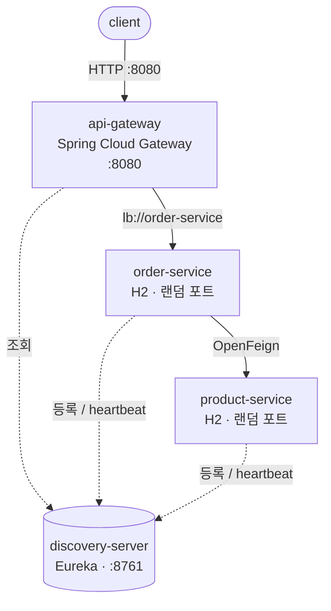

# springboot-simple-msa

Spring Boot 기반 마이크로서비스 아키텍처(MSA)를 **인프라 관점에서 이해하기 위한 학습용 프로젝트**입니다.

비즈니스 로직은 의도적으로 최소한만 담습니다. 이 저장소의 목적은 "주문을 어떻게 잘 처리할 것인가"가 아니라, **서비스가 여러 개로 쪼개졌을 때 서로를 어떻게 찾고, 어떻게 부르고, 어떻게 한 번에 띄우는가**를 손으로 만들어 보는 것입니다.

---

## 1. 무엇을 배우는가

MSA는 하나의 큰 애플리케이션(모놀리식)을 독립 배포 가능한 여러 서비스로 나눈 구조입니다. 나누는 순간 모놀리식에는 없던 문제가 생깁니다.

| 새로 생기는 문제 | 이 프로젝트에서 다루는 해법 |
|---|---|
| 서비스 A가 서비스 B의 주소를 어떻게 아는가 | 서비스 디스커버리 (Eureka) |
| 클라이언트가 서비스마다 다른 주소로 호출해야 하는가 | API Gateway |
| 서비스 간 HTTP 호출을 매번 손으로 짜야 하는가 | OpenFeign |
| 서비스가 여러 개인데 어떻게 한 번에 띄우는가 | Docker Compose |
| 같은 서비스를 여러 개 띄우면 요청은 누가 나누는가 | 클라이언트 사이드 로드밸런싱 |

---

## 2. 아키텍처



실선은 실제 요청이 흐르는 경로, 점선은 Eureka와 주고받는 등록·조회 트래픽입니다.

### 설계 원칙: 주소를 하드코딩하지 않는다

이 구조의 핵심은 **어떤 서비스도 다른 서비스의 IP나 포트를 알지 못한다**는 점입니다.

- 게이트웨이는 `http://localhost:8081`이 아니라 `lb://order-service`로 라우팅합니다.
- order-service는 Feign 인터페이스에 `product-service`라는 **이름만** 적습니다.
- 실제 IP와 포트는 Eureka가 런타임에 채워 넣습니다.

이를 강제하기 위해 **product-service와 order-service의 포트를 `0`(랜덤 할당)으로 둡니다.** 포트를 미리 알 수 없으므로 하드코딩 자체가 불가능해지고, 디스커버리가 실제로 동작하는지 확인할 수밖에 없게 됩니다.

### 모듈 구성

| 모듈 | 포트 | 역할 |
|---|---|---|
| `discovery-server` | 8761 | Eureka 서버. 서비스들이 자신의 주소를 등록하고 서로를 조회하는 전화번호부 |
| `api-gateway` | 8080 | 외부로 열리는 유일한 진입점. 경로에 따라 내부 서비스로 라우팅 |
| `product-service` | 0 (랜덤) | 상품 조회 |
| `order-service` | 0 (랜덤) | 주문 생성. 생성 시 product-service를 호출해 가격을 조회 |

**공통(common) 모듈은 만들지 않습니다.** DTO를 공유하면 편하지만, 그 순간 두 서비스는 함께 배포해야 하는 하나의 덩어리가 됩니다. DTO 중복은 MSA에서 독립 배포를 얻기 위해 지불하는 의도된 비용입니다.

### 데이터베이스는 서비스마다 따로

각 서비스가 자신의 H2 인메모리 DB를 내장합니다. 서비스 간에 DB를 공유하지 않는 것이 원칙(Database per Service)입니다. DB를 공유하면 한쪽의 스키마 변경이 다른 쪽을 깨뜨려서, 서비스를 나눈 의미가 사라집니다.

인메모리이므로 재시작하면 데이터는 사라집니다. 학습 목적상 기동 속도를 택한 선택입니다.

---

## 3. 도메인 (의도적으로 최소)

```
Product { id, name, price, stock }      GET  /products/{id}
Order   { id, productId, quantity, totalPrice }   POST /orders
```

주문 생성 흐름은 다음과 같습니다.

1. 클라이언트가 게이트웨이로 `POST /api/orders`를 보냅니다.
2. 게이트웨이가 Eureka에서 order-service의 실제 주소를 찾아 요청을 넘깁니다.
3. order-service가 Feign으로 product-service를 호출해 가격을 조회합니다.
4. `price × quantity`를 계산해 주문을 저장하고 응답합니다.

로직은 이게 전부입니다. 곱셈 한 번이 서비스 두 개를 건너간다는 사실 자체가 학습 대상입니다.

---

## 4. 단계별 로드맵

한 번에 전부 만들지 않고, 단계마다 **"이게 왜 필요한가"를 체감한 뒤 다음을 얹습니다.** 각 단계는 커밋 하나에 대응하며, 검증 기준을 통과해야 다음으로 넘어갑니다.

| Phase | 추가하는 것 | 검증 기준 | 상태 |
|---|---|---|---|
| **1** | 멀티모듈 골격, Eureka, 서비스 2개, Gateway, Feign | Eureka 대시보드에 3개 등록 확인 + `POST /api/orders` 성공 | **완료** |
| **2** | 서비스별 Dockerfile, Docker Compose | `docker compose up` 한 번으로 Phase 1과 동일한 결과 | 예정 |
| **3** | product-service 인스턴스 2개로 스케일 아웃 | 두 인스턴스 로그에 요청이 번갈아 들어오는지 확인 | 예정 |
| **4** | Kafka 기반 비동기 이벤트 (주문 생성 → 재고 차감) | product-service가 죽어도 주문은 성공하고, 복구 시 재고가 반영됨 | 예정 |
| **5** | Zipkin 분산 추적, Resilience4j 서킷 브레이커 | Zipkin에서 gateway→order→product가 한 줄로 보임 + 장애 시 fallback 응답 | 예정 |

Phase 1~2가 "MSA 인프라 이해"의 대부분을 차지합니다. Phase 3 이후는 필요할 때 이어서 진행합니다.

---

## 5. 실행 방법

### 사전 요구사항

- JDK 21 (Gradle toolchain으로 고정)
- Docker / Docker Compose (Phase 2부터)

### Phase 1 — 로컬에서 개별 실행

기동 순서가 중요합니다. Eureka가 먼저 떠 있어야 나머지가 자신을 등록할 수 있습니다.

```bash
./gradlew :discovery-server:bootRun    # 1. 가장 먼저
./gradlew :product-service:bootRun     # 2.
./gradlew :order-service:bootRun       # 3.
./gradlew :api-gateway:bootRun         # 4.
```

등록 확인은 브라우저에서 http://localhost:8761 을 열어 인스턴스 3개(`API-GATEWAY`, `ORDER-SERVICE`, `PRODUCT-SERVICE`)가 보이는지로 합니다.

> 기동 직후에는 호출이 실패할 수 있습니다. Eureka 클라이언트는 기본적으로 30초 주기로 레지스트리를 갱신하므로, 서비스가 떠 있어도 게이트웨이가 그 사실을 알기까지 시간이 걸립니다. 1분 정도 기다린 뒤 다시 시도하면 됩니다.

동작 확인:

```bash
curl -X POST http://localhost:8080/api/orders \
  -H 'Content-Type: application/json' \
  -d '{"productId": 1, "quantity": 3}'
# {"id":1,"productId":1,"quantity":3,"totalPrice":267000.00}

curl http://localhost:8080/api/products/1
# {"id":1,"name":"키보드","price":89000.00,"stock":30}
```

### Phase 2 — Docker Compose로 한 번에

```bash
./gradlew build
docker compose up --build
```

---

## 6. 기술 스택

| 항목 | 선택 | 이유 |
|---|---|---|
| Java | 21 (LTS) | Spring Cloud 생태계가 LTS 기준으로 가장 안정적입니다 |
| Spring Boot | 3.5.x | |
| Spring Cloud | 2025.0.x | Boot 3.5와 짝을 이루는 릴리스 트레인입니다 |
| 빌드 | Gradle 멀티모듈 (Groovy DSL) | 서브프로젝트 4개를 한 저장소에서 버전 통합 관리합니다 |
| 서비스 디스커버리 | Netflix Eureka | 등록/해제 과정을 대시보드로 직접 볼 수 있어 학습에 유리합니다 |
| 게이트웨이 | Spring Cloud Gateway | |
| 서비스 간 통신 | OpenFeign | 인터페이스 선언만으로 HTTP 클라이언트가 생성되며, 서킷 브레이커를 붙이기 쉽습니다 |
| 저장소 | H2 (인메모리, 서비스별 분리) | 기동이 빠르고 Database per Service 원칙은 그대로 체감됩니다 |

---

## 7. 테스트 방침

서비스당 통합 테스트 1개씩만 둡니다 (`@SpringBootTest`, Eureka와 Feign을 비활성화한 테스트 프로파일 사용). 학습 프로젝트이므로 커버리지가 아니라 **"단계별 검증 기준이 실제로 통과하는가"** 를 확인하는 용도입니다.

Kafka를 도입하는 Phase 4 시점에 Testcontainers 도입 여부를 다시 판단합니다.
