# MSA 학습 노트 — 코드로 읽는 마이크로서비스 인프라

이 문서는 이 저장소의 코드를 따라가며 **MSA 인프라 구성 요소가 각각 어떤 문제를 풀기 위해 존재하는지**를 정리한 학습 노트입니다.

README가 "무엇을 어떻게 실행하는가"를 다룬다면, 이 문서는 "왜 이 조각이 필요한가"를 다룹니다. 각 절은 다음 순서로 구성됩니다.

1. **문제** — 서비스를 나누었기 때문에 새로 생긴 문제
2. **해법** — 그 문제를 푸는 구성 요소
3. **코드** — 이 저장소의 어느 파일에 있는지
4. **다이어그램** — 실제로 무슨 일이 벌어지는지
5. **직접 확인** — 눈으로 확인하는 방법

---

## 0. 출발점: 왜 나누면 문제가 생기는가

하나의 애플리케이션 안에서는 다른 기능을 부르는 일이 **메서드 호출**입니다.

```java
BigDecimal price = productService.findById(1L).getPrice();
```

이 한 줄에는 공짜로 딸려오는 것이 많습니다. 상대는 반드시 존재하고, 즉시 응답하며, 실패하면 같은 스택 트레이스에 남고, 같은 트랜잭션 안에서 함께 롤백됩니다.

서비스를 프로세스 단위로 나누는 순간 이 전제가 전부 사라집니다. 그리고 사라진 전제 하나하나가 이 프로젝트의 구성 요소 하나하나에 대응합니다.

| 모놀리식에서 공짜였던 것 | 나눈 뒤 생긴 질문 | 이 프로젝트의 답 |
|---|---|---|
| 상대가 어디 있는지 안다 | 상대 주소를 어떻게 아는가 | 서비스 디스커버리 (Eureka) |
| 진입점이 하나다 | 클라이언트가 서비스마다 다른 주소를 알아야 하는가 | API Gateway |
| 상대는 하나뿐이다 | 여러 개면 누구에게 보내는가 | 클라이언트 사이드 로드밸런싱 |
| 호출은 그냥 성공한다 | 상대가 죽어 있으면 어떻게 되는가 | 서킷 브레이커 (Resilience4j) |
| 실패는 한 스택에 남는다 | 어디서 느려졌는지 어떻게 아는가 | 분산 추적 (Zipkin) |
| 모든 일이 즉시 끝난다 | 지금 당장 안 해도 되는 일은 | 비동기 이벤트 (Kafka) |
| 세션 하나로 로그인 상태를 안다 | 서비스마다 세션을 공유해야 하는가 | JWT 인증·인가 (Spring Security) |

> 이 표가 이 문서의 목차입니다.

---

## 1. 전체 지도

`docker compose up` 으로 뜨는 컨테이너 전체 구성입니다.

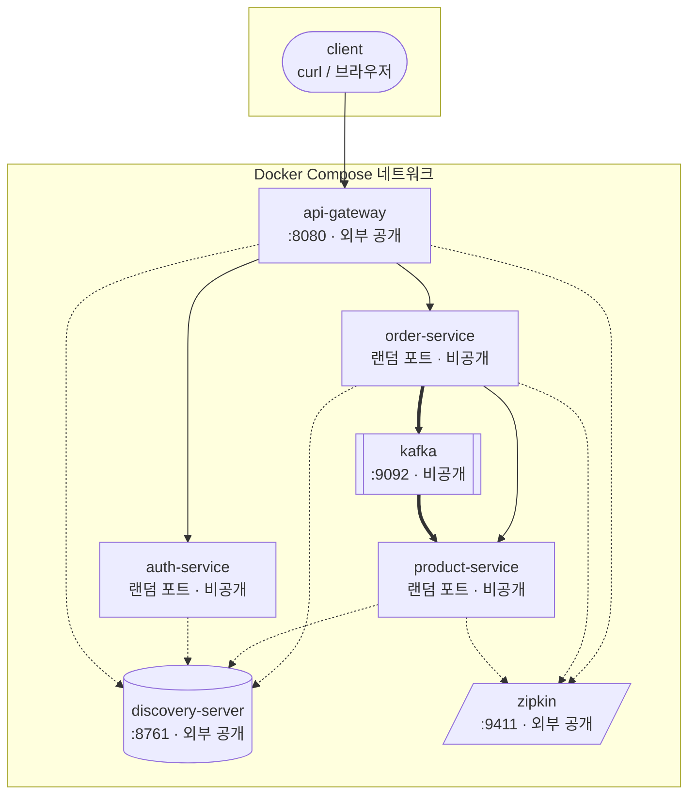

**외부에 열린 포트는 셋뿐입니다.** 8080(게이트웨이), 8761(Eureka 대시보드), 9411(Zipkin UI). auth-service, order-service, product-service는 호스트 포트를 갖지 않으므로 외부에서 직접 부를 방법이 없습니다. 게이트웨이를 우회할 수 없는 구조가 설정으로 강제되어 있습니다.

### 코드 지도

| 파일 | 역할 |
|---|---|
| `settings.gradle` | 5개 서브프로젝트 등록 |
| `build.gradle` | 공통 설정(Java 21, BOM, `jar` 태스크 비활성화) |
| `Dockerfile` | 5개 서비스가 공유하는 단일 이미지 정의 |
| `docker-compose.yml` | 컨테이너 구성, 기동 순서, 환경변수 주입 |
| `discovery-server/` | Eureka 서버. 클래스 1개가 전부 |
| `auth-service/` | 로그인과 JWT 발급 |
| `api-gateway/` | 라우팅 규칙(`application.yml`)이 본체 |
| `product-service/` | 상품 조회 + 재고 차감 컨슈머 |
| `order-service/` | 주문 생성 + Feign 호출 + 이벤트 발행 + 서킷 브레이커 |

---

## 2. 서비스 디스커버리 — 상대의 주소를 어떻게 아는가

### 문제

order-service가 product-service를 부르려면 주소가 필요합니다. 설정 파일에 `http://192.168.0.11:8081` 이라고 적으면 당장은 동작하지만, 다음 상황에서 전부 깨집니다.

- 컨테이너를 재시작해 IP가 바뀌었을 때
- 인스턴스를 2개로 늘렸을 때 (주소가 둘이 됨)
- 인스턴스 하나가 죽었을 때 (죽은 주소로 계속 보냄)

### 해법

주소를 **아무도 적지 않게** 만듭니다. 대신 서비스들이 자기 주소를 등록하는 전화번호부를 두고, 부르는 쪽은 **이름으로** 조회합니다.

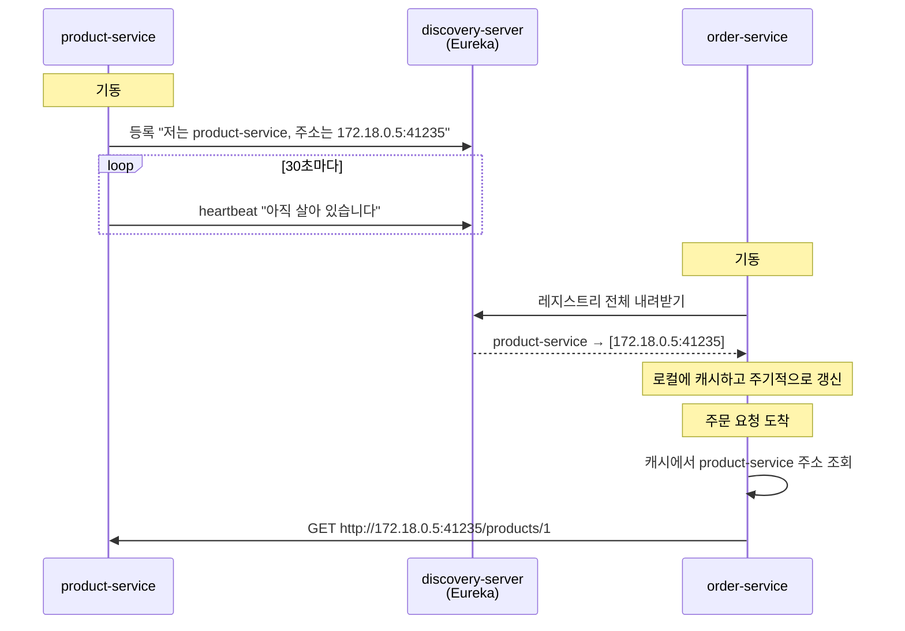

**핵심은 조회가 호출 시점에 원격으로 일어나지 않는다는 점입니다.** order-service는 레지스트리 사본을 로컬에 들고 주기적으로 갱신합니다. 덕분에 Eureka가 잠시 죽어도 이미 알고 있는 주소로는 계속 통신할 수 있습니다. 대신 **정보가 항상 조금 낡아 있습니다.** 인스턴스를 늘려도 즉시 반영되지 않는 이유가 이것입니다.

### 코드

`discovery-server/src/main/java/.../DiscoveryServerApplication.java` — 서버 쪽은 어노테이션 하나가 전부입니다.

```java
@EnableEurekaServer
@SpringBootApplication
public class DiscoveryServerApplication { ... }
```

`product-service/src/main/resources/application.yml` — 클라이언트 쪽은 등록할 주소만 알려줍니다.

```yaml
server:
  port: 0            # ← 주목

eureka:
  client:
    service-url:
      defaultZone: ${EUREKA_SERVER_URL:http://localhost:8761/eureka}
```

### 설계 장치: 포트를 0으로 둔 이유

`server.port: 0` 은 OS에게 빈 포트를 아무거나 달라는 뜻입니다. **포트를 미리 알 수 없으므로 하드코딩이 물리적으로 불가능해집니다.** 학습 프로젝트에서 "디스커버리를 쓰는 척하면서 실제로는 주소를 알고 있는" 상태를 막기 위한 장치입니다.

이 선택은 나중에 인스턴스를 여러 개 띄울 때도 값을 합니다(4절).

### 직접 확인

```bash
curl -s -H 'Accept: application/json' http://localhost:8761/eureka/apps \
  | grep -o '"name":"[A-Z-]*"' | sort -u
```

---

## 3. API Gateway — 클라이언트가 알아야 할 주소를 하나로

### 문제

서비스가 여러 개면 클라이언트는 그 주소를 전부 알아야 합니다. 서비스를 쪼갤 때마다 클라이언트(웹, 앱)를 함께 고쳐야 한다면, 서비스를 나눈 이점이 사라집니다.

### 해법

외부에 하나의 주소만 노출하고, 경로에 따라 내부로 넘깁니다.

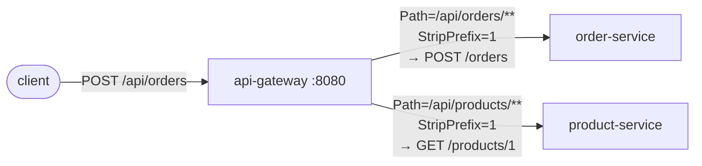

### 코드

`api-gateway/src/main/resources/application.yml` — 자바 코드는 한 줄도 없습니다. 라우팅은 설정입니다.

```yaml
spring:
  cloud:
    gateway:
      server:
        webflux:
          routes:
            - id: order-service
              uri: lb://order-service      # ← IP 가 아니라 이름
              predicates:
                - Path=/api/orders/**
              filters:
                - StripPrefix=1            # /api 를 떼고 전달
```

**`lb://` 는 "Eureka에서 이 이름으로 등록된 인스턴스를 찾아 부하를 나눠 보내라"는 뜻입니다.** `http://` 였다면 그냥 그 주소로 보냈을 것입니다. 이 두 글자가 디스커버리와 로드밸런싱을 동시에 켭니다.

> **버전 주의**: Spring Cloud 2025.0.0부터 설정 키가 `spring.cloud.gateway.routes` 에서 `spring.cloud.gateway.server.webflux.routes` 로 이동했고, 의존성 이름도 `spring-cloud-starter-gateway` 에서 `spring-cloud-starter-gateway-server-webflux` 로 바뀌었습니다. 검색되는 자료 대부분이 옛 이름 기준이므로 그대로 따라 하면 라우팅이 잡히지 않습니다.

---

## 4. 클라이언트 사이드 로드밸런싱 — 여러 개면 누가 나누는가

### 문제

`product-service` 인스턴스가 2개일 때 요청을 누가 나눠 보내는가?

### 해법: 중앙 장비가 없다

전통적인 구조는 앞단에 로드밸런서 장비를 두고 모든 요청을 통과시킵니다. 이 프로젝트는 다릅니다. **호출하는 쪽이 인스턴스 목록을 받아 스스로 고릅니다.**

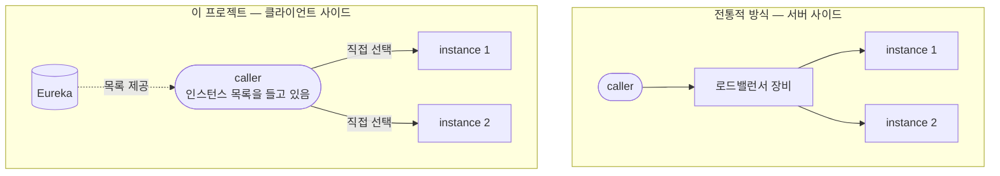

결과적으로 **게이트웨이 경로와 Feign 경로가 각각 따로 부하를 나눕니다.** 중앙에 병목이 될 장비가 없다는 것이 장점이고, 모든 호출자가 로드밸런싱 로직을 품어야 한다는 것이 대가입니다.

### 직접 확인

```bash
docker compose up -d --scale product-service=2
for i in $(seq 1 10); do curl -s -o /dev/null http://localhost:8080/api/products/1; done
docker compose logs product-service | grep "상품 조회 요청" | sed 's/ *|.*//' | sort | uniq -c
```

실측 결과 (총 17회):

```
   8 product-service-1
   9 product-service-2
```

### 여기서 `server.port: 0` 이 다시 값을 합니다

호스트 포트를 고정했다면 두 번째 컨테이너가 같은 포트를 잡지 못해 `--scale` 자체가 실패합니다. 2절의 선택이 이 절을 가능하게 만들었습니다.

### 반영이 즉시가 아닌 이유

인스턴스를 늘려도 수십 초 동안은 새 인스턴스로 요청이 가지 않을 수 있습니다. 지연이 두 겹이기 때문입니다.

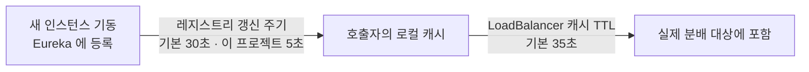

이 지연은 버그가 아니라, 매 호출마다 원격 조회를 하지 않기 위해 치르는 대가입니다.

---

## 5. 동기 통신 — OpenFeign

### 문제

order-service가 총액을 계산하려면 가격이 필요한데, 가격은 product-service만 알고 있습니다.

### 해법

인터페이스를 선언하면 HTTP 클라이언트 구현체가 생성됩니다.

### 코드

`order-service/src/main/java/.../ProductClient.java`

```java
@FeignClient(name = "product-service", fallbackFactory = ProductClientFallback.class)
public interface ProductClient {

    @GetMapping("/products/{id}")
    ProductResponse findById(@PathVariable("id") Long id);

    record ProductResponse(Long id, String name, BigDecimal price, int stock) {}
}
```

**IP도 포트도 등장하지 않습니다.** `name = "product-service"` 는 Eureka에 등록된 이름이며, 실제 주소는 호출 시점에 채워집니다.

### 설계 결정: 공통 모듈을 두지 않는다

`ProductResponse` 는 product-service의 `Product` 와 필드가 겹칩니다. 공통 모듈로 묶으면 중복이 사라지지만, 그 순간 두 서비스는 **함께 배포해야 하는 하나의 덩어리**가 됩니다. product-service가 필드 하나를 바꾸면 order-service도 다시 빌드해야 합니다.

이 프로젝트는 중복을 택했습니다. **중복은 독립 배포를 얻기 위해 지불하는 의도된 비용입니다.**

또한 수신측은 필요한 필드만 선언해도 됩니다. 두 서비스가 합의한 것은 자바 클래스가 아니라 **JSON 필드 이름**이기 때문입니다.

---

## 6. 비동기 통신 — Kafka

### 문제

주문이 생기면 재고도 줄어야 합니다. 이것도 동기로 호출하면 될까요?

동기로 하면 **재고 차감이 실패할 때 주문도 실패합니다.** 그런데 사용자 입장에서 주문은 이미 성립했습니다. 재고 반영은 몇 초 늦어도 문제가 없습니다.

### 판단 기준

`OrderController.create()` 안에 성격이 다른 두 통신이 나란히 있습니다.

| | 가격 조회 | 재고 차감 |
|---|---|---|
| 방식 | 동기 (OpenFeign) | 비동기 (Kafka) |
| 판단 | **응답에 그 값이 필요한가?** → 필요 | → 불필요 |
| 대가 | 상대가 죽으면 함께 실패 | 즉시 반영되지 않음 |

**"응답에 그 답이 필요한가"** 하나로 갈립니다.

### 흐름

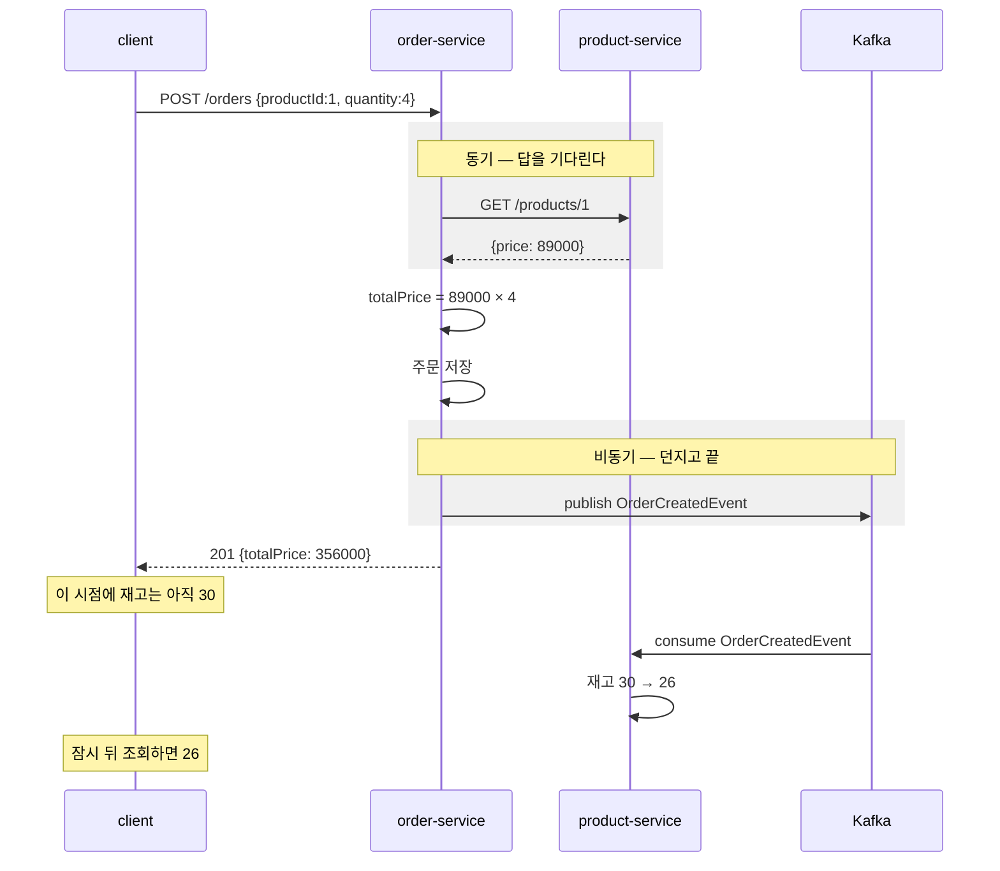

응답과 재고 반영 사이에 **틈**이 있습니다. 이를 결과적 일관성(eventual consistency)이라고 합니다. 버그가 아니라 비동기를 택한 대가입니다.

### 코드

발행 — `order-service/src/main/java/.../OrderController.java`

```java
Order order = repository.save(new Order(product.id(), request.quantity(), totalPrice));

kafkaTemplate.send(OrderCreatedEvent.TOPIC,
        new OrderCreatedEvent(order.getId(), order.getProductId(), order.getQuantity()));
return order;
```

구독 — `product-service/src/main/java/.../OrderCreatedListener.java`

```java
@KafkaListener(topics = OrderCreatedEvent.TOPIC, groupId = "product-service")
void handle(OrderCreatedEvent event) { ... }
```

### 설계 결정: 이름이 `DecreaseStockCommand`가 아닌 이유

order-service는 "재고를 깎아라"라고 **지시하지 않습니다.** "주문이 생겼다"는 **사실만** 알립니다.

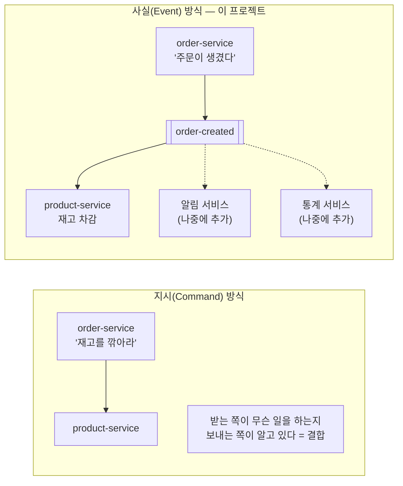

사실로 알리면 나중에 알림 서비스나 통계 서비스가 같은 이벤트를 구독해도 **order-service는 손댈 필요가 없습니다.**

### Kafka는 메시지 큐가 아니라 로그입니다

일반적인 큐는 소비하면 메시지가 사라집니다. Kafka는 읽어도 남아 있고, 각 컨슈머 그룹이 "어디까지 읽었는지"(오프셋)를 따로 기록합니다.

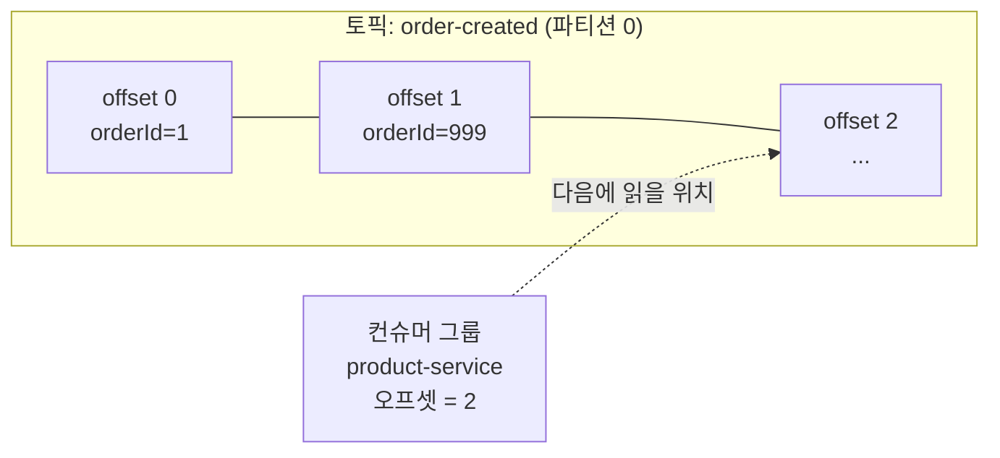

이 성질 덕분에 **구독자가 죽어 있어도 이벤트는 유실되지 않습니다.**

### 직접 확인: 죽은 동안 쌓였다가 처리되는가

```bash
docker compose stop product-service

# 구독자가 없어도 브로커에는 쌓인다
echo '{"orderId":999,"productId":1,"quantity":5}' | \
  docker compose exec -T kafka /opt/kafka/bin/kafka-console-producer.sh \
  --bootstrap-server localhost:9092 --topic order-created

docker compose start product-service
docker compose logs product-service | grep "재고 차감"
```

실측 결과:

```
재고 차감: 주문수량=4, 남은재고=26 (orderId=1)     ← 중지 전에 처리됨
재고 차감: 주문수량=5, 남은재고=25 (orderId=999)   ← 재기동 후 처리됨
```

여기서 두 가지를 더 읽을 수 있습니다.

- **`orderId=1` 은 재처리되지 않았습니다.** 오프셋이 커밋되어 있어 그 다음부터 이어 읽습니다. `auto-offset-reset: earliest` 는 그룹이 **처음 만들어질 때만** 적용됩니다.
- **남은 재고가 21이 아니라 25입니다.** 컨테이너 재시작으로 H2 인메모리 DB가 초기값(30)으로 돌아갔기 때문입니다. **메시지의 내구성과 서비스 상태의 내구성은 별개 문제**라는 것을 보여줍니다.

---

## 7. 분산 추적 — 어디서 느려졌는가

### 문제

모놀리식에서는 느린 요청 하나를 스택 트레이스로 추적할 수 있었습니다. 이제 하나의 요청이 4개 프로세스를 거치므로, 각 서비스 로그를 열어 시각을 대조해야 합니다.

### 해법

요청 하나에 **trace id**를 부여하고, 서비스 경계를 넘을 때 함께 전달합니다.

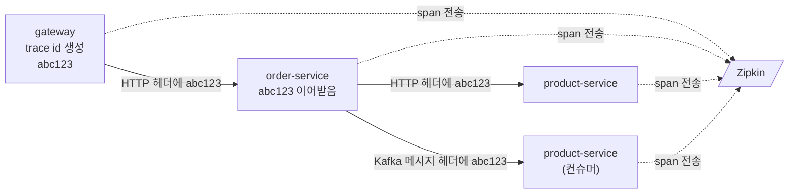

**추적의 본질은 "기록을 남기는 일"이 아니라 "경계 너머로 id를 전달하는 일"입니다.** 이 프로젝트에서 그 전달을 담당하는 것이 다음 둘입니다.

| 설정 | 없으면 끊기는 구간 |
|---|---|
| `feign-micrometer` 의존성 | order → product (Feign 호출) |
| `spring.kafka.*.observation-enabled` | order → product (Kafka 이벤트) |

이 둘이 없으면 각 서비스가 자기 span은 남기지만 **서로 연결되지 않아 별개 요청으로 보입니다.**

### 실측 결과

주문 생성 1건이 만든 trace입니다.

```
[api-gateway]        SERVER    http post                      41.9ms
  [api-gateway]      CLIENT    http post                      34.8ms
    [order-service]  SERVER    http post /orders              31.0ms
      [order-service]          circuit-breaker                15.4ms
        [order-service] CLIENT http get                       13.4ms
          [product-service] SERVER http get /products/{id}     5.7ms
      [order-service] PRODUCER order-created send             13.4ms
        [product-service] CONSUMER order-created receive       4.5ms
```

**Kafka를 건너간 구간까지 같은 trace에 들어옵니다.** 비동기 이벤트는 응답을 기다리지 않으므로 호출 스택으로는 절대 이어질 수 없는데, 메시지 헤더에 실린 trace id 덕분에 인과 관계가 보존됩니다.

로그에도 같은 id가 찍히므로, Zipkin에서 느린 요청을 찾은 뒤 그 id로 각 서비스 로그를 검색할 수 있습니다.

```
WARN [order-service] [o-auto-1-exec-1] [6a72e4d5...-8c77ff1a...] ...
                                        └ trace id ─┘ └ span id ┘
```

---

## 8. 서킷 브레이커 — 상대의 장애가 나에게 번지는 것을 막는다

### 문제

product-service가 죽으면 주문도 실패합니다. 문제는 실패한다는 사실이 아니라 **느리게 실패한다**는 점입니다.

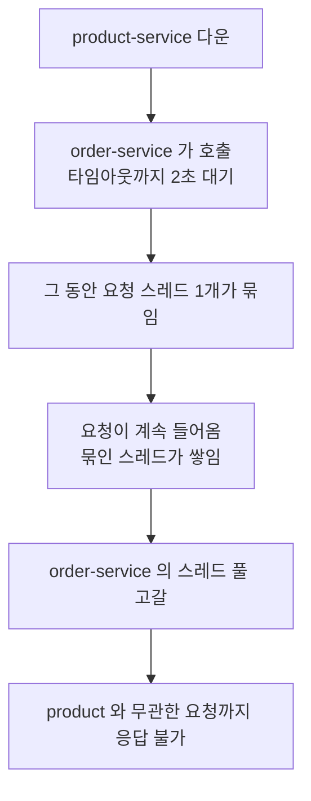

상대 하나가 죽었을 뿐인데 우리까지 함께 죽습니다. 이를 장애 전파(cascading failure)라고 합니다.

### 해법

두꺼비집처럼, 실패가 일정 비율을 넘으면 회로를 열어 **호출을 시도조차 하지 않습니다.**

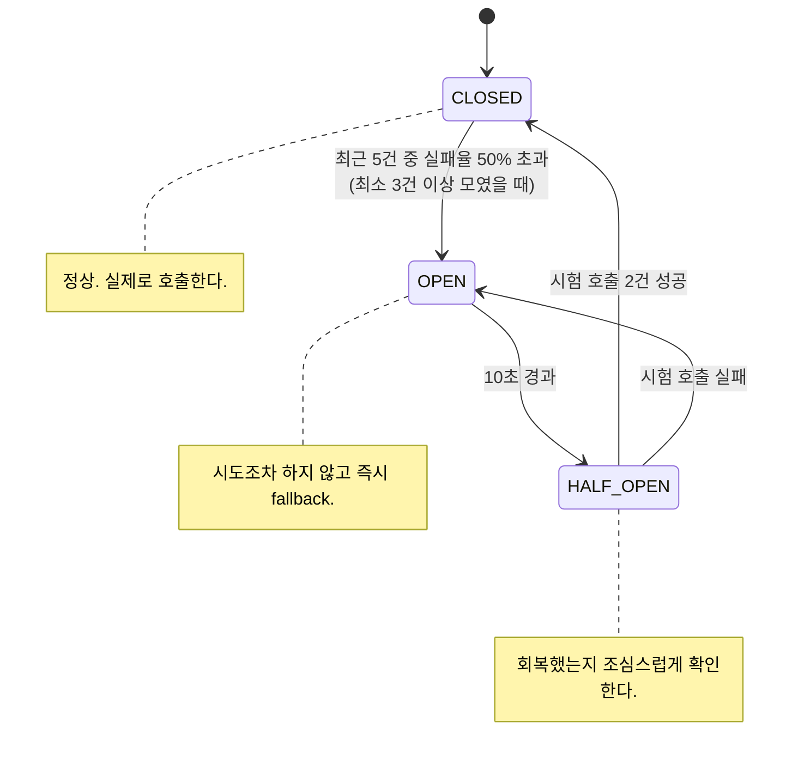

### 코드

`order-service/src/main/java/.../ResilienceConfig.java` 에 임계값이, `ProductClientFallback.java` 에 열렸을 때의 동작이 있습니다.

### 실측 결과

```bash
docker compose stop product-service
# 주문을 연달아 시도하며 소요 시간 측정
```

| 시점 | 응답 | 소요 시간 | fallback이 받은 원인 |
|---|---|---|---|
| 정상 | 201 | 0.53s | — |
| 중지 직후 (CLOSED) | 503 | **2.03s** | `TimeoutException` — 실제로 시도했다 실패 |
| 회로 OPEN 이후 | 503 | **0.015s** | `CallNotPermittedException` — 시도조차 안 함 |

**약 135배 빨라졌습니다.** 응답 코드는 똑같이 실패지만, 스레드를 2초씩 붙잡지 않는다는 것이 차이입니다.

### 설계 결정: fallback이 가짜 가격을 만들지 않는 이유

**모든 호출에 의미 있는 대체값이 있는 것은 아닙니다.**

| 호출 | 좋은 fallback |
|---|---|
| 추천 상품 목록 | 빈 목록. 화면은 그려진다 |
| 최근 본 상품 | 빈 목록 |
| **주문할 상품의 가격** | **없음.** 0원으로 주문받으면 잘못된 데이터가 DB에 영구히 남는다 |

그래서 이 프로젝트의 fallback은 대체값을 만들지 않고 503으로 거절합니다. **서킷 브레이커의 가치는 "그럴듯한 가짜 응답"이 아니라 "빠르고 정직한 실패"에 있습니다.**

### 함정: 타임아웃이 두 겹입니다

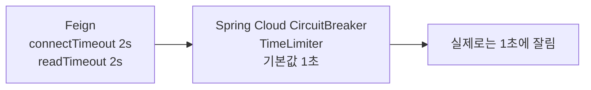

`TimeLimiter` 를 명시하지 않으면 기본값 1초가 조용히 적용되어, Feign에 설정한 값이 무시됩니다. 이 프로젝트는 두 값을 2초로 맞춰 두었습니다.

---

## 9. 인증·인가 — 세션 없이 로그인 상태를 다루기

### 문제

모놀리식에서는 로그인하면 서버가 세션을 만들고 쿠키로 세션 id를 돌려줍니다. 이후 요청은 그 id로 "누구인가"를 알 수 있습니다. 서버가 상태를 들고 있기 때문입니다.

서비스가 5개면 어떻게 될까요? 각 서비스가 그 세션을 알아야 합니다. 세션 저장소를 공유하면 그 저장소가 단일 장애점이 되고, 서비스 사이에 새로운 결합이 생깁니다.

### 해법: 상태를 토큰 안에 넣는다

JWT(JSON Web Token)는 사용자 정보를 담고 **서명**이 붙은 문자열입니다. 서버가 아무것도 기억하지 않아도, 서명만 검증하면 내용을 믿을 수 있습니다.

```
헤더.페이로드.서명

eyJhbGciOiJIUzI1NiJ9 . eyJzdWIiOiJ1c2VyIiwidWlkIjoxLCJyb2xlcyI6WyJST0xFX1VTRVIiXX0 . 5nQ...
   알고리즘              담긴 내용(누구나 읽을 수 있음)              위조 방지용 서명
```

**공유해야 하는 것이 세션 저장소가 아니라 열쇠 하나로 줄어듭니다.**

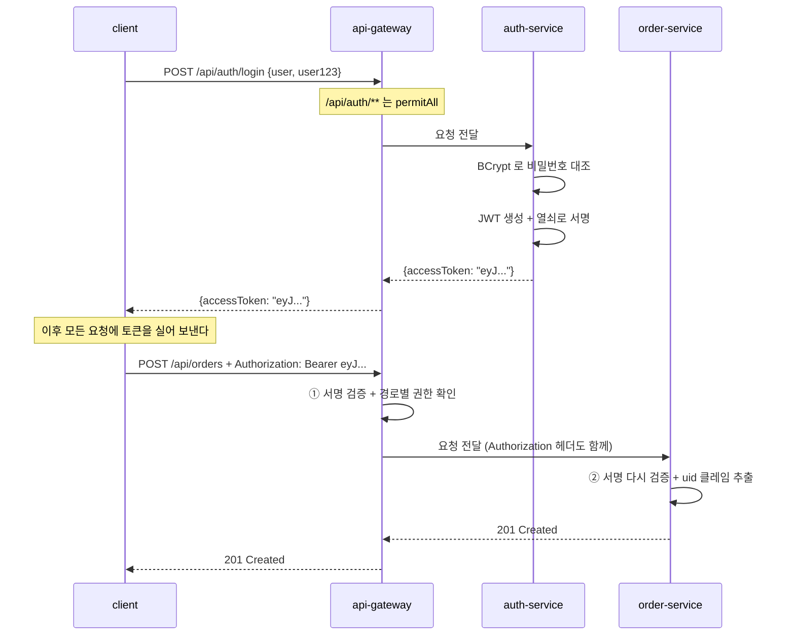

### 코드

| 파일 | 역할 |
|---|---|
| `auth-service/.../AuthController.java` | 로그인. 실패 사유를 구분해 알려주지 않는다 |
| `auth-service/.../JwtIssuer.java` | 클레임 구성과 서명 |
| `auth-service/.../SecurityConfig.java` | BCrypt 인코더, `JwtEncoder` |
| `api-gateway/.../SecurityConfig.java` | 리액티브 검증(첫 검문) |
| `order-service/.../SecurityConfig.java` | 서블릿 검증(재검증) |
| `product-service/.../SecurityConfig.java` | 서블릿 검증 + ADMIN 규칙 |

`jjwt` 같은 외부 라이브러리를 쓰지 않았습니다. 스프링 시큐리티에 이미 `NimbusJwtEncoder`/`NimbusJwtDecoder`가 들어 있어, 발급도 검증도 표준 스택 안에서 끝납니다.

### 비밀번호는 해시로만 저장합니다

```java
repository.save(new AppUser("user", encoder.encode("user123"), "ROLE_USER"));
```

BCrypt는 같은 비밀번호라도 매번 다른 salt를 섞으므로 해시값이 매번 달라지고, **의도적으로 느리게** 설계되어 있어 대량 대입 공격에 시간 비용을 강제합니다. 저장된 값은 `$2a$`로 시작하는 해시이며 원문으로 되돌릴 수 없습니다.

### 왜 두 번 검증하는가


게이트웨이는 첫 검문일 뿐입니다. **검증은 데이터를 실제로 가지고 있는 쪽에서 해야 합니다.** 이 원칙을 zero trust라고 합니다.

### 인증 한 번, 인가 두 층

여기가 이 절에서 가장 중요한 부분입니다. 관문이 셋인데, 앞의 하나가 **인증**이고 뒤의 둘이 **인가**입니다.

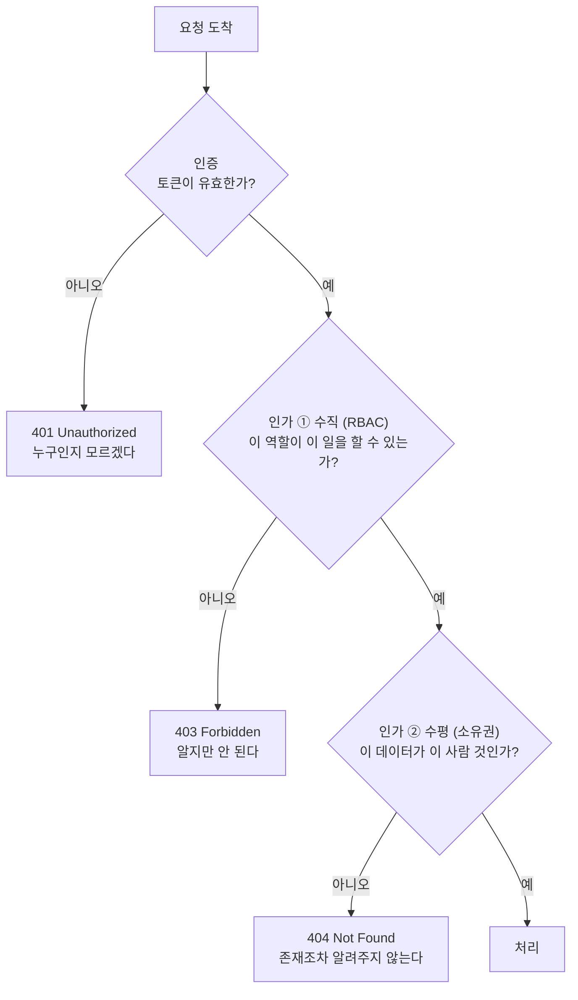

**수직까지만 하고 수평을 빠뜨리는 것이 매우 흔한 실수입니다.** 역할 검사는 "무엇을 할 수 있는가"만 봅니다. "누구의 데이터인가"는 전혀 보지 않습니다.

> 위 흐름은 `GET /orders/{id}` 처럼 **특정 자원 하나**를 지목하는 요청 기준입니다. `GET /orders` 같은 목록 조회에는 거절할 대상이 없으므로 404가 나지 않고, 애초에 본인 것만 담아 돌려주는 방식으로 같은 원칙을 지킵니다.

Phase 6 이전의 이 프로젝트가 정확히 그 상태였습니다. `GET /orders`가 모든 사람의 주문을 반환했습니다. 이런 결함을 IDOR(Insecure Direct Object Reference)라고 합니다.

해결은 조회 단계에서부터 사용자를 조건에 넣는 것입니다.

```java
// 위험: 전부 가져온 뒤 자바 코드에서 거른다 → 거르는 코드를 빠뜨리면 전체 노출
repository.findAll();

// 안전: 조회 자체에 사용자가 들어간다
repository.findByUserId(userIdOf(jwt));
```

**사용자 id를 요청 파라미터로 받지 않는 것**도 핵심입니다. `?userId=2`로 받으면 그 값을 바꿔 남의 데이터를 볼 수 있습니다. 반드시 서명이 검증된 토큰에서 꺼내야 합니다.

### 직접 확인

```bash
login() { curl -s -X POST http://localhost:8080/api/auth/login \
  -H 'Content-Type: application/json' \
  -d "{\"username\":\"$1\",\"password\":\"$2\"}" | jq -r .accessToken; }

USER_T=$(login user user123)
ADMIN_T=$(login admin admin123)
```

실측 결과입니다.

| 요청 | 토큰 없음 | USER | ADMIN |
|---|---|---|---|
| `GET /api/products/1` | 200 | 200 | 200 |
| `POST /api/orders` | 401 | 201 | 201 |
| `POST /api/products` | 401 | **403** | 201 |

수평적 인가:

```
user  의 목록 → [id 1,2,3,4]  (userId=1)
admin 의 목록 → [id 5]         (userId=2)  ← ADMIN 이어도 남의 주문은 안 보인다
admin 이 /api/orders/1 조회 → 404
```

**ADMIN이라도 남의 주문은 보이지 않습니다.** 관리자 권한은 "상품을 등록할 수 있다"이지 "모든 주문을 볼 수 있다"가 아닙니다.

**남의 주문 조회가 403이 아니라 404인 이유**는 403이 "그 주문은 존재하지만 네 것이 아니다"라는 정보를 흘리기 때문입니다.

### 위조 시도

```bash
# 페이로드의 roles 를 ROLE_ADMIN 으로 바꾸고 서명은 원본 그대로 붙인다
```

```
페이로드를 ROLE_ADMIN 으로 위조  → 401
서명부를 다른 값으로 교체        → 401
```

서명은 **헤더와 페이로드 전체**에 대해 계산되므로, 내용을 한 글자라도 바꾸면 서명이 맞지 않게 됩니다. 열쇠를 모르면 올바른 서명을 새로 만들 수도 없습니다.

> **JWT는 서명될 뿐 암호화되지 않습니다.** 페이로드는 누구나 base64 디코딩으로 열어볼 수 있습니다. 변조는 막지만 열람은 막지 못하므로, 비밀번호나 개인정보를 클레임에 담아서는 안 됩니다.

### 의도적으로 남긴 한계

| 항목 | 현재 | 실무에서는 |
|---|---|---|
| 열쇠 관리 | 저장소에 기본값이 있음 | Secrets Manager / Vault. **저장소에 올라간 열쇠는 이미 유출된 열쇠** |
| 서명 알고리즘 | HS256 (대칭키) | RS256 (비대칭키) |
| 토큰 만료 | 1시간, 갱신 없음 | 짧은 액세스 토큰 + 리프레시 토큰 |
| 로그아웃 | 없음 | 블랙리스트 또는 짧은 만료 |
| Kafka 이벤트 | 인증 정보 없음 | 발행 주체를 남기고 컨슈머가 검증 |

**대칭키(HS256)의 한계는 특히 짚어둘 만합니다.** 서명과 검증에 같은 열쇠를 쓰므로, 검증만 하면 되는 product-service도 **토큰을 발급할 수 있는 열쇠**를 갖게 됩니다. 서비스 하나가 뚫리면 공격자가 임의의 ADMIN 토큰을 만들어 낼 수 있다는 뜻입니다. 비대칭키(RS256)를 쓰면 auth-service만 개인키로 서명하고 나머지는 공개키로 검증만 하게 되어 이 문제가 사라집니다.

---

## 10. 한 요청의 전 생애

지금까지의 조각을 하나로 잇습니다. `POST /api/orders` 한 번에 벌어지는 일 전부입니다.

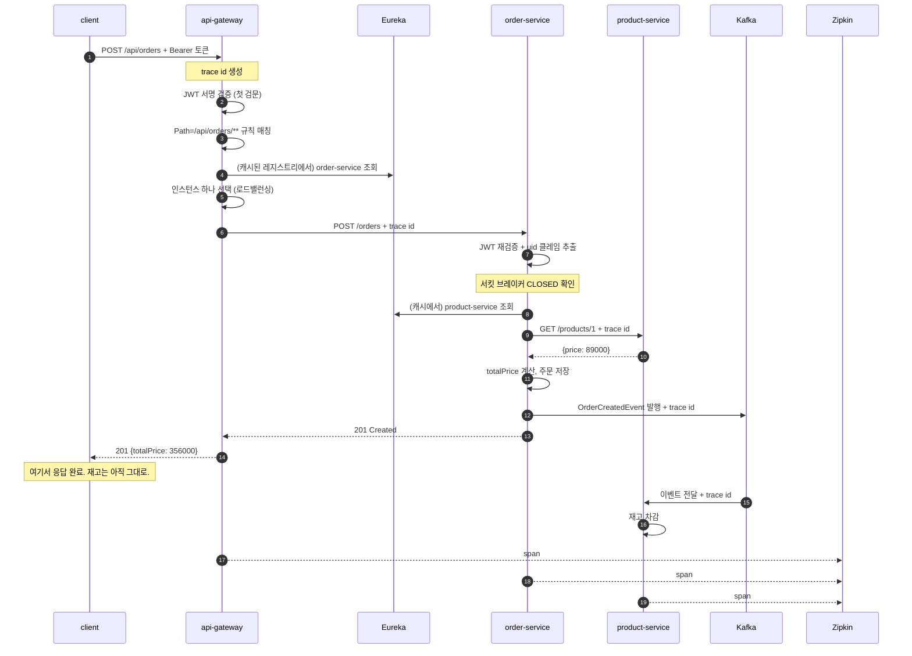

**14번에서 클라이언트는 이미 응답을 받았고, 재고 차감(15~16번)은 그 뒤에 일어납니다.** 동기와 비동기의 경계가 이 지점입니다. 17~19번의 span 전송도 응답 이후이므로, 추적을 켠다고 해서 사용자가 기다리는 시간이 늘지는 않습니다.

---

## 11. 이 프로젝트가 다루지 않은 것

학습 범위를 좁히기 위해 의도적으로 제외한 것들입니다. 실무로 넘어갈 때 이어서 볼 주제입니다.

| 주제 | 왜 제외했는가 | 언제 필요한가 |
|---|---|---|
| 중앙 설정 관리 (Config Server) | 서비스 4개는 각자 관리해도 부담이 없음 | 설정 변경을 재배포 없이 반영해야 할 때 |
| 영속 DB | 인메모리 H2로 기동 속도를 택함 | 재시작에도 데이터가 남아야 할 때 |
| DLQ / 보상 트랜잭션 | 재고 부족 이벤트를 로그만 남기고 버림 | 실패한 이벤트를 반드시 처리해야 할 때 |
| 분산 트랜잭션 (Saga) | 재고 차감 실패 시 주문을 되돌리지 않음 | 여러 서비스에 걸친 정합성이 필요할 때 |
| Kubernetes | Compose로 개념 이해가 충분함 | 실제 운영 배포 |
| 메트릭·알림 (Prometheus) | 추적만으로 흐름 이해는 가능 | 운영 중 이상 징후를 감지해야 할 때 |

### 이 프로젝트를 관통하는 한 가지

각 절의 "대가" 칸을 모아 보면 하나의 문장이 됩니다.

> **MSA의 구성 요소는 대부분 "나누었기 때문에 생긴 문제"를 되돌리기 위해 존재합니다.**

모놀리식에서 공짜였던 것(주소를 안다, 즉시 응답한다, 한 트랜잭션에 묶인다)을 되찾기 위해 Eureka와 Gateway와 Kafka와 Zipkin과 Resilience4j를 각각 도입했습니다. 나누는 데는 비용이 따르며, **그 비용을 감당할 만큼 독립 배포가 필요한가**가 MSA 도입의 실제 판단 기준입니다.
