# MSA 학습 노트 — 코드로 읽는 마이크로서비스 인프라

이 문서는 이 저장소의 코드를 따라가며 **MSA 인프라 구성 요소가 각각 어떤 문제를 풀기 위해 존재하는지**를 정리한 학습 노트입니다.

README가 "무엇을 어떻게 실행하는가"를 다룬다면, 이 문서는 "왜 이 조각이 필요한가"를 다룹니다. 각 절은 다음 순서로 구성됩니다.

1. **문제** — 서비스를 나누었기 때문에 새로 생긴 문제
2. **해법** — 그 문제를 푸는 구성 요소
3. **코드** — 이 저장소의 어느 파일에 있는지
4. **다이어그램** — 실제로 무슨 일이 벌어지는지
5. **직접 확인** — 눈으로 확인하는 방법

---

## 0. 출발점: 왜 나누면 문제가 생기는가

하나의 애플리케이션 안에서는 다른 기능을 부르는 일이 **메서드 호출**입니다.

```java
BigDecimal price = productService.findById(1L).getPrice();
```

이 한 줄에는 공짜로 딸려오는 것이 많습니다. 상대는 반드시 존재하고, 즉시 응답하며, 실패하면 같은 스택 트레이스에 남고, 같은 트랜잭션 안에서 함께 롤백됩니다.

서비스를 프로세스 단위로 나누는 순간 이 전제가 전부 사라집니다. 그리고 사라진 전제 하나하나가 이 프로젝트의 구성 요소 하나하나에 대응합니다.

| 모놀리식에서 공짜였던 것 | 나눈 뒤 생긴 질문 | 이 프로젝트의 답 |
|---|---|---|
| 상대가 어디 있는지 안다 | 상대 주소를 어떻게 아는가 | 서비스 디스커버리 (Eureka) |
| 진입점이 하나다 | 클라이언트가 서비스마다 다른 주소를 알아야 하는가 | API Gateway |
| 상대는 하나뿐이다 | 여러 개면 누구에게 보내는가 | 클라이언트 사이드 로드밸런싱 |
| 호출은 그냥 성공한다 | 상대가 죽어 있으면 어떻게 되는가 | 서킷 브레이커 (Resilience4j) |
| 실패는 한 스택에 남는다 | 어디서 느려졌는지 어떻게 아는가 | 분산 추적 (Zipkin) |
| 모든 일이 즉시 끝난다 | 지금 당장 안 해도 되는 일은 | 비동기 이벤트 (Kafka) |
| 세션 하나로 로그인 상태를 안다 | 서비스마다 세션을 공유해야 하는가 | JWT 인증·인가 (Spring Security) |
| 실패하면 트랜잭션이 함께 롤백된다 | DB 가 나뉘어 롤백할 수 없으면 | Saga 보상 트랜잭션 |

> 이 표가 이 문서의 목차입니다.

---

## 1. 전체 지도

`docker compose up` 으로 뜨는 컨테이너 전체 구성입니다.

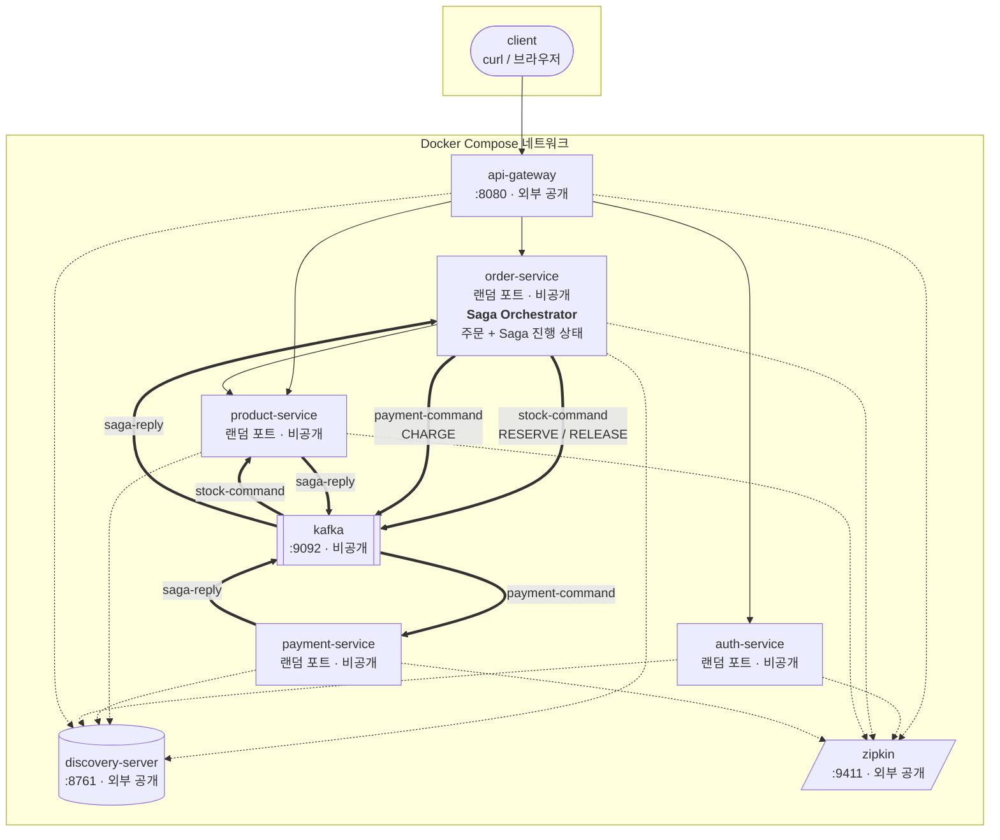

**외부에 열린 포트는 셋뿐입니다.** 8080(게이트웨이), 8761(Eureka 대시보드), 9411(Zipkin UI). auth-service, order-service, product-service, payment-service는 호스트 포트를 갖지 않으므로 외부에서 직접 부를 방법이 없습니다. 게이트웨이를 우회할 수 없는 구조가 설정으로 강제되어 있습니다.

Kafka를 오가는 굵은 화살표가 전부 order-service를 거치는 것이 이 구성의 특징입니다. **두 명령이 동시에 나가는 것은 아닙니다.** 재고 응답을 받은 뒤에야 결제 명령이 나갑니다. 이 그림은 무엇이 무엇과 통신하는지만 보여 주며, 순서와 그 이유는 11절에서 다룹니다.

### 코드 지도

| 파일 | 역할 |
|---|---|
| `settings.gradle` | 6개 서브프로젝트 등록 |
| `build.gradle` | 공통 설정(Java 21, BOM, `jar` 태스크 비활성화) |
| `Dockerfile` | 모든 서비스가 공유하는 단일 이미지 정의 |
| `docker-compose.yml` | 컨테이너 구성, 기동 순서, 환경변수 주입 |
| `discovery-server/` | Eureka 서버. 클래스 1개가 전부 |
| `auth-service/` | 로그인과 JWT 발급 |
| `api-gateway/` | 라우팅 규칙(`application.yml`)이 본체 |
| `product-service/` | 상품 조회·등록 + 재고 확보·복구 명령 처리 |
| `payment-service/` | 결제 명령 처리. HTTP 엔드포인트가 없다 |
| `order-service/` | 주문 생성 + Feign 호출 + 서킷 브레이커 + **Saga 오케스트레이션** |

---

## 2. 서비스 디스커버리 — 상대의 주소를 어떻게 아는가

### 문제

order-service가 product-service를 부르려면 주소가 필요합니다. 설정 파일에 `http://192.168.0.11:8081` 이라고 적으면 당장은 동작하지만, 다음 상황에서 전부 깨집니다.

- 컨테이너를 재시작해 IP가 바뀌었을 때
- 인스턴스를 2개로 늘렸을 때 (주소가 둘이 됨)
- 인스턴스 하나가 죽었을 때 (죽은 주소로 계속 보냄)

### 해법

주소를 **아무도 적지 않게** 만듭니다. 대신 서비스들이 자기 주소를 등록하는 전화번호부를 두고, 부르는 쪽은 **이름으로** 조회합니다.

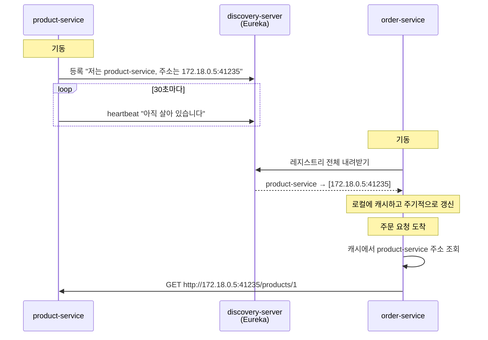

**핵심은 조회가 호출 시점에 원격으로 일어나지 않는다는 점입니다.** order-service는 레지스트리 사본을 로컬에 들고 주기적으로 갱신합니다. 덕분에 Eureka가 잠시 죽어도 이미 알고 있는 주소로는 계속 통신할 수 있습니다. 대신 **정보가 항상 조금 낡아 있습니다.** 인스턴스를 늘려도 즉시 반영되지 않는 이유가 이것입니다.

### 코드

`discovery-server/src/main/java/.../DiscoveryServerApplication.java` — 서버 쪽은 어노테이션 하나가 전부입니다.

```java
@EnableEurekaServer
@SpringBootApplication
public class DiscoveryServerApplication { ... }
```

`product-service/src/main/resources/application.yml` — 클라이언트 쪽은 등록할 주소만 알려줍니다.

```yaml
server:
  port: 0            # ← 주목

eureka:
  client:
    service-url:
      defaultZone: ${EUREKA_SERVER_URL:http://localhost:8761/eureka}
```

### 설계 장치: 포트를 0으로 둔 이유

`server.port: 0` 은 OS에게 빈 포트를 아무거나 달라는 뜻입니다. **포트를 미리 알 수 없으므로 하드코딩이 물리적으로 불가능해집니다.** 학습 프로젝트에서 "디스커버리를 쓰는 척하면서 실제로는 주소를 알고 있는" 상태를 막기 위한 장치입니다.

이 선택은 나중에 인스턴스를 여러 개 띄울 때도 값을 합니다(4절).

### 직접 확인

```bash
curl -s -H 'Accept: application/json' http://localhost:8761/eureka/apps \
  | grep -o '"name":"[A-Z-]*"' | sort -u
```

---

## 3. API Gateway — 클라이언트가 알아야 할 주소를 하나로

### 문제

서비스가 여러 개면 클라이언트는 그 주소를 전부 알아야 합니다. 서비스를 쪼갤 때마다 클라이언트(웹, 앱)를 함께 고쳐야 한다면, 서비스를 나눈 이점이 사라집니다.

### 해법

외부에 하나의 주소만 노출하고, 경로에 따라 내부로 넘깁니다.


### 코드

`api-gateway/src/main/resources/application.yml` — 자바 코드는 한 줄도 없습니다. 라우팅은 설정입니다.

```yaml
spring:
  cloud:
    gateway:
      server:
        webflux:
          routes:
            - id: order-service
              uri: lb://order-service      # ← IP 가 아니라 이름
              predicates:
                - Path=/api/orders/**
              filters:
                - StripPrefix=1            # /api 를 떼고 전달
```

**`lb://` 는 "Eureka에서 이 이름으로 등록된 인스턴스를 찾아 부하를 나눠 보내라"는 뜻입니다.** `http://` 였다면 그냥 그 주소로 보냈을 것입니다. 이 두 글자가 디스커버리와 로드밸런싱을 동시에 켭니다.

> **버전 주의**: Spring Cloud 2025.0.0부터 설정 키가 `spring.cloud.gateway.routes` 에서 `spring.cloud.gateway.server.webflux.routes` 로 이동했고, 의존성 이름도 `spring-cloud-starter-gateway` 에서 `spring-cloud-starter-gateway-server-webflux` 로 바뀌었습니다. 검색되는 자료 대부분이 옛 이름 기준이므로 그대로 따라 하면 라우팅이 잡히지 않습니다.

---

## 4. 클라이언트 사이드 로드밸런싱 — 여러 개면 누가 나누는가

### 문제

`product-service` 인스턴스가 2개일 때 요청을 누가 나눠 보내는가?

### 해법: 중앙 장비가 없다

전통적인 구조는 앞단에 로드밸런서 장비를 두고 모든 요청을 통과시킵니다. 이 프로젝트는 다릅니다. **호출하는 쪽이 인스턴스 목록을 받아 스스로 고릅니다.**


결과적으로 **게이트웨이 경로와 Feign 경로가 각각 따로 부하를 나눕니다.** 중앙에 병목이 될 장비가 없다는 것이 장점이고, 모든 호출자가 로드밸런싱 로직을 품어야 한다는 것이 대가입니다.

### 직접 확인

분포를 세려면 **어느 인스턴스가 응답했는지**를 밖에서 알 수 있어야 합니다. 컨테이너 로그를 문자열로 긁는 방법도 있지만, 로그 형식과 셸 환경(한글 `grep`, `sed` 동작)에 의존해 쉽게 깨집니다. 부하 도구를 붙여도 마찬가지입니다 — Gatling 도 k6 도 "누가 응답했는지"는 모릅니다.

그래서 product-service 가 **모든 응답에 자기 식별자를 헤더로 실어 보냅니다.**

```java
@Component
class InstanceIdHeaderFilter extends OncePerRequestFilter {
    protected void doFilterInternal(req, res, chain) {
        res.setHeader("X-Instance-Id", instanceId.value());   // 체인을 타기 전에
        chain.doFilter(req, res);
    }
}
```

컨트롤러가 아니라 필터에 둔 이유는 **에러 응답까지 빠짐없이** 붙어야 하기 때문입니다. 일부 응답에만 헤더가 있으면 집계가 어긋납니다. 그리고 응답이 커밋된 뒤에는 헤더를 추가할 수 없으므로 체인을 타기 전에 세팅합니다.

```bash
docker compose up -d --build --scale product-service=2

for i in $(seq 1 20); do
  curl -s -o /dev/null -D - http://localhost:8080/api/products/1 | grep -i '^x-instance-id'
done | sort | uniq -c
```

실측 결과 (총 20회):

```
  10 X-Instance-Id: 8a2a06f3a842-0cb259
  10 X-Instance-Id: e11bf3383a34-4770a1
```

식별자 앞부분은 호스트명인데, 도커에서는 **컨테이너 ID 와 같습니다.** 그래서 `docker compose ps` 와 바로 대조됩니다. 뒤의 짧은 임의값은 한 머신에서 여러 인스턴스를 띄웠을 때 호스트명이 겹치는 것을 막습니다.

부하를 제대로 걸어도 결론은 같습니다. Gatling 으로 650건(램프업 + 초당 30건 유지)을 보낸 결과입니다.

```
=== 인스턴스별 처리 건수 (총 650건) ===
  526ad169bfd6-7c7264   325  (50.0%)
  5058505857ac-4a9acc   325  (50.0%)
```

시나리오는 `load-test/src/gatling/java` 에 있습니다. Gatling 도 어느 인스턴스가 응답했는지는 모르므로, 시뮬레이션이 이 헤더를 직접 받아 셉니다.

> 이 헤더는 게이트웨이가 그대로 통과시킵니다. Spring Cloud Gateway 는 응답 헤더를 별도 설정 없이 전달하므로, 클라이언트는 게이트웨이 뒤에서 누가 일했는지 볼 수 있습니다. 실무에서 내부 구조를 감춰야 한다면 게이트웨이에서 이런 헤더를 제거하는 필터를 두기도 합니다.

### 여기서 `server.port: 0` 이 다시 값을 합니다

호스트 포트를 고정했다면 두 번째 컨테이너가 같은 포트를 잡지 못해 `--scale` 자체가 실패합니다. 2절의 선택이 이 절을 가능하게 만들었습니다.

### 반영이 즉시가 아닌 이유

인스턴스를 늘려도 수십 초 동안은 새 인스턴스로 요청이 가지 않을 수 있습니다. 지연이 두 겹이기 때문입니다.

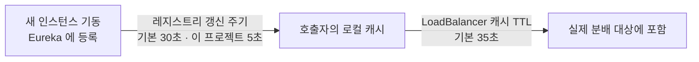

이 지연은 버그가 아니라, 매 호출마다 원격 조회를 하지 않기 위해 치르는 대가입니다.

---

## 5. 동기 통신 — OpenFeign

### 문제

order-service가 총액을 계산하려면 가격이 필요한데, 가격은 product-service만 알고 있습니다.

### 해법

인터페이스를 선언하면 HTTP 클라이언트 구현체가 생성됩니다.

### 코드

`order-service/src/main/java/.../ProductClient.java`

```java
@FeignClient(name = "product-service", fallbackFactory = ProductClientFallback.class)
public interface ProductClient {

    @GetMapping("/products/{id}")
    ProductResponse findById(@PathVariable("id") Long id);

    record ProductResponse(Long id, String name, BigDecimal price, int stock) {}
}
```

**IP도 포트도 등장하지 않습니다.** `name = "product-service"` 는 Eureka에 등록된 이름이며, 실제 주소는 호출 시점에 채워집니다.

### 설계 결정: 공통 모듈을 두지 않는다

`ProductResponse` 는 product-service의 `Product` 와 필드가 겹칩니다. 공통 모듈로 묶으면 중복이 사라지지만, 그 순간 두 서비스는 **함께 배포해야 하는 하나의 덩어리**가 됩니다. product-service가 필드 하나를 바꾸면 order-service도 다시 빌드해야 합니다.

이 프로젝트는 중복을 택했습니다. **중복은 독립 배포를 얻기 위해 지불하는 의도된 비용입니다.**

또한 수신측은 필요한 필드만 선언해도 됩니다. 두 서비스가 합의한 것은 자바 클래스가 아니라 **JSON 필드 이름**이기 때문입니다.

---

## 6. 비동기 통신 — Kafka

> **이 절의 코드 예시는 Phase 4 시점입니다.** 토픽 이름(`order-created`)과 메시지 타입(`OrderCreatedEvent`)은 Phase 8에서 명령/응답 구조로 바뀌어 지금 저장소에는 없습니다. 발행·구독의 원리를 보는 데는 이쪽이 단순해 그대로 두었습니다. 현재 토픽 구성은 11절에 있습니다.

### 문제

주문이 생기면 재고도 줄어야 합니다. 이것도 동기로 호출하면 될까요?

동기로 하면 **재고 차감이 실패할 때 주문도 실패합니다.** 그런데 사용자 입장에서 주문은 이미 성립했습니다. 재고 반영은 몇 초 늦어도 문제가 없습니다.

### 판단 기준

`OrderController.create()` 안에 성격이 다른 두 통신이 나란히 있습니다.

| | 가격 조회 | 재고 차감 |
|---|---|---|
| 방식 | 동기 (OpenFeign) | 비동기 (Kafka) |
| 판단 | **응답에 그 값이 필요한가?** → 필요 | → 불필요 |
| 대가 | 상대가 죽으면 함께 실패 | 즉시 반영되지 않음 |

**"응답에 그 답이 필요한가"** 하나로 갈립니다.

### 흐름

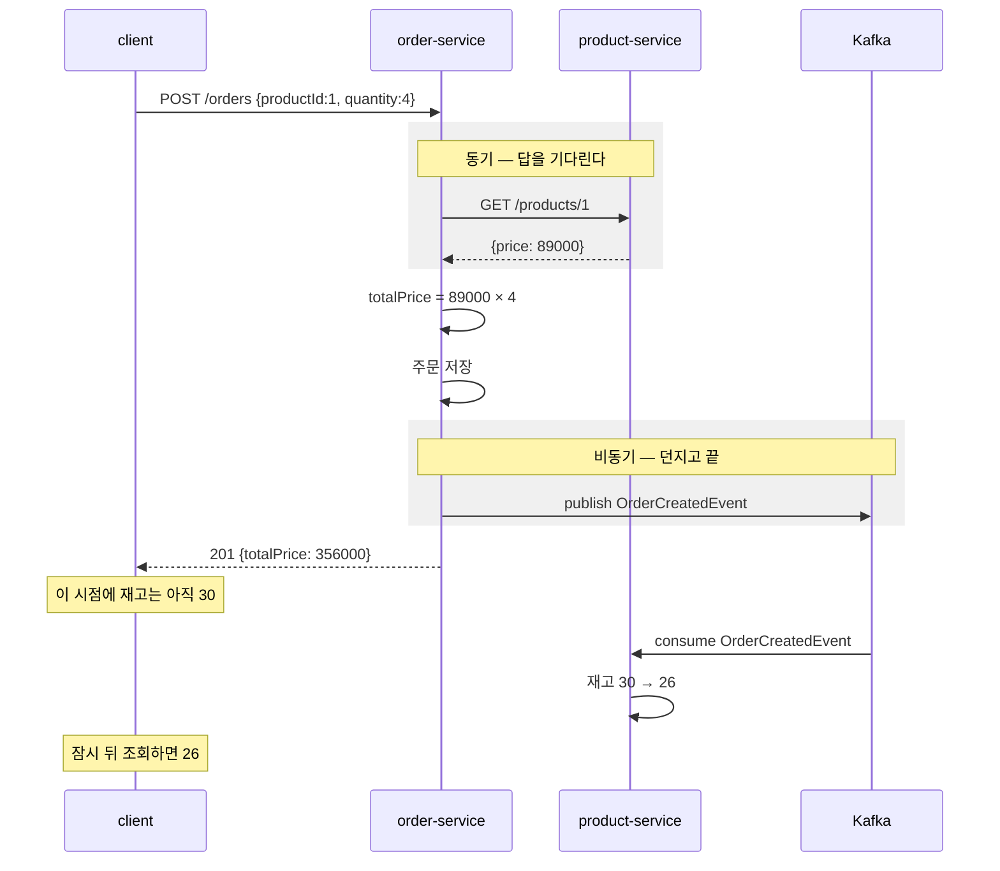

응답과 재고 반영 사이에 **틈**이 있습니다. 이를 결과적 일관성(eventual consistency)이라고 합니다. 버그가 아니라 비동기를 택한 대가입니다.

### 코드

발행 — `order-service/src/main/java/.../OrderController.java`

```java
Order order = repository.save(new Order(product.id(), request.quantity(), totalPrice));

kafkaTemplate.send(OrderCreatedEvent.TOPIC,
        new OrderCreatedEvent(order.getId(), order.getProductId(), order.getQuantity()));
return order;
```

구독 — `product-service/src/main/java/.../OrderCreatedListener.java`

```java
@KafkaListener(topics = OrderCreatedEvent.TOPIC, groupId = "product-service")
void handle(OrderCreatedEvent event) { ... }
```

### 설계 결정: 이름이 `DecreaseStockCommand`가 아닌 이유

order-service는 "재고를 깎아라"라고 **지시하지 않습니다.** "주문이 생겼다"는 **사실만** 알립니다.

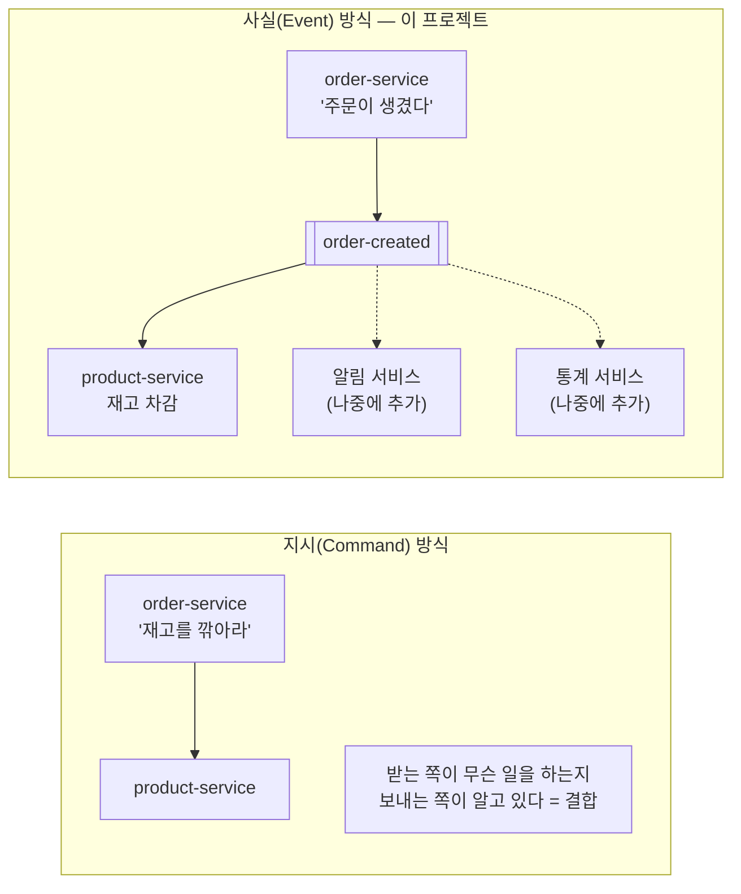

사실로 알리면 나중에 알림 서비스나 통계 서비스가 같은 이벤트를 구독해도 **order-service는 손댈 필요가 없습니다.**

### Kafka는 메시지 큐가 아니라 로그입니다

일반적인 큐는 소비하면 메시지가 사라집니다. Kafka는 읽어도 남아 있고, 각 컨슈머 그룹이 "어디까지 읽었는지"(오프셋)를 따로 기록합니다.

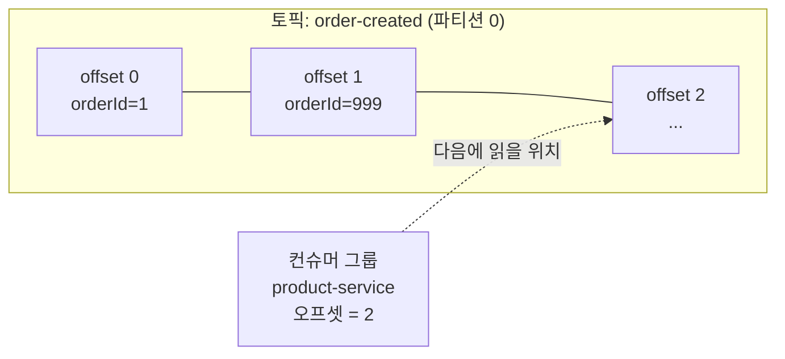

이 성질 덕분에 **구독자가 죽어 있어도 이벤트는 유실되지 않습니다.**

### 직접 확인: 죽은 동안 쌓였다가 처리되는가

```bash
docker compose stop product-service

# 구독자가 없어도 브로커에는 쌓인다
echo '{"orderId":999,"productId":1,"quantity":5}' | \
  docker compose exec -T kafka /opt/kafka/bin/kafka-console-producer.sh \
  --bootstrap-server localhost:9092 --topic order-created

docker compose start product-service
docker compose logs product-service | grep "재고 차감"
```

실측 결과:

```
재고 차감: 주문수량=4, 남은재고=26 (orderId=1)     ← 중지 전에 처리됨
재고 차감: 주문수량=5, 남은재고=25 (orderId=999)   ← 재기동 후 처리됨
```

여기서 두 가지를 더 읽을 수 있습니다.

- **`orderId=1` 은 재처리되지 않았습니다.** 오프셋이 커밋되어 있어 그 다음부터 이어 읽습니다. `auto-offset-reset: earliest` 는 그룹이 **처음 만들어질 때만** 적용됩니다.
- **남은 재고가 21이 아니라 25입니다.** 컨테이너 재시작으로 H2 인메모리 DB가 초기값(30)으로 돌아갔기 때문입니다. **메시지의 내구성과 서비스 상태의 내구성은 별개 문제**라는 것을 보여줍니다.

---

## 7. 분산 추적 — 어디서 느려졌는가

### 문제

모놀리식에서는 느린 요청 하나를 스택 트레이스로 추적할 수 있었습니다. 이제 하나의 요청이 4개 프로세스를 거치므로, 각 서비스 로그를 열어 시각을 대조해야 합니다.

### 해법

요청 하나에 **trace id**를 부여하고, 서비스 경계를 넘을 때 함께 전달합니다.

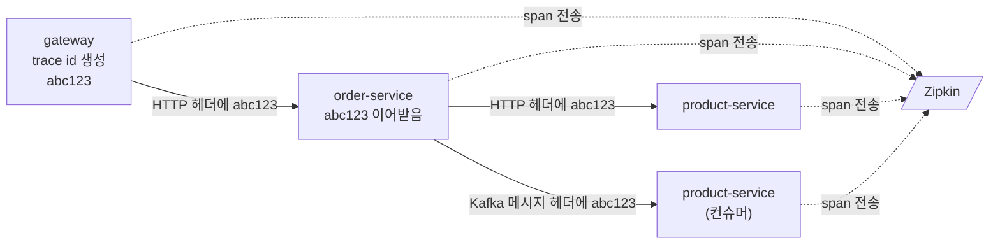

**추적의 본질은 "기록을 남기는 일"이 아니라 "경계 너머로 id를 전달하는 일"입니다.** 이 프로젝트에서 그 전달을 담당하는 것이 다음 둘입니다.

| 설정 | 없으면 끊기는 구간 |
|---|---|
| `feign-micrometer` 의존성 | order → product (Feign 호출) |
| `spring.kafka.*.observation-enabled` | order → product (Kafka 이벤트) |

이 둘이 없으면 각 서비스가 자기 span은 남기지만 **서로 연결되지 않아 별개 요청으로 보입니다.**

### 실측 결과

주문 생성 1건이 만든 trace입니다.

```
[api-gateway]        SERVER    http post                      41.9ms
  [api-gateway]      CLIENT    http post                      34.8ms
    [order-service]  SERVER    http post /orders              31.0ms
      [order-service]          circuit-breaker                15.4ms
        [order-service] CLIENT http get                       13.4ms
          [product-service] SERVER http get /products/{id}     5.7ms
      [order-service] PRODUCER order-created send             13.4ms
        [product-service] CONSUMER order-created receive       4.5ms
```

**Kafka를 건너간 구간까지 같은 trace에 들어옵니다.** 비동기 이벤트는 응답을 기다리지 않으므로 호출 스택으로는 절대 이어질 수 없는데, 메시지 헤더에 실린 trace id 덕분에 인과 관계가 보존됩니다.

로그에도 같은 id가 찍히므로, Zipkin에서 느린 요청을 찾은 뒤 그 id로 각 서비스 로그를 검색할 수 있습니다.

```
WARN [order-service] [o-auto-1-exec-1] [6a72e4d5...-8c77ff1a...] ...
                                        └ trace id ─┘ └ span id ┘
```

---

## 8. 서킷 브레이커 — 상대의 장애가 나에게 번지는 것을 막는다

### 문제

product-service가 죽으면 주문도 실패합니다. 문제는 실패한다는 사실이 아니라 **느리게 실패한다**는 점입니다.

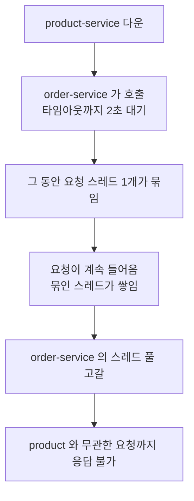

상대 하나가 죽었을 뿐인데 우리까지 함께 죽습니다. 이를 장애 전파(cascading failure)라고 합니다.

### 해법

두꺼비집처럼, 실패가 일정 비율을 넘으면 회로를 열어 **호출을 시도조차 하지 않습니다.**

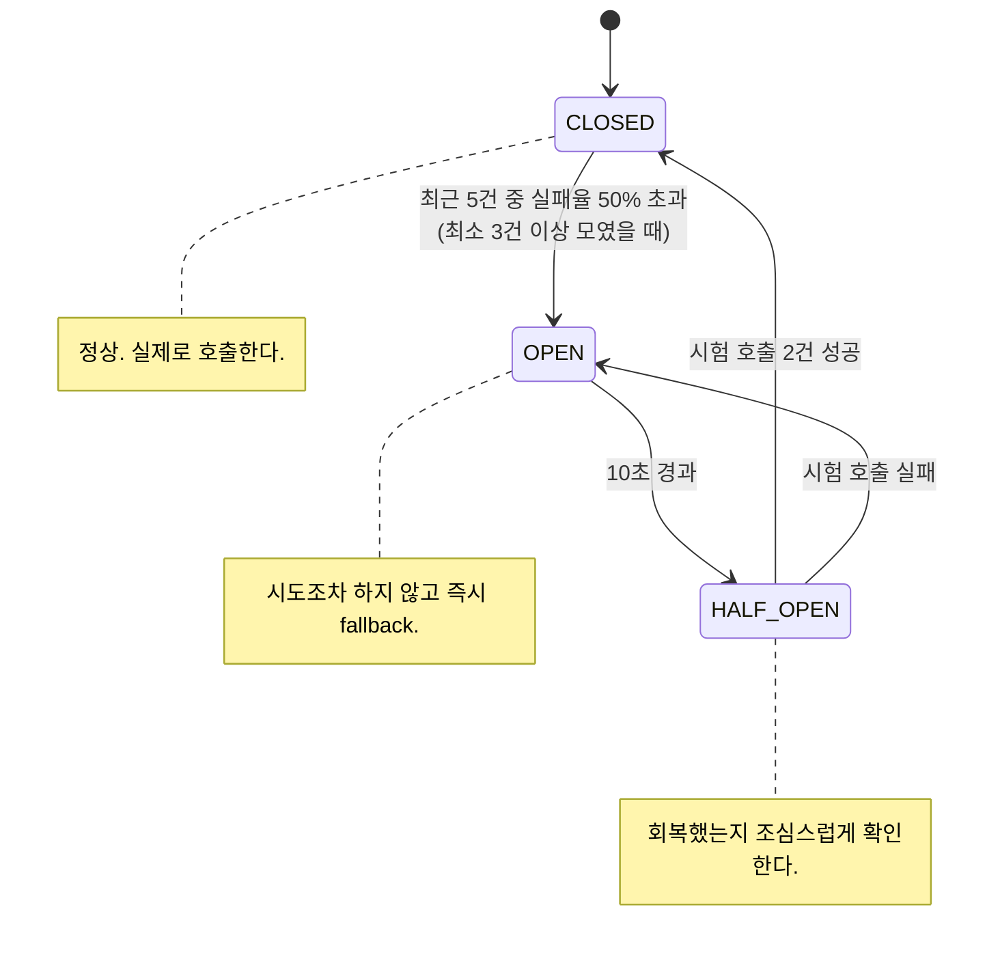

### 코드

`order-service/src/main/java/.../ResilienceConfig.java` 에 임계값이, `ProductClientFallback.java` 에 열렸을 때의 동작이 있습니다.

### 실측 결과

```bash
docker compose stop product-service
# 주문을 연달아 시도하며 소요 시간 측정
```

| 시점 | 응답 | 소요 시간 | fallback이 받은 원인 |
|---|---|---|---|
| 정상 | 201 | 0.53s | — |
| 중지 직후 (CLOSED) | 503 | **2.03s** | `TimeoutException` — 실제로 시도했다 실패 |
| 회로 OPEN 이후 | 503 | **0.015s** | `CallNotPermittedException` — 시도조차 안 함 |

**약 135배 빨라졌습니다.** 응답 코드는 똑같이 실패지만, 스레드를 2초씩 붙잡지 않는다는 것이 차이입니다.

### 설계 결정: fallback이 가짜 가격을 만들지 않는 이유

**모든 호출에 의미 있는 대체값이 있는 것은 아닙니다.**

| 호출 | 좋은 fallback |
|---|---|
| 추천 상품 목록 | 빈 목록. 화면은 그려진다 |
| 최근 본 상품 | 빈 목록 |
| **주문할 상품의 가격** | **없음.** 0원으로 주문받으면 잘못된 데이터가 DB에 영구히 남는다 |

그래서 이 프로젝트의 fallback은 대체값을 만들지 않고 503으로 거절합니다. **서킷 브레이커의 가치는 "그럴듯한 가짜 응답"이 아니라 "빠르고 정직한 실패"에 있습니다.**

### 함정: 타임아웃이 두 겹입니다

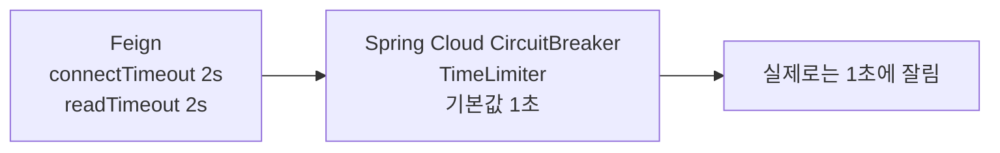

`TimeLimiter` 를 명시하지 않으면 기본값 1초가 조용히 적용되어, Feign에 설정한 값이 무시됩니다. 이 프로젝트는 두 값을 2초로 맞춰 두었습니다.

---

## 9. 인증·인가 — 세션 없이 로그인 상태를 다루기

### 문제

모놀리식에서는 로그인하면 서버가 세션을 만들고 쿠키로 세션 id를 돌려줍니다. 이후 요청은 그 id로 "누구인가"를 알 수 있습니다. 서버가 상태를 들고 있기 때문입니다.

서비스가 5개면 어떻게 될까요? 각 서비스가 그 세션을 알아야 합니다. 세션 저장소를 공유하면 그 저장소가 단일 장애점이 되고, 서비스 사이에 새로운 결합이 생깁니다.

### 해법: 상태를 토큰 안에 넣는다

JWT(JSON Web Token)는 사용자 정보를 담고 **서명**이 붙은 문자열입니다. 서버가 아무것도 기억하지 않아도, 서명만 검증하면 내용을 믿을 수 있습니다.

```
헤더.페이로드.서명

eyJhbGciOiJIUzI1NiJ9 . eyJzdWIiOiJ1c2VyIiwidWlkIjoxLCJyb2xlcyI6WyJST0xFX1VTRVIiXX0 . 5nQ...
   알고리즘              담긴 내용(누구나 읽을 수 있음)              위조 방지용 서명
```

**공유해야 하는 것이 세션 저장소가 아니라 열쇠 하나로 줄어듭니다.**

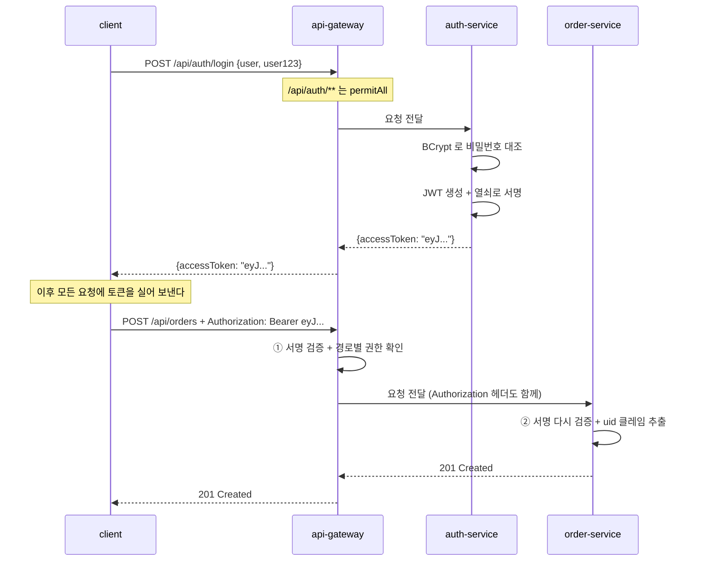

### 코드

| 파일 | 역할 |
|---|---|
| `auth-service/.../AuthController.java` | 로그인. 실패 사유를 구분해 알려주지 않는다 |
| `auth-service/.../JwtIssuer.java` | 클레임 구성과 서명 |
| `auth-service/.../SecurityConfig.java` | BCrypt 인코더, `JwtEncoder` |
| `api-gateway/.../SecurityConfig.java` | 리액티브 검증(첫 검문) |
| `order-service/.../SecurityConfig.java` | 서블릿 검증(재검증) |
| `product-service/.../SecurityConfig.java` | 서블릿 검증 + ADMIN 규칙 |

`jjwt` 같은 외부 라이브러리를 쓰지 않았습니다. 스프링 시큐리티에 이미 `NimbusJwtEncoder`/`NimbusJwtDecoder`가 들어 있어, 발급도 검증도 표준 스택 안에서 끝납니다.

### 비밀번호는 해시로만 저장합니다

```java
repository.save(new AppUser("user", encoder.encode("user123"), "ROLE_USER"));
```

BCrypt는 같은 비밀번호라도 매번 다른 salt를 섞으므로 해시값이 매번 달라지고, **의도적으로 느리게** 설계되어 있어 대량 대입 공격에 시간 비용을 강제합니다. 저장된 값은 `$2a$`로 시작하는 해시이며 원문으로 되돌릴 수 없습니다.

### 왜 두 번 검증하는가

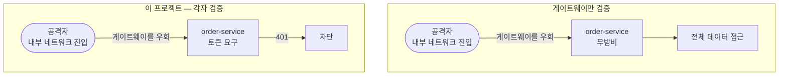

게이트웨이는 첫 검문일 뿐입니다. **검증은 데이터를 실제로 가지고 있는 쪽에서 해야 합니다.** 이 원칙을 zero trust라고 합니다.

### 인증 한 번, 인가 두 층

여기가 이 절에서 가장 중요한 부분입니다. 관문이 셋인데, 앞의 하나가 **인증**이고 뒤의 둘이 **인가**입니다.

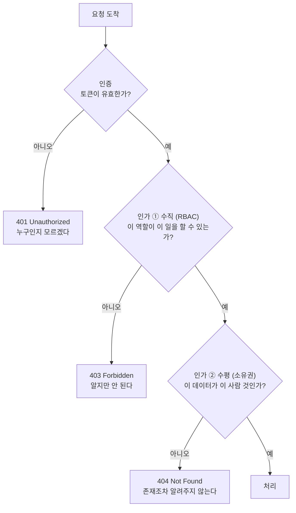

**수직까지만 하고 수평을 빠뜨리는 것이 매우 흔한 실수입니다.** 역할 검사는 "무엇을 할 수 있는가"만 봅니다. "누구의 데이터인가"는 전혀 보지 않습니다.

> 위 흐름은 `GET /orders/{id}` 처럼 **특정 자원 하나**를 지목하는 요청 기준입니다. `GET /orders` 같은 목록 조회에는 거절할 대상이 없으므로 404가 나지 않고, 애초에 본인 것만 담아 돌려주는 방식으로 같은 원칙을 지킵니다.

Phase 6 이전의 이 프로젝트가 정확히 그 상태였습니다. `GET /orders`가 모든 사람의 주문을 반환했습니다. 이런 결함을 IDOR(Insecure Direct Object Reference)라고 합니다.

해결은 조회 단계에서부터 사용자를 조건에 넣는 것입니다.

```java
// 위험: 전부 가져온 뒤 자바 코드에서 거른다 → 거르는 코드를 빠뜨리면 전체 노출
repository.findAll();

// 안전: 조회 자체에 사용자가 들어간다
repository.findByUserId(userIdOf(jwt));
```

**사용자 id를 요청 파라미터로 받지 않는 것**도 핵심입니다. `?userId=2`로 받으면 그 값을 바꿔 남의 데이터를 볼 수 있습니다. 반드시 서명이 검증된 토큰에서 꺼내야 합니다.

### 직접 확인

```bash
login() { curl -s -X POST http://localhost:8080/api/auth/login \
  -H 'Content-Type: application/json' \
  -d "{\"username\":\"$1\",\"password\":\"$2\"}" | jq -r .accessToken; }

USER_T=$(login user user123)
ADMIN_T=$(login admin admin123)
```

실측 결과입니다.

| 요청 | 토큰 없음 | USER | ADMIN |
|---|---|---|---|
| `GET /api/products/1` | 200 | 200 | 200 |
| `POST /api/orders` | 401 | 201 | 201 |
| `POST /api/products` | 401 | **403** | 201 |

수평적 인가:

```
user  의 목록 → [id 1,2,3,4]  (userId=1)
admin 의 목록 → [id 5]         (userId=2)  ← ADMIN 이어도 남의 주문은 안 보인다
admin 이 /api/orders/1 조회 → 404
```

**ADMIN이라도 남의 주문은 보이지 않습니다.** 관리자 권한은 "상품을 등록할 수 있다"이지 "모든 주문을 볼 수 있다"가 아닙니다.

**남의 주문 조회가 403이 아니라 404인 이유**는 403이 "그 주문은 존재하지만 네 것이 아니다"라는 정보를 흘리기 때문입니다.

### 위조 시도

```bash
# 페이로드의 roles 를 ROLE_ADMIN 으로 바꾸고 서명은 원본 그대로 붙인다
```

```
페이로드를 ROLE_ADMIN 으로 위조  → 401
서명부를 다른 값으로 교체        → 401
```

서명은 **헤더와 페이로드 전체**에 대해 계산되므로, 내용을 한 글자라도 바꾸면 서명이 맞지 않게 됩니다. 열쇠를 모르면 올바른 서명을 새로 만들 수도 없습니다.

> **JWT는 서명될 뿐 암호화되지 않습니다.** 페이로드는 누구나 base64 디코딩으로 열어볼 수 있습니다. 변조는 막지만 열람은 막지 못하므로, 비밀번호나 개인정보를 클레임에 담아서는 안 됩니다.

### 의도적으로 남긴 한계

| 항목 | 현재 | 실무에서는 |
|---|---|---|
| 열쇠 관리 | 저장소에 기본값이 있음 | Secrets Manager / Vault. **저장소에 올라간 열쇠는 이미 유출된 열쇠** |
| 서명 알고리즘 | HS256 (대칭키) | RS256 (비대칭키) |
| 토큰 만료 | 1시간, 갱신 없음 | 짧은 액세스 토큰 + 리프레시 토큰 |
| 로그아웃 | 없음 | 블랙리스트 또는 짧은 만료 |
| Kafka 이벤트 | 인증 정보 없음 | 발행 주체를 남기고 컨슈머가 검증 |

**대칭키(HS256)의 한계는 특히 짚어둘 만합니다.** 서명과 검증에 같은 열쇠를 쓰므로, 검증만 하면 되는 product-service도 **토큰을 발급할 수 있는 열쇠**를 갖게 됩니다. 서비스 하나가 뚫리면 공격자가 임의의 ADMIN 토큰을 만들어 낼 수 있다는 뜻입니다. 비대칭키(RS256)를 쓰면 auth-service만 개인키로 서명하고 나머지는 공개키로 검증만 하게 되어 이 문제가 사라집니다.

---

## 10. Saga — 롤백할 수 없을 때 되돌리는 법

> **이 절의 코드는 Phase 7 시점입니다.** Phase 8에서 오케스트레이션으로 바꾸면서 여기 나오는 `OrderCreatedEvent`·`StockResultEvent`와 두 리스너는 삭제됐습니다. 지금 저장소에는 없으므로 커밋 `984c313`에서 보십시오. **일부러 남겨 둔 절입니다.** Saga가 무엇인지는 이쪽이 더 단순하게 보여 주고, 11절이 이것을 "무엇이 불편했는가"의 출발점으로 씁니다.

### 문제

6절의 재고 차감에는 구멍이 있었습니다. 재고가 부족하면 로그만 남기고 이벤트를 버렸습니다. 그 결과는 이렇습니다.

```
order-service 의 DB:   주문 #3 — 모니터 100개, 32,000,000원  ← 성공한 것처럼 남음
product-service 의 DB: 모니터 재고 7                          ← 아무 일도 없었음
```

**두 서비스가 서로 다른 사실을 믿고 있습니다.** 모놀리식이라면 하나의 트랜잭션으로 묶여 함께 롤백됐을 일입니다.

```java
@Transactional
void createOrder() {
    orderRepository.save(order);
    product.decreaseStock(qty);   // 여기서 예외 → 위의 save 도 함께 취소
}
```

이 한 줄짜리 안전장치가 서비스를 나누는 순간 사라집니다. **DB가 다르면 트랜잭션도 다릅니다.** 2단계 커밋(2PC)이라는 기법이 있긴 하지만, 참여자 하나가 응답하지 않으면 나머지 전부가 잠긴 채 기다려야 해서 마이크로서비스에서는 사실상 쓰지 않습니다.

### 해법: 되돌리지 말고, 되돌리는 효과를 내는 일을 하나 더 한다

Saga는 긴 트랜잭션 하나를 **여러 개의 짧은 로컬 트랜잭션**으로 쪼갭니다. 각 단계는 자기 DB에서 즉시 커밋하고, 뒤 단계가 실패하면 앞 단계를 **취소하는 새로운 작업**(보상 트랜잭션)을 실행합니다.

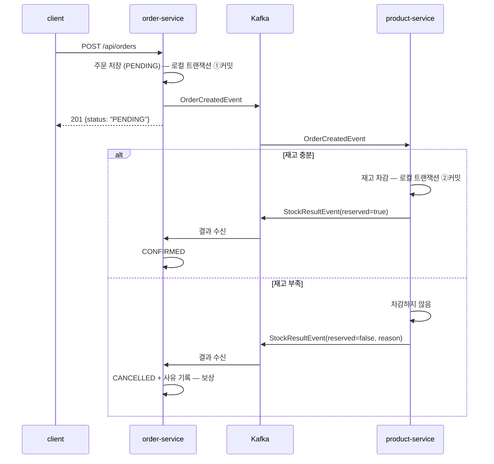

### 상태 전이

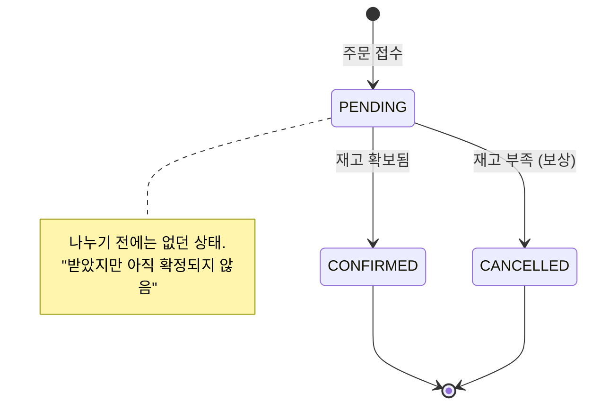

**PENDING이라는 중간 상태가 생기는 것이 Saga의 가장 큰 변화입니다.** 나누기 전에는 주문이 성공 아니면 실패 둘 중 하나였습니다. 이제 `201 Created`의 의미가 "확정됐다"가 아니라 **"접수했다"**로 바뀝니다. UI도 "주문 완료"가 아니라 "주문 처리 중"을 보여줘야 합니다.

### 코드

| 파일 | 역할 |
|---|---|
| `order-service/.../OrderStatus.java` | PENDING / CONFIRMED / CANCELLED |
| `order-service/.../Order.java` | `confirm()`, `cancel(reason)` — 보상이 여기 있다 |
| `product-service/.../StockResultEvent.java` | 재고 처리 결과 (성공/실패 + 사유) |
| `product-service/.../OrderCreatedListener.java` | 차감 시도 후 **반드시 결과를 발행** |
| `order-service/.../StockResultListener.java` | 결과를 듣고 확정 또는 취소 |

가장 중요한 변화는 product-service가 **실패해도 침묵하지 않게** 된 것입니다.

```java
// Phase 4: 실패하면 그냥 로그
log.warn("재고 부족으로 차감하지 않음: ...");

// Phase 7: 실패도 사실이므로 알린다
return StockResultEvent.rejected(orderId, productId, quantity, "재고 부족 (요청 %d, 남은 재고 %d)");
```

### 보상은 롤백이 아닙니다

이미 커밋된 트랜잭션은 되돌릴 수 없습니다. 보상은 **되돌리는 효과를 내는 새로운 작업**입니다. 차이가 드러나는 지점이 있습니다.

| | 롤백 | 보상 |
|---|---|---|
| 흔적 | 아무 일도 없었던 것이 됨 | **취소했다는 기록이 남음** |
| 중간 상태 | 외부에서 볼 수 없음 | **잠깐이지만 남들이 볼 수 있음** |
| 범위 | DB가 알아서 | 결제 환불, 쿠폰 복구 등 직접 다 짜야 함 |

두 번째가 특히 중요합니다. 주문 #3이 취소되기 전 짧은 순간, 조회하면 PENDING 주문이 실제로 보입니다. 이 구간을 없앨 수는 없고, **받아들이고 설계에 반영**해야 합니다.

그래서 이 프로젝트는 취소된 주문을 **삭제하지 않고 사유와 함께 남깁니다.** 사용자에게도 운영자에게도 "왜 취소됐는가"가 필요한 정보이기 때문입니다.

### 코레오그래피 vs 오케스트레이션

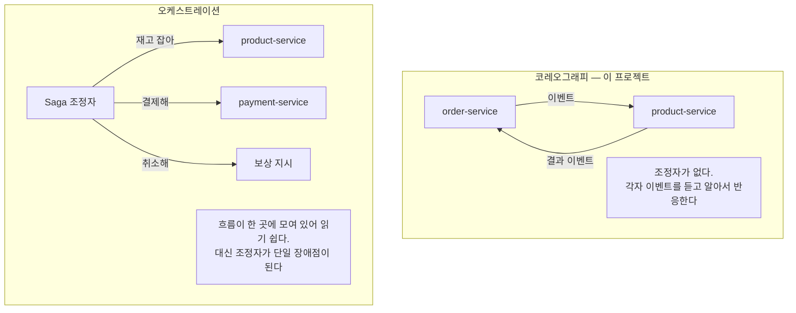

참여 서비스가 둘뿐인 Phase 7 시점에는 조정자를 둘 이유가 없었습니다. **참여자가 늘어 전체 흐름을 코드에서 따라가기 어려워지는 시점**이 오케스트레이션으로 옮길 때입니다.

> **그 시점이 Phase 8에서 왔습니다.** 결제 단계를 더하자 참여자가 셋이 되었고, 위 그림의 오른쪽이 실제 구조가 되었습니다. 무엇이 계기였고 무엇을 지불했는지는 [11절](#11-오케스트레이션--흐름을-한-곳으로-모으기)에 있습니다.

### 직접 확인

```bash
TOKEN=$(curl -s -X POST http://localhost:8080/api/auth/login \
  -H 'Content-Type: application/json' \
  -d '{"username":"user","password":"user123"}' | jq -r .accessToken)

order() { curl -s -X POST http://localhost:8080/api/orders \
  -H "Authorization: Bearer $TOKEN" -H 'Content-Type: application/json' \
  -d "{\"productId\":2,\"quantity\":$1}"; }

order 5      # 재고 12 안쪽
order 100    # 재고 초과

curl -s http://localhost:8080/api/orders -H "Authorization: Bearer $TOKEN" | jq -c '.[]'
```

응답 직후에는 둘 다 PENDING입니다.

```json
{"id":2,"quantity":5,"status":"PENDING"}
{"id":3,"quantity":100,"status":"PENDING"}
```

잠시 뒤 Saga가 끝나면 갈립니다.

```json
{"id":2,"quantity":5,  "status":"CONFIRMED","cancelReason":null}
{"id":3,"quantity":100,"status":"CANCELLED","cancelReason":"재고 부족 (요청 100, 남은 재고 7)"}
```

재고는 `12 - 5 = 7`이고, **취소된 주문의 100은 차감되지 않았습니다.** 두 서비스가 같은 사실을 믿는 상태로 되돌아왔습니다.

### 멱등성 — 같은 이벤트가 두 번 와도 견디기

**Kafka는 at-least-once입니다.** 컨슈머가 메시지를 처리하고 오프셋을 커밋하기 직전에 죽거나, 컨슈머 그룹에 리밸런싱이 일어나면 같은 메시지가 다시 전달됩니다. "정확히 한 번"은 분산 시스템에서 매우 비싼 보장이라, 대개 **재전송을 허용하고 받는 쪽이 견디게** 만듭니다.

문제는 모든 연산이 재실행에 안전하지는 않다는 점입니다.

| 연산 | 두 번 실행하면 | 멱등한가 |
|---|---|---|
| 주문 상태를 CONFIRMED 로 설정 | 여전히 CONFIRMED | ✅ |
| **재고를 5 만큼 차감** | **10 이 깎임** | ❌ |
| 이메일 발송 | 두 통 발송 | ❌ |

**누적되는 연산**과 **덮어쓰는 연산**의 차이입니다. order-service의 상태 변경은 덮어쓰기라 그냥 두어도 안전하지만, product-service의 재고 차감은 막아야 합니다.

#### 처리 기록을 남긴다

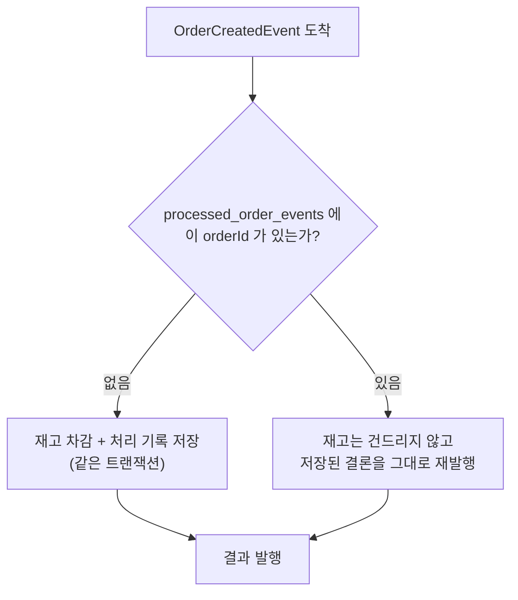

두 가지가 설계의 핵심입니다.

**1) `orderId`를 기본키로 삼습니다.** 자동 증가 id를 두고 orderId를 일반 컬럼에 넣으면 중복 행이 들어갈 수 있습니다. 기본키로 두면 DB가 유일성을 보장합니다.

**2) 중복이어도 결과를 다시 발행합니다.** 그냥 건너뛰면, 첫 처리에서 발행이 실패했을 경우 주문이 PENDING으로 영원히 남습니다. 그래서 처리 기록에 **결론까지 함께 저장**해 두고 재발행합니다.

```java
var seen = processedEvents.findById(event.orderId());
if (seen.isPresent()) {
    // 재고는 그대로, 결론만 다시 알린다
    return new StockResultEvent(..., seen.get().isReserved(), seen.get().getReason());
}
```

#### 재고 차감과 기록은 한 트랜잭션이어야 합니다

따로 커밋하면 "재고는 깎였는데 기록은 없는" 상태가 생기고, 그러면 재전송 때 또 깎입니다. 둘 다 product-service의 같은 DB 안에 있으므로 `@Transactional`로 묶을 수 있습니다.

> **함정: self-invocation.** `@Transactional`은 스프링이 만든 프록시를 거쳐야 동작합니다. 같은 클래스 안에서 자기 메서드를 호출하면 프록시를 지나지 않아 **트랜잭션이 조용히 걸리지 않습니다.** 에러도 나지 않아 알아채기 어렵습니다. 그래서 이 프로젝트는 트랜잭션 경계를 `StockReservationService`라는 별도 빈으로 옮겼습니다.

#### 직접 확인

같은 이벤트를 콘솔 프로듀서로 3번 발행합니다.

```bash
for i in 1 2 3; do
  echo '{"orderId":777,"productId":1,"quantity":5}' | \
    docker compose exec -T kafka /opt/kafka/bin/kafka-console-producer.sh \
    --bootstrap-server localhost:9092 --topic order-created
done

curl -s http://localhost:8080/api/products/1
```

실측 결과입니다. 재고 30에서 **5만 깎였습니다.**

```
{"id":1,"name":"키보드","price":89000.00,"stock":25}
```

로그를 보면 첫 번째만 차감하고 나머지는 기록을 보고 건너뛴 것이 드러납니다.

```
재고 차감: productId=1, 주문수량=5, 남은재고=25 (orderId=777)
이미 처리한 주문. 재고는 건드리지 않고 결과만 재발행: orderId=777, 최초처리=...
이미 처리한 주문. 재고는 건드리지 않고 결과만 재발행: orderId=777, 최초처리=...
```

### 아직 남은 문제 두 가지

코드에 `ponytail:` 주석으로 표시해 두었습니다.

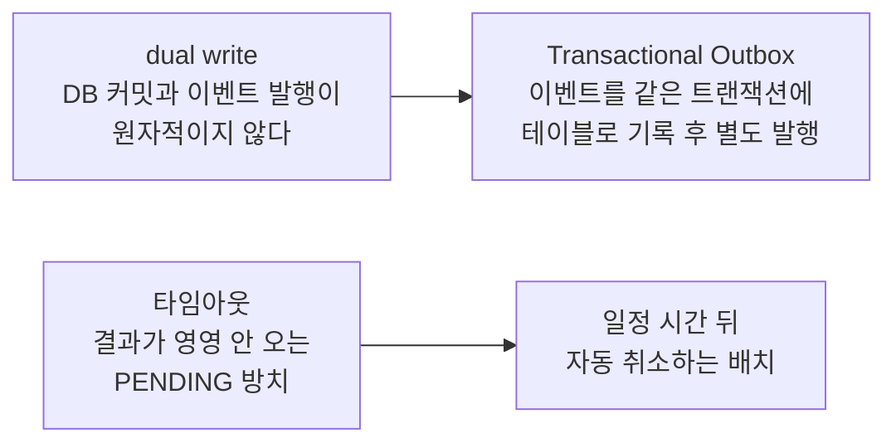

dual write는 멱등성 처리로 **완화**되었습니다. 발행 직전에 죽더라도 재전송 때 같은 결론이 다시 나가기 때문입니다. 다만 재전송 자체가 없으면 여전히 PENDING으로 남으므로, 완전한 해결은 아닙니다.

---

## 11. 오케스트레이션 — 흐름을 한 곳으로 모으기

10절의 Saga는 **코레오그래피(choreography)** 방식이었습니다. 중앙에 지시자를 두지 않고, 각 서비스가 남이 발행한 이벤트를 듣고 자기 판단으로 다음 행동을 하는 방식입니다. 무용수들이 지휘자 없이 서로를 보며 맞춰 추는 군무에서 온 이름입니다.

### 코레오그래피로 두면 무엇이 불편한가

두 가지가 걸립니다.

**첫째, 흐름이 코드 어디에도 적혀 있지 않습니다.** "재고를 잡은 뒤 무엇을 하는가"는 `OrderCreatedListener`와 `StockResultListener` 두 파일에 나뉘어 있었습니다. 전체 순서를 알려면 두 서비스의 파일을 각각 읽고 머릿속에서 이어 붙여야 합니다. 참여자가 늘면 그만큼 더 흩어집니다.

**둘째, 진행 상태를 아무도 들고 있지 않습니다.** 주문이 `PENDING`에서 멈춰 있을 때, 요청이 상대에게 도달하지 못한 것인지 처리는 됐는데 응답이 유실된 것인지 판단할 근거가 시스템 어디에도 없습니다. 그래서 10절 끝에 남겨 둔 "타임아웃" 문제는 코레오그래피 구조에서는 **손댈 방법 자체가 없었습니다.** 어디서 멈췄는지 모르는데 무엇을 되돌린다는 말이 성립하지 않기 때문입니다.

### 조정자를 둔다는 것

**오케스트레이션(orchestration)** 은 다음 단계를 결정하는 주체를 한 곳에 모으는 방식입니다. 그 조정자를 오케스트레이터라고 부릅니다.

흔한 오해가 하나 있습니다. 오케스트레이션의 정의는 **"다음 단계를 결정하는 주체가 하나인가"** 이지, 그 주체가 별도 프로세스인가가 아닙니다. 이 프로젝트는 조정자를 새 서비스로 분리하지 않고 `order-service` 안의 `OrderSagaOrchestrator` 클래스 하나로 두었습니다. 그렇게 하면 Saga 상태와 주문 상태가 **같은 DB**에 있게 되어, "단계를 옮기는 쓰기"와 "주문 상태를 바꾸는 쓰기"를 한 트랜잭션으로 묶을 수 있습니다. 조정자를 떼어내면 이 둘이 다른 DB로 갈라져, 서로 어긋난 상태를 따로 다뤄야 합니다.

조정자를 별도 서비스로 분리할 실익은 **여러 종류의 Saga가 생겨 조정 로직 자체가 하나의 관심사가 될 때** 나타납니다.

### 사실(event)과 지시(command)

바뀐 것은 메시지의 성격입니다.

| | 코레오그래피 | 오케스트레이션 |
|---|---|---|
| 메시지 | `OrderCreated` — **사실** | `RESERVE` / `CHARGE` — **지시** |
| 판단하는 쪽 | 듣는 쪽 | 보내는 쪽 |
| 참여자가 아는 것 | 자기 앞에 무슨 일이 있었는지 | 없음 |

"주문이 생겼다"는 사실을 들은 서비스는 그것으로 무엇을 할지 **스스로** 정합니다. "재고를 잡아라"라는 지시를 받은 서비스는 이미 정해진 일을 할 뿐입니다.

그래서 지금의 `product-service`는 자기 다음에 결제 단계가 있다는 사실을 모르고, `payment-service`는 앞에 재고 단계가 있었다는 사실을 모릅니다. **단계를 끼워 넣거나 순서를 바꿔도 참여자 코드는 건드리지 않습니다.**

### 실행과 보상을 같은 토픽에 담는 이유

이번 Phase에서 단계를 둘로 늘렸습니다. 재고 확보 다음에 결제가 옵니다. 결제가 실패하면 이미 잡아 둔 재고를 **되돌리라고 지시**해야 합니다. 여기서 처음으로 다른 서비스를 향한 보상 명령이 등장합니다.

토픽은 셋입니다.

| 토픽 | 방향 | 실리는 것 |
|---|---|---|
| `stock-command` | 오케스트레이터 → product | `RESERVE`, `RELEASE` |
| `payment-command` | 오케스트레이터 → payment | `CHARGE` |
| `saga-reply` | 참여자 전체 → 오케스트레이터 | 처리 결과 |

`RESERVE`와 `RELEASE`를 **같은 토픽**에 담은 것이 요점입니다. Kafka는 같은 토픽의 **같은 파티션 안에서만** 순서를 보장합니다. 토픽을 나누면 "되돌려라"가 "잡아라"를 추월할 수 있고, 그 경합을 애플리케이션이 직접 막아야 합니다.

여기에 조건이 하나 더 붙습니다. 같은 토픽이어도 파티션이 여러 개면 메시지가 흩어집니다. 그래서 발행할 때 **`orderId`를 메시지 키로** 지정합니다. Kafka는 같은 키를 같은 파티션에 넣으므로, 한 주문의 명령들은 보낸 순서 그대로 도착합니다.

```java
kafkaTemplate.send(StockCommand.TOPIC, String.valueOf(order.getId()), command);
```

### 상태 머신

오케스트레이터는 각 주문의 진행 단계를 `OrderSaga` 테이블에 기록합니다.

```mermaid
stateDiagram-v2
    [*] --> RESERVING_STOCK: 주문 접수
    RESERVING_STOCK --> CHARGING_PAYMENT: RESERVE 성공
    RESERVING_STOCK --> FAILED: RESERVE 실패
    CHARGING_PAYMENT --> COMPLETED: CHARGE 성공
    CHARGING_PAYMENT --> COMPENSATING_STOCK: CHARGE 실패
    COMPENSATING_STOCK --> FAILED: RELEASE 완료
    RESERVING_STOCK --> FAILED: 타임아웃
    CHARGING_PAYMENT --> COMPENSATING_STOCK: 타임아웃
    COMPENSATING_STOCK --> COMPENSATING_STOCK: 타임아웃 (RELEASE 재발행)
    COMPLETED --> [*]
    FAILED --> [*]
```

**완료한 단계의 목록을 따로 저장하지 않습니다.** 단계가 선형이므로 "지금 어느 단계인가" 하나만 알면 되돌릴 대상이 결정됩니다. `CHARGING_PAYMENT`에서 실패했다면 그보다 앞선 단계는 재고 확보뿐입니다. 분기하거나 병렬로 갈라지는 Saga라면 완료 목록이 필요해지지만, 그때 도입하면 됩니다.

각 단계는 **자기가 어떤 응답을 기다리는지**를 함께 들고 있습니다.

```java
enum SagaStep {
    RESERVING_STOCK("RESERVE"),
    CHARGING_PAYMENT("CHARGE"),
    COMPENSATING_STOCK("RELEASE"),
    COMPLETED(null),      // 더 기다릴 응답이 없다
    FAILED(null);
```

응답이 도착하면 이 값으로 "지금 기다리던 것이 맞는가"를 먼저 확인하고, 어긋나면 버립니다. 이 검사가 없으면 뒤에서 볼 문제가 생깁니다.

### 코드

조정자 쪽입니다. **흐름 판단은 `OrderSagaOrchestrator` 하나에만 있습니다.**

| 파일 | 역할 |
|---|---|
| `order-service/.../OrderSagaOrchestrator.java` | **흐름 전체.** 상태 전이와 다음 명령 결정 |
| `order-service/.../OrderSaga.java` | 진행 상태 엔티티. 주문과 같은 DB |
| `order-service/.../SagaStep.java` | 단계 열거형. 각 단계가 기다리는 응답을 함께 들고 있다 |
| `order-service/.../SagaReplyListener.java` | 응답 수신만. 판단은 조정자에 넘긴다 |
| `order-service/.../SagaTimeoutSweeper.java` | 멈춘 사가 탐지만. 처리는 조정자에 넘긴다 |
| `order-service/.../StockCommand.java`, `PaymentCommand.java`, `SagaReply.java` | 메시지 타입 |

참여자 쪽입니다. 둘의 구조가 같습니다 — **리스너는 받아서 넘기고 답하기만, 트랜잭션은 서비스 빈에** 있습니다.

| 파일 | 역할 |
|---|---|
| `product-service/.../StockCommandListener.java` | 명령 수신 → 서비스 호출 → 응답 발행 |
| `product-service/.../StockReservationService.java` | `RESERVE`/`RELEASE` 로컬 트랜잭션 + 멱등 기록 |
| `payment-service/.../PaymentCommandListener.java` | 위와 같은 구조 |
| `payment-service/.../PaymentService.java` | `CHARGE` 로컬 트랜잭션 + 멱등 기록 |
| `payment-service/.../Account.java` | 계좌. `withdraw`는 잔액이 모자라면 `false`를 돌려준다 |
| `*/ProcessedCommand.java` | 멱등 기록. 키가 `(orderId, action)` |

리스너와 서비스를 굳이 나눈 데는 이유가 있습니다. `@Transactional`은 스프링이 만든 **프록시를 거쳐야** 동작하는데, 같은 클래스 안에서 자기 메서드를 부르면 프록시를 지나지 않아 **트랜잭션이 조용히 걸리지 않습니다**(self-invocation). 경계를 다른 빈으로 옮기면 이 문제가 사라집니다.

`payment-service`에는 **HTTP 엔드포인트가 하나도 없습니다.** Kafka 명령만 받습니다. 그래서 토큰을 검증할 대상도 없어 시큐리티 설정을 두지 않았습니다. 서비스가 반드시 REST API를 가져야 하는 것은 아니라는 예입니다.

### 진행 상태를 모으면 무엇이 가능해지는가

10절에서 손댈 수 없다고 남겨 두었던 타임아웃이 이제 가능해집니다. `SagaTimeoutSweeper`가 10초마다, 30초 넘게 응답 없이 머문 Saga를 찾습니다.

```java
List<OrderSaga> stalled = sagas.findByStepInAndUpdatedAtBefore(SagaStep.waiting(), deadline);
```

멈춘 단계에 따라 처리가 갈립니다.

1. `RESERVING_STOCK`에서 멈춤 → 되돌릴 앞 단계가 없으므로 주문만 취소합니다.
2. `CHARGING_PAYMENT`에서 멈춤 → 재고가 이미 잡혀 있으므로 `RELEASE`를 보냅니다.
3. `COMPENSATING_STOCK`에서 멈춤 → `RELEASE`를 다시 보냅니다.

3번에는 재시도 횟수 상한이 없습니다. **보상을 포기하면 재고가 영영 묶인 채 남기 때문입니다.** 참여자 쪽이 멱등하므로 여러 번 보내도 안전합니다.

다만 이 상한 없음은 **응답이 아예 오지 않는 경우**에만 해당합니다. 참여자가 명시적으로 "복구할 수 없다"고 답하는 경우는 다릅니다. `RELEASE` 실패 응답을 받으면 `afterRelease`는 로그만 남기고 곧바로 `FAILED`로 끝내며, `FAILED`는 `SagaStep.waiting()`에서 빠져 있어 스위퍼도 다시 들여다보지 않습니다. 응답이 오지 않는 것과 참여자가 "복구할 수 없다"고 답하는 것은 다릅니다. 후자는 재시도로 풀리지 않으므로 사람 개입이 필요한 상태로 남깁니다.

이 기능의 존재 자체가 오케스트레이션이 무엇을 사는지 보여 줍니다. 진행 상태가 한 테이블에 모였기 때문에 비로소 "어디서 멈췄는가"를 질의할 수 있습니다.

### 구현에서 부딪힌 두 가지

둘 다 테스트가 통과하는데도 틀려 있던 것들입니다. **테스트가 초록불이라고 트랜잭션이 걸린 것은 아닙니다.**

**1) `@Transactional`은 public 메서드에만 걸립니다**

조정자의 진입점 셋을 처음에는 package-private으로 두었습니다. 스프링의 기본 프록시 방식은 public 메서드에만 트랜잭션 속성을 적용하므로, 세 메서드가 **트랜잭션 없이** 돌고 있었습니다. Saga 단계를 옮기는 쓰기와 주문 상태를 바꾸는 쓰기가 각각 커밋되던 셈이라, 조정자를 `order-service`에 둔 근거 자체가 성립하지 않았습니다.

테스트 아홉 개가 전부 통과했습니다. 트랜잭션이 없어도 개별 저장이 각각 커밋되니 최종 상태 단언은 그대로 맞기 때문입니다. **이 결함은 테스트로 잡히지 않습니다.**

**2) 트랜잭션 안에서 발행하면, 롤백돼도 명령은 이미 나가 있습니다**

스위퍼 스레드와 응답 리스너가 같은 사가를 동시에 옮길 수 있습니다. `OrderSaga`에 `@Version`(낙관적 락)을 두어 진 쪽이 롤백되게 했습니다. 그런데 발행이 트랜잭션 **안**에 있으면 이런 일이 벌어집니다.

```
스위퍼: 타임아웃 판정 → RELEASE 발행 → (아직 커밋 전)
리스너: CHARGE 성공 → COMPLETED + 주문 CONFIRMED → 커밋
스위퍼: 커밋 시도 → 낙관적 락 충돌 → 롤백
```

**DB는 되돌아가지만 이미 나간 RELEASE는 되돌아가지 않습니다.** 참여자는 재고를 반납하고, 결과는 주문 확정 + 결제 완료 + 재고 반납입니다. `@Version`으로 막으려던 바로 그 어긋남이 발행 경로로 샙니다.

> **`@Version`은 행을 지키지 이미 나간 메시지를 지키지는 못합니다.**

그래서 발행을 **커밋 이후**로 옮겼습니다(`sendAfterCommit`). 반대 방향의 위험은 남습니다 — 커밋 뒤 발행 직전에 죽으면 명령이 나가지 않습니다. 다만 그때는 사가가 대기 단계에 그대로 머물러 스위퍼가 다시 집어 갑니다. **되돌릴 수 있는 실패와 되돌릴 수 없는 실패 중 후자를 피한 선택**입니다. 완전한 해결은 Transactional Outbox입니다.

### 타임아웃은 실패가 아니라 "모름"이다

여기서 실제로 확인하다 드러난 구멍이 하나 있습니다. 이 프로젝트에서 가장 값진 발견이므로 그대로 남깁니다.

타임아웃으로 주문을 취소하고 재고까지 되돌린 뒤, 멈춰 있던 `payment-service`를 다시 띄웠습니다. 그러자 밀려 있던 `CHARGE` 명령이 **실제로 처리됐습니다.**

```
order   | 어긋난 응답이라 버린다: orderId=4, 현재단계=FAILED, 응답=CHARGE
payment | 결제 완료: userId=1, 청구액=90000.00, 남은잔액=910000.00 (orderId=4)
```

주문은 `CANCELLED`인데 **돈은 빠져나갔습니다.** 오케스트레이터가 늦은 응답을 버린 것은 상태 관리로서 옳습니다. 그러나 응답을 버리는 것과 **참여자 쪽에서 이미 일어난 부작용을 되돌리는 것은 다른 일**입니다.

설계 단계에서는 결제에 대응하는 보상(`REFUND`)을 범위에서 뺐습니다. 근거는 "결제가 마지막 단계라 그 뒤에 실패할 단계가 없어 호출될 경로가 없다"였습니다. **이 근거가 틀렸습니다.** 타임아웃 경로가 정확히 그 경로를 만듭니다.

분산 시스템의 대표적인 함정이 이것입니다.

> **응답이 없다는 것은 상대가 일을 하지 않았다는 뜻이 아니라, 했는지 안 했는지 알 수 없다는 뜻입니다.**

타임아웃을 실패로 단정하는 순간 이런 어긋남이 생깁니다. 해법은 둘 중 하나입니다.

- 이미 끝난 Saga에 늦은 **성공** 응답이 도착하면 버리지 말고, 그 단계의 보상을 발행합니다.
- 보상을 시작하기 전에 참여자에게 "그 주문 처리했습니까"를 되묻습니다.

둘 다 이번 범위 밖으로 두었습니다. 고쳐 버리면 이 교훈이 코드 안에 숨기 때문입니다.

### 대가

오케스트레이션이 공짜는 아닙니다.

**참여자를 추가하면, 참여자 코드는 그대로여도 오케스트레이터는 반드시 바뀝니다.** 흐름을 아는 곳이 거기 하나뿐이기 때문입니다. 코레오그래피에서는 새 서비스가 관심 있는 이벤트를 구독하기만 하면 기존 코드를 건드릴 일이 없었습니다.

| | 코레오그래피 | 오케스트레이션 |
|---|---|---|
| 흐름을 읽으려면 | 모든 리스너를 모아 봐야 함 | 한 클래스만 보면 됨 |
| 참여자를 추가하면 | 새 구독만 추가 | 조정자를 반드시 수정 |
| 진행 상태 | 아무도 모름 | 한 테이블에 모임 |
| 결합 | 이벤트 이름에 느슨하게 | 조정자가 참여자 전부를 앎 |

어느 한쪽이 늘 나은 것이 아니라 **어디를 고치게 될 것인가의 선택**입니다. 참여자가 둘셋이고 흐름이 단순하면 코레오그래피의 느슨함이 유리하고, 단계가 늘고 "지금 어디까지 갔는지"를 물어야 할 일이 생기면 조정자를 두는 편이 낫습니다.

이 절의 대가 역시 14절의 문장으로 모입니다. 조정자는 **나누었기 때문에 흩어진 흐름**을 다시 한 곳으로 모으려고 존재합니다.

### 실측

`docker compose up -d --build` 상태에서 확인한 결과입니다.

**결제 실패 시 보상.** 모니터(320,000원) 4개를 주문하면 1,280,000원이 되어 잔액을 넘습니다. 재고 12개는 충분하므로 1단계는 통과하고 결제에서만 실패합니다.

```
보상 전 재고: 12
{"id":3,"totalPrice":1280000.00,"status":"PENDING"}
보상 후 재고: 12
{"id":3,"status":"CANCELLED","cancelReason":"잔액 부족 (청구 1280000.00, 잔액 733000.00)"}
```

세 서비스의 로그를 시간순으로 모으면 보상 체인이 그대로 보입니다.

```
order   | 재고 확보 완료. 결제를 요청한다: orderId=3
product | 재고 차감: productId=2, 주문수량=4, 남은재고=8 (orderId=3)
payment | 잔액 부족: userId=1, 청구액=1280000.00, 잔액=733000.00 (orderId=3)
order   | 보상 개시. 재고 복구를 요청한다: orderId=3, 사유=잔액 부족 (청구 1280000.00, 잔액 733000.00)
product | 재고 복구(보상): productId=2, 복구수량=4, 현재재고=12 (orderId=3)
order   | 주문 취소: orderId=3, 사유=잔액 부족 (청구 1280000.00, 잔액 733000.00)
```

잔액이 100만 원이 아니라 733,000원인 것은 앞선 주문 267,000원이 실제로 결제됐기 때문입니다.

**타임아웃 보상.** `payment-service`를 멈춘 채 주문하면 30초 뒤 스위퍼가 걷어냅니다.

```
order | 응답이 없는 사가 1건을 처리한다 (임계 PT30S)
order | 보상 개시. 재고 복구를 요청한다: orderId=4, 사유=결제 응답이 없어 주문을 취소했습니다
order | 주문 취소: orderId=4, 사유=결제 응답이 없어 주문을 취소했습니다
```

**멱등.** 멱등 키를 `(orderId, action)` 조합으로 두었으므로 `RESERVE`와 `RELEASE`가 서로를 막지 않습니다. 키가 `orderId` 단독이었다면 보상이 "이미 처리함"으로 무시되어 재고가 영영 복구되지 않습니다.

```
차감 전 재고: 27
RESERVE 3회 후 재고: 22      (15 가 아니라 5 만 줄었다)
RELEASE 2회 후 재고: 27      (한 번만 복구)
```

---

## 12. 서비스 경계를 넘는 데이터 — 조인할 것과 박제할 것

### 문제

DB를 서비스마다 나누면 `JOIN`이 사라집니다. 주문 목록에 상품 이름을 띄우려면 주문 N건마다 product-service를 불러야 합니다. 전형적인 N+1이고, 흔히 이렇게 이어집니다.

> 조인이 안 된다 → 애플리케이션에서 조인하자 → 느리다 → **CQRS로 읽기 전용 DB를 두고 미리 조인해 두자**

### 그런데 질문을 하나 던져 보면

> **상품 이름이 "키보드"에서 "무선 키보드"로 바뀌면, 3년 전 주문 내역의 상품명도 함께 바뀌어야 합니까?**

아닙니다. 영수증은 거래 시점의 사실을 박제해야 합니다. **조인해 오면 과거 주문이 현재 상품을 따라 움직입니다.**

그리고 이미 그렇게 하고 있었습니다. `Order.totalPrice`는 상품 가격이 올라도 바뀌지 않습니다. 주문할 때 계산해 **복사해 둔** 값이기 때문입니다. 가격만 박제하고 이름은 조인해 오는 것은 일관성이 없습니다.

> **MSA에서 겪는 조인 통증의 상당 부분은 애초에 조인하면 안 되는 것을 조인하려다 생깁니다.** DB를 나눈 것이 그 사실을 드러냈을 뿐입니다.

### 참조와 복제를 가르는 기준

| | 참조 (조회해 온다) | 복제 (박제한다) |
|---|---|---|
| 질문 | 원본이 바뀌면 **같이 바뀌어야 하는가** | 그 시점의 값이 **남아야 하는가** |
| 예 | 상품 상세 화면의 재고·가격 | 주문 내역의 상품명·결제 금액 |
| 성격 | 지금의 상태 | 과거의 사실 |

주문↔상품은 참조 관계가 아니라 **거래 시점 복제** 관계입니다.

### 코드

```java
Order order = repository.save(
        new Order(userIdOf(jwt), product.id(), product.name(), request.quantity(), totalPrice));
```

`Order`에 `productName` 필드가 하나 늘었을 뿐입니다. 이 한 필드가 조인을 없앤 것이 아니라 **조인할 필요 자체를 없앴습니다.**

### 직접 확인

product-service를 아예 정지시킨 뒤 주문 목록을 조회합니다.

```bash
docker compose stop product-service

curl -s -o /dev/null -w "%{http_code}\n" http://localhost:8080/api/products/1
curl -s http://localhost:8080/api/orders -H "Authorization: Bearer $TOKEN"
```

실측 결과입니다.

```
  GET /api/products/1 → 500
{"id":1,"productId":1,"productName":"키보드","totalPrice":178000.00,"status":"CONFIRMED"}
```

**상품 조회는 실패하는데 주문 목록에는 상품명이 그대로 나옵니다.** 조인해서 이름을 얻고 있었다면 여기서 함께 실패했을 것입니다. 조회 경로가 다른 서비스의 생사와 무관해졌다는 뜻이고, 이는 성능 이전에 **가용성**의 문제입니다.

### 대가

복제한 값은 **원본과 갱신되지 않습니다.** 상품명 오타를 고쳐도 이미 나간 주문의 이름은 그대로입니다. 여기서는 그게 정확히 원하는 동작이지만, "지금의 상태"를 복제해 두었다면 조용히 낡은 값을 내놓는 버그가 됩니다.

**그래서 복제 전에 위 표의 질문을 먼저 통과시켜야 합니다.** 값이 낡아도 되는지가 아니라, **낡아야 맞는지**를 묻는 것입니다.

이것으로 해결되지 않는 경우도 있습니다. "금액 큰 순으로 정렬해 페이징" 같은 조회는 복제만으로는 안 되고 여러 서비스의 데이터를 한 저장소에 모아야 합니다. 그때가 CQRS 읽기 모델이 필요해지는 시점이며, **"조인이 안 돼서"가 아니라 "정렬·페이징 때문에"** 라는 것이 정직한 동기입니다.

---

## 13. 한 요청의 전 생애

지금까지의 조각을 하나로 잇습니다. `POST /api/orders` 한 번에 벌어지는 일 전부입니다.

```mermaid
sequenceDiagram
    autonumber
    participant C as client
    participant G as api-gateway
    participant E as Eureka
    participant O as order-service<br/>(Orchestrator)
    participant P as product-service
    participant Y as payment-service
    participant K as Kafka
    participant Z as Zipkin

    C->>G: POST /api/orders + Bearer 토큰
    Note over G: trace id 생성
    G->>G: JWT 서명 검증 (첫 검문)

    G->>G: Path=/api/orders/** 규칙 매칭
    G->>E: (캐시된 레지스트리에서) order-service 조회
    G->>G: 인스턴스 하나 선택 (로드밸런싱)
    G->>O: POST /orders + trace id

    O->>O: JWT 재검증 + uid 클레임 추출
    Note over O: 서킷 브레이커 CLOSED 확인
    O->>E: (캐시에서) product-service 조회
    O->>P: GET /products/1 + trace id
    P-->>O: {price: 89000}

    O->>O: totalPrice 계산, 주문 저장 (PENDING)<br/>+ Saga 저장 (RESERVING_STOCK)
    O->>K: stock-command {RESERVE} + trace id
    O-->>G: 201 Created
    G-->>C: 201 {totalPrice: 356000}

    Note over C: 여기서 응답 완료. 재고도 결제도 아직 그대로.

    K->>P: 명령 전달 + trace id
    P->>P: 재고 차감
    P->>K: saga-reply {RESERVE, ok}
    K->>O: 응답 전달
    O->>O: Saga → CHARGING_PAYMENT
    O->>K: payment-command {CHARGE}
    K->>Y: 명령 전달 + trace id
    Y->>Y: 잔액 차감
    Y->>K: saga-reply {CHARGE, ok}
    K->>O: 응답 전달
    O->>O: Saga → COMPLETED, 주문 확정 (CONFIRMED)

    G-->>Z: span
    O-->>Z: span
    P-->>Z: span
    Y-->>Z: span
```

**14번에서 클라이언트는 이미 응답을 받았고, 재고 차감과 결제(15번 이후)는 그 뒤에 일어납니다.** 동기와 비동기의 경계가 이 지점입니다. 마지막 span 전송도 응답 이후이므로, 추적을 켠다고 해서 사용자가 기다리는 시간이 늘지는 않습니다.

이 다이어그램에서 눈여겨볼 것은 **Kafka를 오가는 화살표가 전부 order-service를 한 번씩 거친다**는 점입니다. 코레오그래피였다면 `product-service`가 `payment-service`에게 직접 넘겼을 자리에 조정자가 한 번 더 끼어듭니다. 왕복이 늘어나는 대신, 그 지점마다 진행 상태가 기록되어 어디서 멈췄는지 알 수 있게 됩니다.

---

## 14. 이 프로젝트가 다루지 않은 것

학습 범위를 좁히기 위해 의도적으로 제외한 것들입니다. 실무로 넘어갈 때 이어서 볼 주제입니다.

| 주제 | 왜 제외했는가 | 언제 필요한가 |
|---|---|---|
| 중앙 설정 관리 (Config Server) | 서비스 다섯 개는 각자 관리해도 부담이 없음 | 설정 변경을 재배포 없이 반영해야 할 때 |
| 영속 DB | 인메모리 H2로 기동 속도를 택함 | 재시작에도 데이터가 남아야 할 때 |
| 늦은 성공 응답에 대한 보상 (`REFUND`) | **설계 근거가 틀렸던 항목입니다.** "결제가 마지막 단계라 보상이 호출될 경로가 없다"고 판단했으나, 11절에서 보듯 타임아웃 경로가 그 경로를 만듭니다 | 타임아웃 뒤 늦게 성공한 작업의 부작용을 되돌려야 할 때 |
| DLQ (Dead Letter Queue) | 보상 자체가 실패하면 로그만 남기고 사람 개입에 맡김 | 실패한 메시지를 반드시 다시 처리해야 할 때 |
| Transactional Outbox | 상태 저장과 메시지 발행이 원자적이지 않음. 타임아웃 스위퍼로 걷어내는 선에서 그침 | 메시지 유실이 업무상 허용되지 않을 때 |
| Kubernetes | Compose로 개념 이해가 충분함 | 실제 운영 배포 |
| 메트릭·알림 (Prometheus) | 추적만으로 흐름 이해는 가능 | 운영 중 이상 징후를 감지해야 할 때 |

### 이 프로젝트를 관통하는 한 가지

각 절의 "대가" 칸을 모아 보면 하나의 문장이 됩니다.

> **MSA의 구성 요소는 대부분 "나누었기 때문에 생긴 문제"를 되돌리기 위해 존재합니다.**

모놀리식에서 공짜였던 것(주소를 안다, 즉시 응답한다, 한 트랜잭션에 묶인다)을 되찾기 위해 Eureka와 Gateway와 Kafka와 Zipkin과 Resilience4j를 각각 도입했습니다. 나누는 데는 비용이 따르며, **그 비용을 감당할 만큼 독립 배포가 필요한가**가 MSA 도입의 실제 판단 기준입니다.

---

## 부록 A. 컨테이너로 묶을 때 부딪히는 것들

서비스를 나누면 "어떻게 한 번에 띄우는가"가 새로운 문제가 됩니다. Docker Compose 로 옮기는 과정에서 실제로 부딪힌 셋을 남깁니다.

### 1) `localhost` 가 자기 자신을 가리킨다

컨테이너 안에서 `localhost` 는 호스트가 아니라 그 컨테이너 자신입니다. 로컬 실행 때 쓰던 `http://localhost:8761/eureka` 가 통하지 않습니다.

```yaml
defaultZone: ${EUREKA_SERVER_URL:http://localhost:8761/eureka}
```

`${변수:기본값}` 형태로 두면 **로컬 실행은 그대로 동작하고**, Compose 에서는 환경변수로 덮어씁니다. 컨테이너끼리는 Compose 가 등록해 준 서비스 이름(`discovery-server`)을 DNS 로 쓸 수 있습니다.

> DNS 로 찾을 수 있는 것은 '컨테이너'까지입니다. 인스턴스가 몇 개 살아 있는지, 어느 것이 건강한지를 다루는 것은 여전히 Eureka 의 몫입니다. 그래서 Compose 를 쓰면서도 디스커버리가 필요합니다.

### 2) `depends_on` 은 "준비 완료"를 기다리지 않는다

`depends_on` 만 쓰면 Compose 는 컨테이너가 **시작**된 것까지만 보장합니다. Eureka 가 아직 포트를 열기 전에 나머지가 등록을 시도하면 실패 스택트레이스가 쌓입니다. 재시도로 결국 복구되지만 약 30초가 걸리고, 그동안의 로그는 학습자가 "고장났다"고 오해하기 쉽습니다.

```yaml
healthcheck:
  test: ["CMD", "bash", "-c", "exec 3<>/dev/tcp/localhost/8761"]
depends_on:
  discovery-server:
    condition: service_healthy
```

헬스체크는 `curl` 을 설치하는 대신 bash 의 `/dev/tcp` 로 포트만 확인합니다. 이미지에 추가로 설치할 것이 없습니다.

```mermaid
flowchart LR
    A["depends_on 만"] --> A2["컨테이너 '시작'까지만 보장<br/>→ 등록 실패 로그 + 30초 지연"]
    B["+ healthcheck<br/>condition: service_healthy"] --> B2["실제 '준비 완료'까지 대기<br/>→ 실패 로그 0건"]
```

### 3) 실행 가능한 jar 가 두 개 만들어진다

Gradle 의 `java` 플러그인은 라이브러리용 `*-plain.jar` 를, Spring Boot 플러그인은 실행 가능한 `*.jar` 를 각각 만듭니다. Dockerfile 이 `COPY */build/libs/*.jar app.jar` 로 집으면 두 개가 잡혀 빌드가 실패합니다.

```groovy
tasks.named('jar') { enabled = false }
```

### Dockerfile 은 하나뿐입니다

Spring Boot 실행 가능 jar 는 어느 서비스든 실행 방법이 같습니다. 그래서 이미지 정의를 5개 만들지 않고, 어떤 모듈을 담을지만 빌드 인자로 받습니다.

```dockerfile
ARG SERVICE
COPY ${SERVICE}/build/libs/*.jar app.jar
```

Docker 안에서 Gradle 빌드를 하는 멀티스테이지 방식은 쓰지 않았습니다. 매번 의존성을 새로 받아 느려서 학습 루프에 맞지 않습니다. CI 를 붙일 때 도입하면 됩니다.

### 포트를 여는 기준

호스트 포트를 여는 것은 **외부에서 직접 불러야 하는 것**뿐입니다.

| 컨테이너 | 호스트 포트 | 이유 |
|---|---|---|
| api-gateway | 8080 | 외부 진입점 |
| discovery-server | 8761 | Eureka 대시보드를 브라우저로 보기 위해 |
| zipkin | 9411 | 추적 UI 를 브라우저로 보기 위해 |
| auth / order / product | 없음 | 게이트웨이를 거쳐야만 접근 가능하게 강제 |
| kafka | 없음 | 내부 통신 전용. 확인은 `docker compose exec` 로 |

**product-service 에 호스트 포트를 매핑하지 않은 것이 4절의 `--scale` 을 가능하게 합니다.** 포트를 고정했다면 두 번째 컨테이너가 같은 포트를 잡지 못해 실패합니다.
