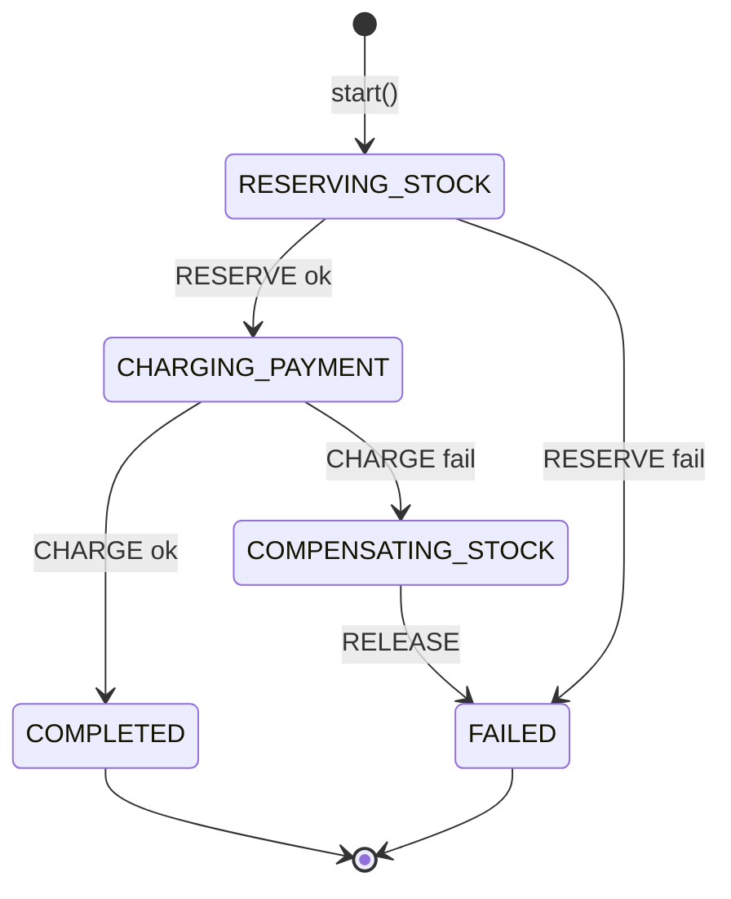
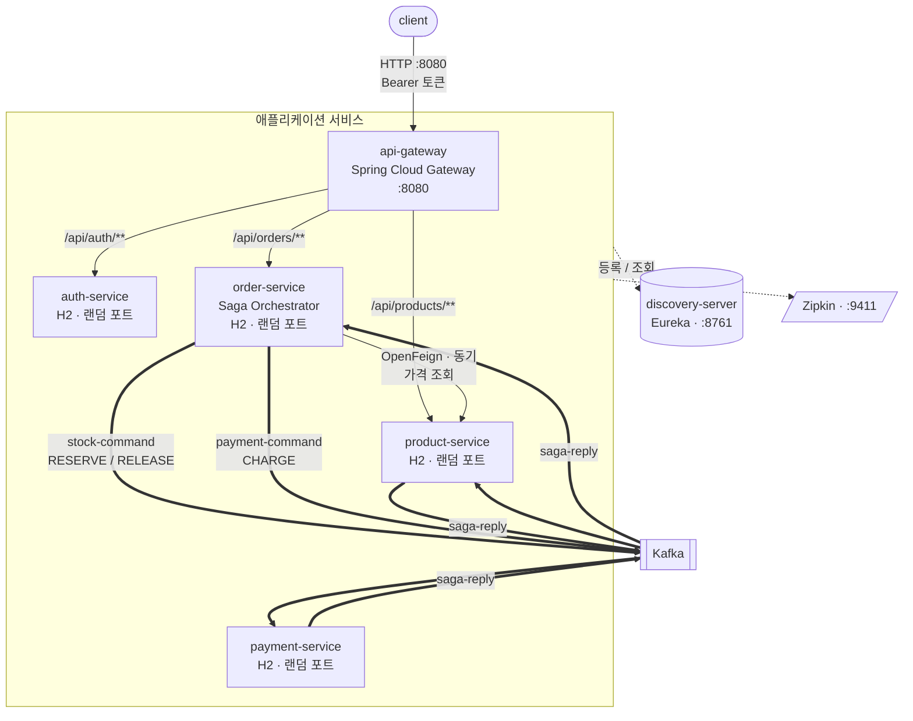

# Phase 8 — Saga 오케스트레이션 전환 구현 계획

> **For agentic workers:** REQUIRED SUB-SKILL: Use superpowers:subagent-driven-development (recommended) or superpowers:executing-plans to implement this plan task-by-task. Steps use checkbox (`- [ ]`) syntax for tracking.

**설계 문서:** [docs/specs/2026-08-09-saga-orchestration-design.md](../specs/2026-08-09-saga-orchestration-design.md) (커밋 `54fe599`)

**Goal:** 코레오그래피 Saga를 오케스트레이션으로 바꾸고, 재고 확보 → 결제 2단계 흐름에서 결제 실패 시 재고를 되돌리는 보상 명령이 실제로 오가게 한다.

**Architecture:** 다음 단계를 결정하는 로직을 `order-service` 안의 `OrderSagaOrchestrator` 한 클래스에 모은다. 참여자(`product-service`, `payment-service`)는 각자의 명령 토픽을 구독해 시키는 일만 하고 공용 `saga-reply` 토픽으로 답한다. Saga 진행 상태는 주문과 같은 DB의 `OrderSaga` 테이블에 남고, 이 상태를 근거로 타임아웃 보상을 돌린다.

**Tech Stack:** Java 21, Spring Boot 3.5.3, Spring Cloud 2025.0.0, Spring Kafka, Spring Data JPA, H2(인메모리), JUnit 5 + AssertJ + Mockito

## Global Constraints

- 서비스 간 **공통 모듈을 만들지 않는다.** 메시지 타입(record)은 서비스마다 각자 정의한다. 기존 방침이며 `spring.json.add.type.headers: false` 설정이 이를 전제한다.
- 모든 신규 클래스는 **package-private**를 기본으로 한다. Kafka 역직렬화 대상 record와 JPA 엔티티만 `public`으로 연다.
- 주석은 **왜 그렇게 했는지**를 적는다. 무엇을 하는지는 코드가 말한다. 기존 파일들의 밀도를 따른다.
- 테스트 속성은 기존과 동일하게 쓴다: `eureka.client.enabled=false`, `management.tracing.enabled=false`, `spring.kafka.listener.auto-startup=false`, `spring.kafka.admin.auto-create=false`.
- 금액은 항상 `BigDecimal`. 부동소수점 금지.
- Kafka 발행 시 **메시지 키는 `String.valueOf(orderId)`**. 같은 주문의 명령이 같은 파티션에 들어가야 실행과 보상의 순서가 지켜진다.
- 타임아웃 기본값: 판정 임계 `30s`, 스위퍼 주기 `10s`. 둘 다 설정으로 뺀다.
- 각 태스크가 끝날 때 `./gradlew build`가 통과해야 한다.

---

## 파일 구조

### 신규 모듈 `payment-service`

| 파일 | 책임 |
|---|---|
| `build.gradle` | 의존성. **security starter는 넣지 않는다** (아래 참고) |
| `PaymentServiceApplication.java` | 부트 진입점 |
| `Account.java`, `AccountRepository.java` | 계좌와 잔액 차감 규칙 |
| `PaymentCommand.java`, `SagaReply.java` | 메시지 타입 |
| `PaymentService.java` | `@Transactional` 잔액 차감 + 멱등 기록 |
| `PaymentCommandListener.java` | 명령 수신 → 서비스 호출 → 응답 발행 |
| `ProcessedCommand.java`, `ProcessedCommandRepository.java` | 멱등 기록 |
| `application.yml`, `data.sql` | 설정과 초기 잔액 |

> **설계 문서 §7.1과의 차이:** 스펙에는 `SecurityConfig.java`가 있었으나 넣지 않습니다. payment-service는 HTTP 엔드포인트가 없어 지킬 것이 없고, security starter를 넣으면 설정할 것만 늘어납니다. 저장소의 zero-trust 방침은 "데이터를 HTTP로 내주는 쪽이 토큰을 다시 검증한다"는 뜻이므로 이 서비스에는 적용 대상이 없습니다.

### `order-service`

| 파일 | 책임 |
|---|---|
| `SagaStep.java` (신규) | 단계 열거형. 각 단계가 **어떤 응답을 기다리는지**를 함께 들고 있다 |
| `OrderSaga.java` (신규) | Saga 진행 상태 엔티티 |
| `OrderSagaRepository.java` (신규) | 조회. 타임아웃 대상 질의 포함 |
| `OrderSagaOrchestrator.java` (신규) | **흐름 전체.** 상태 전이와 다음 명령 결정 |
| `SagaReplyListener.java` (신규) | Kafka 수신만. 판단은 오케스트레이터에 넘긴다 |
| `SagaTimeoutSweeper.java` (신규) | `@Scheduled` 감지만. 처리는 오케스트레이터에 넘긴다 |
| `StockCommand.java`, `PaymentCommand.java`, `SagaReply.java` (신규) | 메시지 타입 |
| `OrderController.java` (수정) | 발행 대신 `orchestrator.start(order)` 호출 |
| `OrderServiceApplication.java` (수정) | 토픽 선언 교체, `@EnableScheduling` |
| `application.yml` (수정) | 컨슈머 기본 타입, 타임아웃 설정 |
| ~~`OrderCreatedEvent.java`, `StockResultEvent.java`, `StockResultListener.java`, `StockResultListenerTest.java`~~ | 삭제 |

리스너·스위퍼를 오케스트레이터와 분리하는 이유는 둘입니다. 첫째, 흐름 판단이 한 곳에만 있어야 "흐름이 한 파일에 모인다"는 이 전환의 목적이 지켜집니다. 둘째, `@Transactional`은 스프링 프록시를 거쳐야 동작하므로 트랜잭션 경계를 **다른 빈**에 두어야 합니다. 같은 클래스 안에서 자기 메서드를 부르면 트랜잭션이 조용히 걸리지 않습니다(self-invocation).

### `product-service`

| 파일 | 책임 |
|---|---|
| `StockCommand.java` (신규) | 명령 타입. `RESERVE` / `RELEASE` |
| `SagaReply.java` (신규) | 응답 타입 |
| `ProcessedCommand.java`, `ProcessedCommandRepository.java` (신규) | 멱등 기록. 키가 `(orderId, action)` |
| `StockCommandListener.java` (신규) | `OrderCreatedListener` 대체 |
| `StockReservationService.java` (수정) | `reserve` + `release` |
| `Product.java` (수정) | `increaseStock` 추가 |
| `application.yml` (수정) | 컨슈머 기본 타입 |
| ~~`OrderCreatedEvent.java`, `OrderCreatedListener.java`, `StockResultEvent.java`, `ProcessedOrderEvent.java`, `ProcessedOrderEventRepository.java`, `OrderCreatedListenerTest.java`~~ | 삭제 |

---

## Task 1: payment-service 모듈 골격과 계좌

**Files:**
- Create: `payment-service/build.gradle`
- Create: `payment-service/src/main/java/com/example/msa/payment/PaymentServiceApplication.java`
- Create: `payment-service/src/main/java/com/example/msa/payment/Account.java`
- Create: `payment-service/src/main/java/com/example/msa/payment/AccountRepository.java`
- Create: `payment-service/src/main/resources/application.yml`
- Create: `payment-service/src/main/resources/data.sql`
- Modify: `settings.gradle`
- Test: `payment-service/src/test/java/com/example/msa/payment/AccountTest.java`

**Interfaces:**
- Consumes: 없음 (첫 태스크)
- Produces:
  - `Account`(entity) — 생성자 `Account(Long userId, BigDecimal balance)`, 메서드 `boolean withdraw(BigDecimal amount)`, `void deposit(BigDecimal amount)`, getter `getUserId()`, `getBalance()`
  - `AccountRepository extends JpaRepository<Account, Long>`
  - 초기 데이터: userId 1과 2에 각각 잔액 `1000000`

- [ ] **Step 1: 모듈을 빌드에 등록한다**

`settings.gradle`의 `include 'order-service'` 다음 줄에 추가합니다.

```groovy
include 'payment-service'
```

- [ ] **Step 2: 의존성을 선언한다**

`payment-service/build.gradle`을 만듭니다. `product-service/build.gradle`에서 security·validation 관련 세 줄을 뺀 것입니다.

```groovy
dependencies {
    // HTTP 엔드포인트는 없지만 웹 서버는 띄운다. Eureka 등록과 헬스체크에 필요하다.
    implementation 'org.springframework.boot:spring-boot-starter-web'
    implementation 'org.springframework.boot:spring-boot-starter-data-jpa'
    implementation 'org.springframework.cloud:spring-cloud-starter-netflix-eureka-client'
    implementation 'org.springframework.kafka:spring-kafka'
    // 분산 추적: Kafka 헤더로 넘어온 trace id 를 이어받아 Zipkin 으로 보낸다.
    implementation 'org.springframework.boot:spring-boot-starter-actuator'
    implementation 'io.micrometer:micrometer-tracing-bridge-brave'
    implementation 'io.zipkin.reporter2:zipkin-reporter-brave'
    runtimeOnly 'com.h2database:h2'
}
```

- [ ] **Step 3: 실패하는 테스트를 쓴다**

`payment-service/src/test/java/com/example/msa/payment/AccountTest.java`

```java
package com.example.msa.payment;

import static org.assertj.core.api.Assertions.assertThat;

import java.math.BigDecimal;
import org.junit.jupiter.api.Test;
import org.springframework.beans.factory.annotation.Autowired;
import org.springframework.boot.test.context.SpringBootTest;

@SpringBootTest(properties = {
        "eureka.client.enabled=false",
        "management.tracing.enabled=false",
        "spring.kafka.listener.auto-startup=false",
        "spring.kafka.admin.auto-create=false"
})
class AccountTest {

    @Autowired
    private AccountRepository repository;

    @Test
    void 초기_계좌는_백만원을_가진다() {
        assertThat(repository.findById(1L).orElseThrow().getBalance())
                .isEqualByComparingTo("1000000");
        assertThat(repository.findById(2L).orElseThrow().getBalance())
                .isEqualByComparingTo("1000000");
    }

    @Test
    void 잔액을_넘는_출금은_거절하고_잔액을_건드리지_않는다() {
        Account account = new Account(99L, new BigDecimal("1000"));

        assertThat(account.withdraw(new BigDecimal("1001"))).isFalse();
        assertThat(account.getBalance()).isEqualByComparingTo("1000");
    }

    @Test
    void 잔액과_같은_금액은_출금할_수_있다() {
        Account account = new Account(99L, new BigDecimal("1000"));

        assertThat(account.withdraw(new BigDecimal("1000"))).isTrue();
        assertThat(account.getBalance()).isEqualByComparingTo("0");
    }

    @Test
    void 입금은_보상에_쓰이므로_잔액을_되돌린다() {
        Account account = new Account(99L, new BigDecimal("1000"));
        account.withdraw(new BigDecimal("400"));

        account.deposit(new BigDecimal("400"));

        assertThat(account.getBalance()).isEqualByComparingTo("1000");
    }
}
```

- [ ] **Step 4: 테스트가 실패하는 것을 확인한다**

Run: `./gradlew :payment-service:test`
Expected: FAIL — 컴파일 오류. `Account`, `AccountRepository`, `PaymentServiceApplication`이 없다.

- [ ] **Step 5: 부트 진입점을 만든다**

`payment-service/src/main/java/com/example/msa/payment/PaymentServiceApplication.java`

```java
package com.example.msa.payment;

import org.springframework.boot.SpringApplication;
import org.springframework.boot.autoconfigure.SpringBootApplication;

@SpringBootApplication
public class PaymentServiceApplication {

    public static void main(String[] args) {
        SpringApplication.run(PaymentServiceApplication.class, args);
    }
}
```

- [ ] **Step 6: 계좌 엔티티를 만든다**

`payment-service/src/main/java/com/example/msa/payment/Account.java`

```java
package com.example.msa.payment;

import jakarta.persistence.Entity;
import jakarta.persistence.Id;
import java.math.BigDecimal;

/**
 * 사용자 계좌. Saga 의 두 번째 참여자가 다루는 자원이다.
 *
 * <p>userId 를 그대로 기본키로 쓴다. 사용자당 계좌가 하나뿐인 학습 범위이므로
 * 별도 계좌번호를 두면 대응 관계만 늘어난다. userId 값은 auth-service 가 발급한
 * 토큰의 uid 클레임에서 온다. 서비스마다 DB 가 분리되어 있으므로 외래키는 없다.
 */
@Entity
public class Account {

    @Id
    private Long userId;

    // 금액은 부동소수점 오차가 없는 BigDecimal 로 다룬다.
    private BigDecimal balance;

    protected Account() {
        // JPA 기본 생성자
    }

    public Account(Long userId, BigDecimal balance) {
        this.userId = userId;
        this.balance = balance;
    }

    /**
     * 잔액을 차감한다. 모자라면 차감하지 않고 false 를 돌려준다.
     *
     * <p>재고의 {@code decreaseStock} 과 같은 모양이다. 실패를 예외가 아니라
     * 반환값으로 알리는 이유는, 잔액 부족이 <b>정상적인 업무 결과</b>이지
     * 시스템 오류가 아니기 때문이다. 이 결과는 그대로 Saga 응답에 실린다.
     *
     * @return 차감에 성공했으면 true
     */
    public boolean withdraw(BigDecimal amount) {
        if (balance.compareTo(amount) < 0) {
            return false;
        }
        balance = balance.subtract(amount);
        return true;
    }

    /**
     * 잔액을 되돌린다.
     *
     * <p>지금은 결제가 마지막 단계라 호출될 경로가 없다. 뒤에 배송 같은 단계가
     * 붙으면 그때의 보상(REFUND)이 이 메서드를 쓴다.
     */
    public void deposit(BigDecimal amount) {
        balance = balance.add(amount);
    }

    public Long getUserId() {
        return userId;
    }

    public BigDecimal getBalance() {
        return balance;
    }
}
```

- [ ] **Step 7: 저장소 인터페이스를 만든다**

`payment-service/src/main/java/com/example/msa/payment/AccountRepository.java`

```java
package com.example.msa.payment;

import org.springframework.data.jpa.repository.JpaRepository;

interface AccountRepository extends JpaRepository<Account, Long> {
}
```

- [ ] **Step 8: 설정과 초기 데이터를 만든다**

`payment-service/src/main/resources/application.yml`

```yaml
server:
  port: 0

spring:
  application:
    name: payment-service
  datasource:
    # 서비스마다 DB 를 분리한다(Database per Service). 이름이 겹치면 안 된다.
    url: jdbc:h2:mem:paymentdb
    username: sa
    password:
  jpa:
    hibernate:
      ddl-auto: create-drop
    # data.sql 이 Hibernate 의 테이블 생성보다 먼저 실행되지 않도록 미룬다.
    defer-datasource-initialization: true
  sql:
    init:
      mode: always
  kafka:
    bootstrap-servers: ${KAFKA_BOOTSTRAP_SERVERS:localhost:9092}
    producer:
      key-serializer: org.apache.kafka.common.serialization.StringSerializer
      value-serializer: org.springframework.kafka.support.serializer.JsonSerializer
      properties:
        spring.json.add.type.headers: false
    template:
      observation-enabled: true
    consumer:
      group-id: payment-service
      auto-offset-reset: earliest
      key-deserializer: org.apache.kafka.common.serialization.StringDeserializer
      value-deserializer: org.springframework.kafka.support.serializer.JsonDeserializer
      properties:
        # 이 서비스가 구독하는 토픽은 payment-command 하나뿐이므로 기본 타입도 하나다.
        spring.json.value.default.type: com.example.msa.payment.PaymentCommand
        spring.json.trusted.packages: com.example.msa.payment
    listener:
      observation-enabled: true

eureka:
  client:
    service-url:
      defaultZone: ${EUREKA_SERVER_URL:http://localhost:8761/eureka}
  instance:
    instance-id: ${spring.application.name}:${random.uuid}

management:
  tracing:
    sampling:
      probability: 1.0
  zipkin:
    tracing:
      endpoint: ${ZIPKIN_ENDPOINT:http://localhost:9411/api/v2/spans}
```

`payment-service/src/main/resources/data.sql`

```sql
-- 인메모리 DB 이므로 기동할 때마다 이 초기 데이터로 시작한다.
-- userId 는 auth-service 가 user, admin 순으로 저장하고 id 가 자동 증가하므로 1, 2 다.
insert into account (user_id, balance) values (1, 1000000);
insert into account (user_id, balance) values (2, 1000000);
```

> `PaymentCommand` 클래스는 아직 없지만 `spring.json.value.default.type` 은 문자열 설정이라 기동에 지장이 없습니다. 리스너가 없어 역직렬화도 일어나지 않습니다. Task 2에서 만듭니다.

- [ ] **Step 9: 테스트가 통과하는 것을 확인한다**

Run: `./gradlew :payment-service:test`
Expected: PASS — 4개 테스트 모두 통과

- [ ] **Step 10: 전체 빌드를 확인하고 커밋한다**

Run: `./gradlew build`
Expected: BUILD SUCCESSFUL

```bash
git add settings.gradle payment-service
git commit -m "feat: payment-service 모듈 신설 - 계좌와 잔액 차감 규칙

Saga 의 두 번째 참여자가 될 서비스의 골격이다. HTTP 엔드포인트가 없어
security starter 를 넣지 않았다. 아직 명령을 받지 않으므로 단위 테스트로만
검증한다."
```

---

## Task 2: payment-service 결제 처리와 멱등

**Files:**
- Create: `payment-service/src/main/java/com/example/msa/payment/PaymentCommand.java`
- Create: `payment-service/src/main/java/com/example/msa/payment/SagaReply.java`
- Create: `payment-service/src/main/java/com/example/msa/payment/ProcessedCommand.java`
- Create: `payment-service/src/main/java/com/example/msa/payment/ProcessedCommandRepository.java`
- Create: `payment-service/src/main/java/com/example/msa/payment/PaymentService.java`
- Create: `payment-service/src/main/java/com/example/msa/payment/PaymentCommandListener.java`
- Test: `payment-service/src/test/java/com/example/msa/payment/PaymentCommandListenerTest.java`

**Interfaces:**
- Consumes: `Account`, `AccountRepository` (Task 1)
- Produces:
  - `PaymentCommand(Long orderId, Long userId, BigDecimal amount, Action action)` — `TOPIC = "payment-command"`, `enum Action { CHARGE }`
  - `SagaReply(Long orderId, String action, boolean success, String reason)` — `TOPIC = "saga-reply"`
  - `PaymentCommandListener.handle(PaymentCommand)` — 테스트에서 직접 호출한다

- [ ] **Step 1: 실패하는 테스트를 쓴다**

`payment-service/src/test/java/com/example/msa/payment/PaymentCommandListenerTest.java`

```java
package com.example.msa.payment;

import static org.assertj.core.api.Assertions.assertThat;
import static org.mockito.ArgumentMatchers.any;
import static org.mockito.ArgumentMatchers.eq;
import static org.mockito.Mockito.times;
import static org.mockito.Mockito.verify;

import java.math.BigDecimal;
import org.junit.jupiter.api.Test;
import org.mockito.ArgumentCaptor;
import org.springframework.beans.factory.annotation.Autowired;
import org.springframework.boot.test.context.SpringBootTest;
import org.springframework.kafka.core.KafkaTemplate;
import org.springframework.test.context.bean.override.mockito.MockitoBean;

/**
 * 브로커 없이 리스너를 직접 호출해 잔액 차감 규칙과 응답 발행을 검증한다.
 * Saga 는 결과를 되돌려 보내야 성립하므로, 실패 경로에서도 응답이 나가는지가 핵심이다.
 */
@SpringBootTest(properties = {
        "eureka.client.enabled=false",
        "management.tracing.enabled=false",
        "spring.kafka.listener.auto-startup=false",
        "spring.kafka.admin.auto-create=false"
})
class PaymentCommandListenerTest {

    @Autowired
    private PaymentCommandListener listener;

    @Autowired
    private AccountRepository accounts;

    @MockitoBean
    private KafkaTemplate<String, Object> kafkaTemplate;

    private SagaReply published() {
        ArgumentCaptor<Object> captor = ArgumentCaptor.forClass(Object.class);
        verify(kafkaTemplate).send(eq(SagaReply.TOPIC), any(String.class), captor.capture());
        return (SagaReply) captor.getValue();
    }

    private static PaymentCommand charge(long orderId, long userId, String amount) {
        return new PaymentCommand(orderId, userId, new BigDecimal(amount),
                PaymentCommand.Action.CHARGE);
    }

    @Test
    void 잔액이_충분하면_차감하고_성공을_알린다() {
        BigDecimal before = accounts.findById(1L).orElseThrow().getBalance();

        listener.handle(charge(1L, 1L, "89000"));

        assertThat(accounts.findById(1L).orElseThrow().getBalance())
                .isEqualByComparingTo(before.subtract(new BigDecimal("89000")));

        SagaReply reply = published();
        assertThat(reply.success()).isTrue();
        assertThat(reply.action()).isEqualTo("CHARGE");
        assertThat(reply.orderId()).isEqualTo(1L);
    }

    @Test
    void 잔액을_넘으면_차감하지_않고_실패를_알린다() {
        BigDecimal before = accounts.findById(2L).orElseThrow().getBalance();

        listener.handle(charge(2L, 2L, "1280000"));

        assertThat(accounts.findById(2L).orElseThrow().getBalance()).isEqualByComparingTo(before);

        SagaReply reply = published();
        assertThat(reply.success()).isFalse();
        // 사유를 담아야 order-service 가 사용자에게 왜 취소됐는지 알려줄 수 있다.
        assertThat(reply.reason()).contains("잔액 부족");
    }

    @Test
    void 계좌가_없으면_실패로_알린다() {
        listener.handle(charge(3L, 9999L, "1000"));

        SagaReply reply = published();
        assertThat(reply.success()).isFalse();
        // 조용히 버리면 Saga 가 영원히 대기 상태로 남는다. 반드시 응답을 보내야 한다.
        assertThat(reply.orderId()).isEqualTo(3L);
    }

    @Test
    void 같은_명령이_두_번_와도_잔액은_한_번만_차감된다() {
        BigDecimal before = accounts.findById(1L).orElseThrow().getBalance();
        PaymentCommand command = charge(10L, 1L, "50000");

        listener.handle(command);
        listener.handle(command);   // Kafka 는 at-least-once 라 재전송이 있을 수 있다

        assertThat(accounts.findById(1L).orElseThrow().getBalance())
                .isEqualByComparingTo(before.subtract(new BigDecimal("50000")));
    }

    @Test
    void 중복_명령에도_같은_결과를_다시_발행한다() {
        PaymentCommand command = charge(11L, 1L, "1000");

        listener.handle(command);
        listener.handle(command);

        // 두 번 발행되어야 한다. 첫 처리에서 발행이 실패했을 수 있으므로
        // 조용히 건너뛰면 Saga 가 대기 상태로 남는다.
        ArgumentCaptor<Object> captor = ArgumentCaptor.forClass(Object.class);
        verify(kafkaTemplate, times(2))
                .send(eq(SagaReply.TOPIC), any(String.class), captor.capture());

        assertThat(captor.getAllValues())
                .allSatisfy(v -> assertThat(((SagaReply) v).success()).isTrue());
    }
}
```

- [ ] **Step 2: 테스트가 실패하는 것을 확인한다**

Run: `./gradlew :payment-service:test --tests '*PaymentCommandListenerTest'`
Expected: FAIL — 컴파일 오류. `PaymentCommand`, `SagaReply`, `PaymentCommandListener`가 없다.

- [ ] **Step 3: 메시지 타입을 만든다**

`payment-service/src/main/java/com/example/msa/payment/PaymentCommand.java`

```java
package com.example.msa.payment;

import java.math.BigDecimal;

/**
 * 오케스트레이터가 보내는 결제 명령.
 *
 * <p>코레오그래피에서 오가던 것은 "주문이 생겼다"는 <b>사실(event)</b>이었다.
 * 여기서 오가는 것은 "결제하라"는 <b>지시(command)</b>다. 사실은 듣는 쪽이 무엇을
 * 할지 스스로 정하지만, 지시는 보내는 쪽이 이미 정해 놓은 것이다. 그래서 이
 * 서비스는 앞에 재고 단계가 있었다는 사실도, 뒤에 무엇이 오는지도 알 필요가 없다.
 *
 * <p>{@code amount} 를 이 서비스가 다시 계산하지 않고 명령에 담아 받는다.
 * 가격은 product-service 의 것이므로 여기서 알 방법이 없고, 주문 시점에 확정된
 * 금액으로 결제해야 하기 때문이다.
 */
public record PaymentCommand(Long orderId, Long userId, BigDecimal amount, Action action) {

    public static final String TOPIC = "payment-command";

    /**
     * 지금은 CHARGE 뿐이다. 결제가 마지막 단계라 그 뒤에 실패할 단계가 없어
     * 보상(REFUND)이 호출될 경로가 없기 때문이다. 배송 같은 단계를 뒤에 붙이는
     * 시점에 추가한다.
     */
    public enum Action {
        CHARGE
    }
}
```

`payment-service/src/main/java/com/example/msa/payment/SagaReply.java`

```java
package com.example.msa.payment;

/**
 * 참여자가 오케스트레이터에게 돌려주는 응답. 모든 참여자가 같은 토픽으로 답한다.
 *
 * <p>{@code action} 을 열거형이 아니라 문자열로 둔 이유가 있다. 이 필드에는
 * product-service 의 RESERVE/RELEASE 와 payment-service 의 CHARGE 가 모두 실린다.
 * 열거형으로 만들려면 세 값을 모두 아는 공통 타입이 필요하고, 그러면 서비스 간
 * 공통 모듈을 두지 않는다는 이 저장소의 방침이 깨진다. 받는 쪽은 "지금 기다리는
 * 응답이 이것이 맞는가"만 문자열로 비교하면 되므로 이 정도로 충분하다.
 */
public record SagaReply(Long orderId, String action, boolean success, String reason) {

    public static final String TOPIC = "saga-reply";

    static SagaReply ok(Long orderId, PaymentCommand.Action action) {
        return new SagaReply(orderId, action.name(), true, null);
    }

    static SagaReply fail(Long orderId, PaymentCommand.Action action, String reason) {
        return new SagaReply(orderId, action.name(), false, reason);
    }
}
```

- [ ] **Step 4: 멱등 기록을 만든다**

`payment-service/src/main/java/com/example/msa/payment/ProcessedCommand.java`

```java
package com.example.msa.payment;

import jakarta.persistence.Entity;
import jakarta.persistence.Id;
import java.time.Instant;

/**
 * 이미 처리한 명령의 기록.
 *
 * <p>Kafka 는 at-least-once 다. 컨슈머가 처리하고 오프셋을 커밋하기 직전에 죽거나
 * 리밸런싱이 일어나면 같은 메시지가 다시 온다. 잔액 차감처럼 <b>누적되는 연산</b>은
 * 그때마다 값이 달라지므로 반드시 걸러야 한다.
 *
 * <p>키가 주문 번호 단독이 아니라 <b>주문 번호와 동작의 조합</b>인 것이 핵심이다.
 * 같은 주문에 CHARGE 와 (나중에 추가될) REFUND 가 모두 올 수 있는데, 키가 주문
 * 번호뿐이면 보상이 "이미 처리함"으로 무시되어 영영 되돌아가지 않는다.
 *
 * <p>복합키를 {@code @EmbeddedId} 대신 문자열 하나로 합쳐 쓴다. 복합키 클래스는
 * equals/hashCode/Serializable 을 요구하는데, 우리는 이 키로 부분 조회를 할 일이
 * 없어 그 보일러플레이트만큼의 값어치가 없다.
 * ponytail: 동작별 집계 같은 질의가 필요해지면 그때 @EmbeddedId 로 쪼갠다.
 */
@Entity
class ProcessedCommand {

    @Id
    private String id;

    private boolean success;

    private String reason;

    private Instant processedAt;

    protected ProcessedCommand() {
        // JPA 기본 생성자
    }

    ProcessedCommand(Long orderId, PaymentCommand.Action action, boolean success, String reason) {
        this.id = idOf(orderId, action);
        this.success = success;
        this.reason = reason;
        this.processedAt = Instant.now();
    }

    static String idOf(Long orderId, PaymentCommand.Action action) {
        return orderId + ":" + action;
    }

    boolean isSuccess() {
        return success;
    }

    String getReason() {
        return reason;
    }

    Instant getProcessedAt() {
        return processedAt;
    }
}
```

`payment-service/src/main/java/com/example/msa/payment/ProcessedCommandRepository.java`

```java
package com.example.msa.payment;

import org.springframework.data.jpa.repository.JpaRepository;

interface ProcessedCommandRepository extends JpaRepository<ProcessedCommand, String> {
}
```

- [ ] **Step 5: 결제 서비스를 만든다**

`payment-service/src/main/java/com/example/msa/payment/PaymentService.java`

```java
package com.example.msa.payment;

import org.slf4j.Logger;
import org.slf4j.LoggerFactory;
import org.springframework.stereotype.Service;
import org.springframework.transaction.annotation.Transactional;

/**
 * 결제 판단. Saga 에서 이 서비스가 맡은 로컬 트랜잭션이다.
 *
 * <p>리스너와 별도의 빈으로 둔 데는 이유가 있다. {@code @Transactional} 은 스프링이
 * 만든 프록시를 거쳐야 동작하는데, <b>같은 클래스 안에서 자기 메서드를 호출하면
 * 프록시를 거치지 않아 트랜잭션이 걸리지 않는다</b>(self-invocation). 조용히 실패하기
 * 때문에 알아채기 어렵다. 트랜잭션 경계를 다른 빈으로 옮기면 이 문제가 사라진다.
 */
@Service
class PaymentService {

    private static final Logger log = LoggerFactory.getLogger(PaymentService.class);

    private final AccountRepository accounts;
    private final ProcessedCommandRepository processed;

    PaymentService(AccountRepository accounts, ProcessedCommandRepository processed) {
        this.accounts = accounts;
        this.processed = processed;
    }

    /**
     * 잔액 차감과 처리 기록을 <b>하나의 트랜잭션</b>으로 묶는다.
     *
     * <p>따로 커밋하면 "잔액은 줄었는데 기록은 없는" 상태가 생기고, 그러면 같은
     * 명령이 다시 왔을 때 또 줄어든다. 둘이 같은 DB 안에 있으므로 묶을 수 있다.
     */
    // public 인 이유: @Transactional 이 non-public 메서드에도 걸리는지는 스프링 버전과
    // 프록시 방식에 따라 달라진다. 조용히 무시되면 알아채기 어려우므로 확실한 쪽을 택했다.
    // 클래스 자체가 package-private 이라 실제 노출 범위는 그대로다.
    @Transactional
    public SagaReply handle(PaymentCommand command) {
        // 이미 처리한 명령이면 잔액을 다시 건드리지 않고 그때의 결론을 그대로 돌려준다.
        // 그냥 건너뛰고 아무것도 돌려주지 않으면, 첫 처리에서 응답 발행이 실패했을 경우
        // Saga 가 영원히 대기 상태로 남는다.
        var seen = processed.findById(ProcessedCommand.idOf(command.orderId(), command.action()));
        if (seen.isPresent()) {
            ProcessedCommand record = seen.get();
            log.info("이미 처리한 명령. 잔액은 건드리지 않고 결과만 재발행: orderId={}, action={}, 최초처리={}",
                    command.orderId(), command.action(), record.getProcessedAt());
            return new SagaReply(command.orderId(), command.action().name(),
                    record.isSuccess(), record.getReason());
        }

        SagaReply reply = accounts.findById(command.userId())
                .map(account -> charge(account, command))
                .orElseGet(() -> {
                    log.warn("존재하지 않는 계좌에 대한 결제 명령: userId={}", command.userId());
                    return SagaReply.fail(command.orderId(), command.action(), "계좌가 없습니다");
                });

        processed.save(new ProcessedCommand(command.orderId(), command.action(),
                reply.success(), reply.reason()));
        return reply;
    }

    private SagaReply charge(Account account, PaymentCommand command) {
        if (!account.withdraw(command.amount())) {
            log.warn("잔액 부족: userId={}, 청구액={}, 잔액={} (orderId={})",
                    command.userId(), command.amount(), account.getBalance(), command.orderId());
            return SagaReply.fail(command.orderId(), command.action(),
                    "잔액 부족 (청구 %s, 잔액 %s)".formatted(command.amount(), account.getBalance()));
        }

        accounts.save(account);
        log.info("결제 완료: userId={}, 청구액={}, 남은잔액={} (orderId={})",
                command.userId(), command.amount(), account.getBalance(), command.orderId());
        return SagaReply.ok(command.orderId(), command.action());
    }
}
```

- [ ] **Step 6: 리스너를 만든다**

`payment-service/src/main/java/com/example/msa/payment/PaymentCommandListener.java`

```java
package com.example.msa.payment;

import org.springframework.kafka.annotation.KafkaListener;
import org.springframework.kafka.core.KafkaTemplate;
import org.springframework.stereotype.Component;

/**
 * 결제 명령을 받아 처리하고 <b>결과를 반드시 되돌려 보낸다</b>.
 *
 * <p>이 클래스에는 흐름 판단이 없다. 성공하면 다음에 무엇을 할지, 실패하면 무엇을
 * 되돌릴지는 전부 오케스트레이터가 정한다. 참여자는 시키는 일을 하고 답할 뿐이다.
 * 그래서 Saga 의 단계 순서를 바꿔도 이 파일은 건드리지 않는다.
 */
@Component
class PaymentCommandListener {

    private final PaymentService paymentService;
    private final KafkaTemplate<String, Object> kafkaTemplate;

    PaymentCommandListener(PaymentService paymentService,
            KafkaTemplate<String, Object> kafkaTemplate) {
        this.paymentService = paymentService;
        this.kafkaTemplate = kafkaTemplate;
    }

    @KafkaListener(topics = PaymentCommand.TOPIC, groupId = "payment-service")
    void handle(PaymentCommand command) {
        SagaReply reply = paymentService.handle(command);

        // 발행은 트랜잭션 밖에서 한다. 브로커 전송이 느리거나 실패할 때
        // DB 커넥션과 락을 붙잡고 있지 않기 위해서다.
        //
        // 키를 orderId 로 지정한다. 같은 주문의 응답이 같은 파티션에 들어가야
        // 오케스트레이터가 받는 순서가 보낸 순서와 같아진다.
        //
        // ponytail: DB 커밋과 발행이 여전히 원자적이지 않다(dual write).
        // 처리 기록을 남겨 두었으므로 발행 직전에 죽더라도 재전송 때 같은 결론이
        // 다시 나가고, 그마저 실패하면 오케스트레이터의 타임아웃이 걷어낸다.
        // 완전한 해결은 Transactional Outbox 패턴이다.
        kafkaTemplate.send(SagaReply.TOPIC, String.valueOf(reply.orderId()), reply);
    }
}
```

- [ ] **Step 7: 테스트가 통과하는 것을 확인한다**

Run: `./gradlew :payment-service:test`
Expected: PASS — `AccountTest` 4개 + `PaymentCommandListenerTest` 5개

- [ ] **Step 8: 전체 빌드를 확인하고 커밋한다**

Run: `./gradlew build`
Expected: BUILD SUCCESSFUL

```bash
git add payment-service
git commit -m "feat: payment-service 결제 명령 처리와 멱등 소비

명령/응답 방식의 참여자를 먼저 만든다. 멱등 키를 (orderId, action) 조합으로
두어 나중에 보상 명령이 '이미 처리함'으로 무시되지 않게 한다.

SagaReply.action 을 문자열로 둔 것은 이 필드에 서로 다른 서비스의 열거형
값이 실리기 때문이다. 공통 모듈을 두지 않는 방침을 지킨다."
```

---

## Task 3: product-service 메시지 타입과 재고 복구

**Files:**
- Create: `product-service/src/main/java/com/example/msa/product/StockCommand.java`
- Create: `product-service/src/main/java/com/example/msa/product/SagaReply.java`
- Create: `product-service/src/main/java/com/example/msa/product/ProcessedCommand.java`
- Create: `product-service/src/main/java/com/example/msa/product/ProcessedCommandRepository.java`
- Modify: `product-service/src/main/java/com/example/msa/product/Product.java`
- Test: `product-service/src/test/java/com/example/msa/product/ProductStockTest.java`

**Interfaces:**
- Consumes: `Product`, `ProductRepository` (기존)
- Produces:
  - `StockCommand(Long orderId, Long productId, int quantity, Action action)` — `TOPIC = "stock-command"`, `enum Action { RESERVE, RELEASE }`
  - `SagaReply(Long orderId, String action, boolean success, String reason)` — `TOPIC = "saga-reply"`, 팩토리 `ok(Long, StockCommand.Action)` / `fail(Long, StockCommand.Action, String)`
  - `ProcessedCommand` — 생성자 `(Long, StockCommand.Action, boolean, String)`, 정적 `idOf(Long, StockCommand.Action)`
  - `Product.increaseStock(int)`

- [ ] **Step 1: 실패하는 테스트를 쓴다**

`product-service/src/test/java/com/example/msa/product/ProductStockTest.java`

```java
package com.example.msa.product;

import static org.assertj.core.api.Assertions.assertThat;

import java.math.BigDecimal;
import org.junit.jupiter.api.Test;

/**
 * 재고 증감 규칙만 따로 확인한다. 스프링 컨텍스트가 필요 없는 순수 단위 테스트다.
 */
class ProductStockTest {

    private static Product product(int stock) {
        return new Product("테스트상품", new BigDecimal("1000"), stock);
    }

    @Test
    void 재고보다_많이_차감하면_실패하고_재고는_그대로다() {
        Product product = product(10);

        assertThat(product.decreaseStock(11)).isFalse();
        assertThat(product.getStock()).isEqualTo(10);
    }

    @Test
    void 차감한_만큼_되돌리면_원래_수량이_된다() {
        Product product = product(10);
        product.decreaseStock(4);

        product.increaseStock(4);

        assertThat(product.getStock()).isEqualTo(10);
    }
}
```

- [ ] **Step 2: 테스트가 실패하는 것을 확인한다**

Run: `./gradlew :product-service:test --tests '*ProductStockTest'`
Expected: FAIL — 컴파일 오류. `increaseStock` 메서드가 없다.

- [ ] **Step 3: 재고 복구 메서드를 추가한다**

`product-service/src/main/java/com/example/msa/product/Product.java`의 `decreaseStock` 바로 아래에 넣습니다.

```java
    /**
     * 차감했던 재고를 되돌린다. Saga 의 <b>보상</b>에 쓰인다.
     *
     * <p>차감과 달리 상한을 검사하지 않는다. 되돌리는 수량은 앞서 실제로 차감한
     * 수량이므로 원래 값을 넘을 수 없고, 넘는다면 그것은 명령이 잘못된 것이지
     * 여기서 막을 일이 아니다. 중복 실행은 호출하는 쪽에서 멱등 기록으로 막는다.
     */
    public void increaseStock(int quantity) {
        stock += quantity;
    }
```

- [ ] **Step 4: 테스트가 통과하는 것을 확인한다**

Run: `./gradlew :product-service:test --tests '*ProductStockTest'`
Expected: PASS — 2개 통과

- [ ] **Step 5: 명령 타입을 만든다**

`product-service/src/main/java/com/example/msa/product/StockCommand.java`

```java
package com.example.msa.product;

/**
 * 오케스트레이터가 보내는 재고 명령.
 *
 * <p>코레오그래피에서 이 서비스가 받던 것은 "주문이 생겼다"는 <b>사실(event)</b>이었고,
 * 재고를 잡을지 말지는 이 서비스가 스스로 판단했다. 이제 받는 것은 "재고를 잡아라",
 * "되돌려라"라는 <b>지시(command)</b>다. 판단은 오케스트레이터가 한다.
 *
 * <p>실행({@code RESERVE})과 보상({@code RELEASE})을 같은 토픽에 담는 것이 중요하다.
 * Kafka 는 같은 토픽의 같은 파티션 안에서만 순서를 보장한다. 토픽을 나누면
 * "되돌려라"가 "잡아라"를 추월할 수 있어, 그 경합을 애플리케이션이 직접 막아야 한다.
 */
public record StockCommand(Long orderId, Long productId, int quantity, Action action) {

    public static final String TOPIC = "stock-command";

    public enum Action {
        RESERVE,
        RELEASE
    }
}
```

- [ ] **Step 6: 응답 타입을 만든다**

`product-service/src/main/java/com/example/msa/product/SagaReply.java`

```java
package com.example.msa.product;

/**
 * 참여자가 오케스트레이터에게 돌려주는 응답. 모든 참여자가 같은 토픽으로 답한다.
 *
 * <p>{@code action} 을 열거형이 아니라 문자열로 둔 이유가 있다. 이 필드에는
 * 이 서비스의 RESERVE/RELEASE 와 payment-service 의 CHARGE 가 모두 실린다.
 * 열거형으로 만들려면 세 값을 모두 아는 공통 타입이 필요하고, 그러면 서비스 간
 * 공통 모듈을 두지 않는다는 이 저장소의 방침이 깨진다.
 */
public record SagaReply(Long orderId, String action, boolean success, String reason) {

    public static final String TOPIC = "saga-reply";

    static SagaReply ok(Long orderId, StockCommand.Action action) {
        return new SagaReply(orderId, action.name(), true, null);
    }

    static SagaReply fail(Long orderId, StockCommand.Action action, String reason) {
        return new SagaReply(orderId, action.name(), false, reason);
    }
}
```

- [ ] **Step 7: 멱등 기록을 만든다**

`product-service/src/main/java/com/example/msa/product/ProcessedCommand.java`

```java
package com.example.msa.product;

import jakarta.persistence.Entity;
import jakarta.persistence.Id;
import java.time.Instant;

/**
 * 이미 처리한 명령의 기록. {@code ProcessedOrderEvent} 를 대체한다.
 *
 * <p>Kafka 는 at-least-once 다. 컨슈머가 처리하고 오프셋을 커밋하기 직전에 죽거나
 * 리밸런싱이 일어나면 같은 메시지가 다시 온다. 재고 차감처럼 <b>누적되는 연산</b>은
 * 그때마다 값이 달라지므로 반드시 걸러야 한다.
 *
 * <p>이전 버전과 달리 키가 주문 번호 단독이 아니라 <b>주문 번호와 동작의 조합</b>이다.
 * 같은 주문에 RESERVE 와 RELEASE 가 모두 오는데 키가 주문 번호뿐이면, 보상 명령이
 * "이미 처리함"으로 무시되어 재고가 영영 복구되지 않는다.
 *
 * <p>복합키를 {@code @EmbeddedId} 대신 문자열 하나로 합쳐 쓴다. 복합키 클래스는
 * equals/hashCode/Serializable 을 요구하는데, 우리는 이 키로 부분 조회를 할 일이
 * 없어 그 보일러플레이트만큼의 값어치가 없다.
 * ponytail: 동작별 집계 같은 질의가 필요해지면 그때 @EmbeddedId 로 쪼갠다.
 */
@Entity
class ProcessedCommand {

    @Id
    private String id;

    private boolean success;

    private String reason;

    private Instant processedAt;

    protected ProcessedCommand() {
        // JPA 기본 생성자
    }

    ProcessedCommand(Long orderId, StockCommand.Action action, boolean success, String reason) {
        this.id = idOf(orderId, action);
        this.success = success;
        this.reason = reason;
        this.processedAt = Instant.now();
    }

    static String idOf(Long orderId, StockCommand.Action action) {
        return orderId + ":" + action;
    }

    boolean isSuccess() {
        return success;
    }

    String getReason() {
        return reason;
    }

    Instant getProcessedAt() {
        return processedAt;
    }
}
```

`product-service/src/main/java/com/example/msa/product/ProcessedCommandRepository.java`

```java
package com.example.msa.product;

import org.springframework.data.jpa.repository.JpaRepository;

interface ProcessedCommandRepository extends JpaRepository<ProcessedCommand, String> {
}
```

- [ ] **Step 8: 빌드를 확인하고 커밋한다**

이 시점에는 아직 `ProcessedOrderEvent`와 새 `ProcessedCommand`가 공존합니다. 다음 태스크에서 옛것을 지웁니다.

Run: `./gradlew build`
Expected: BUILD SUCCESSFUL

```bash
git add product-service
git commit -m "feat: product-service 명령·응답 타입과 재고 복구 메서드

오케스트레이션으로 옮기기 위한 재료를 먼저 만든다. 실행과 보상을 같은
토픽에 담아 Kafka 파티션 수준에서 순서를 보장한다. 멱등 키는 보상이
무시되지 않도록 (orderId, action) 조합으로 둔다."
```

---

## Task 4: product-service를 명령/응답 방식으로 전환

**Files:**
- Modify: `product-service/src/main/java/com/example/msa/product/StockReservationService.java` (전면 교체)
- Create: `product-service/src/main/java/com/example/msa/product/StockCommandListener.java`
- Modify: `product-service/src/main/resources/application.yml:40`
- Delete: `product-service/src/main/java/com/example/msa/product/OrderCreatedEvent.java`
- Delete: `product-service/src/main/java/com/example/msa/product/OrderCreatedListener.java`
- Delete: `product-service/src/main/java/com/example/msa/product/StockResultEvent.java`
- Delete: `product-service/src/main/java/com/example/msa/product/ProcessedOrderEvent.java`
- Delete: `product-service/src/main/java/com/example/msa/product/ProcessedOrderEventRepository.java`
- Delete: `product-service/src/test/java/com/example/msa/product/OrderCreatedListenerTest.java`
- Test: `product-service/src/test/java/com/example/msa/product/StockCommandListenerTest.java`

**Interfaces:**
- Consumes: `StockCommand`, `SagaReply`, `ProcessedCommand`, `ProcessedCommandRepository`, `Product.increaseStock` (Task 3)
- Produces: `StockCommandListener.handle(StockCommand)` — 테스트에서 직접 호출한다

- [ ] **Step 1: 실패하는 테스트를 쓴다**

`product-service/src/test/java/com/example/msa/product/StockCommandListenerTest.java`

```java
package com.example.msa.product;

import static org.assertj.core.api.Assertions.assertThat;
import static org.mockito.ArgumentMatchers.any;
import static org.mockito.ArgumentMatchers.eq;
import static org.mockito.Mockito.times;
import static org.mockito.Mockito.verify;

import org.junit.jupiter.api.Test;
import org.mockito.ArgumentCaptor;
import org.springframework.beans.factory.annotation.Autowired;
import org.springframework.boot.test.context.SpringBootTest;
import org.springframework.kafka.core.KafkaTemplate;
import org.springframework.test.context.bean.override.mockito.MockitoBean;

/**
 * 브로커 없이 리스너를 직접 호출해 재고 명령 처리와 응답 발행을 검증한다.
 * 실행(RESERVE)과 보상(RELEASE)이 서로를 막지 않는지가 이 전환의 핵심이다.
 */
@SpringBootTest(properties = {
        "eureka.client.enabled=false",
        "management.tracing.enabled=false",
        "spring.kafka.listener.auto-startup=false",
        "spring.kafka.admin.auto-create=false"
})
class StockCommandListenerTest {

    @Autowired
    private StockCommandListener listener;

    @Autowired
    private ProductRepository repository;

    @MockitoBean
    private KafkaTemplate<String, Object> kafkaTemplate;

    private SagaReply published() {
        ArgumentCaptor<Object> captor = ArgumentCaptor.forClass(Object.class);
        verify(kafkaTemplate).send(eq(SagaReply.TOPIC), any(String.class), captor.capture());
        return (SagaReply) captor.getValue();
    }

    private static StockCommand reserve(long orderId, long productId, int quantity) {
        return new StockCommand(orderId, productId, quantity, StockCommand.Action.RESERVE);
    }

    private static StockCommand release(long orderId, long productId, int quantity) {
        return new StockCommand(orderId, productId, quantity, StockCommand.Action.RELEASE);
    }

    private int stockOf(long productId) {
        return repository.findById(productId).orElseThrow().getStock();
    }

    @Test
    void 주문_수량만큼_재고를_차감하고_성공을_알린다() {
        int before = stockOf(1L);

        listener.handle(reserve(1L, 1L, 3));

        assertThat(stockOf(1L)).isEqualTo(before - 3);

        SagaReply reply = published();
        assertThat(reply.success()).isTrue();
        assertThat(reply.action()).isEqualTo("RESERVE");
    }

    @Test
    void 재고보다_많이_주문하면_차감하지_않고_실패를_알린다() {
        int before = stockOf(2L);

        listener.handle(reserve(2L, 2L, before + 1));

        assertThat(stockOf(2L)).isEqualTo(before);

        SagaReply reply = published();
        assertThat(reply.success()).isFalse();
        assertThat(reply.reason()).contains("재고 부족");
    }

    @Test
    void 없는_상품_명령도_실패로_알린다() {
        listener.handle(reserve(3L, 9999L, 1));

        SagaReply reply = published();
        assertThat(reply.success()).isFalse();
        // 조용히 버리면 Saga 가 영원히 대기 상태로 남는다.
        assertThat(reply.orderId()).isEqualTo(3L);
    }

    @Test
    void 같은_명령이_두_번_와도_재고는_한_번만_차감된다() {
        int before = stockOf(1L);
        StockCommand command = reserve(10L, 1L, 4);

        listener.handle(command);
        listener.handle(command);   // Kafka 는 at-least-once 라 재전송이 있을 수 있다

        assertThat(stockOf(1L)).isEqualTo(before - 4);
    }

    @Test
    void 중복_명령에도_같은_결과를_다시_발행한다() {
        StockCommand command = reserve(11L, 1L, 2);

        listener.handle(command);
        listener.handle(command);

        // 두 번 발행되어야 한다. 첫 처리에서 발행이 실패했을 수 있으므로
        // 조용히 건너뛰면 Saga 가 대기 상태로 남는다.
        ArgumentCaptor<Object> captor = ArgumentCaptor.forClass(Object.class);
        verify(kafkaTemplate, times(2))
                .send(eq(SagaReply.TOPIC), any(String.class), captor.capture());

        assertThat(captor.getAllValues())
                .allSatisfy(v -> assertThat(((SagaReply) v).success()).isTrue());
    }

    @Test
    void 보상_명령은_재고를_되돌리고_성공을_알린다() {
        int before = stockOf(3L);
        listener.handle(reserve(20L, 3L, 5));
        assertThat(stockOf(3L)).isEqualTo(before - 5);

        listener.handle(release(20L, 3L, 5));

        assertThat(stockOf(3L)).isEqualTo(before);
    }

    @Test
    void 같은_주문의_보상은_차감_기록에_막히지_않는다() {
        // 멱등 키가 orderId 단독이면 이 테스트가 깨진다. (orderId, action) 이어야 한다.
        int before = stockOf(1L);
        listener.handle(reserve(21L, 1L, 6));

        listener.handle(release(21L, 1L, 6));

        assertThat(stockOf(1L)).isEqualTo(before);
    }

    @Test
    void 보상_명령이_두_번_와도_재고는_한_번만_복구된다() {
        int before = stockOf(2L);
        listener.handle(reserve(22L, 2L, 3));
        StockCommand compensation = release(22L, 2L, 3);

        listener.handle(compensation);
        listener.handle(compensation);

        // 두 번 복구되면 재고가 원래보다 많아진다. 보상도 반드시 멱등해야 한다.
        assertThat(stockOf(2L)).isEqualTo(before);
    }
}
```

- [ ] **Step 2: 테스트가 실패하는 것을 확인한다**

Run: `./gradlew :product-service:test --tests '*StockCommandListenerTest'`
Expected: FAIL — 컴파일 오류. `StockCommandListener`가 없다.

- [ ] **Step 3: 재고 서비스를 명령 기반으로 바꾼다**

`product-service/src/main/java/com/example/msa/product/StockReservationService.java` 전체를 아래로 교체합니다.

```java
package com.example.msa.product;

import org.slf4j.Logger;
import org.slf4j.LoggerFactory;
import org.springframework.stereotype.Service;
import org.springframework.transaction.annotation.Transactional;

/**
 * 재고 명령 처리. Saga 에서 이 서비스가 맡은 로컬 트랜잭션이다.
 *
 * <p>리스너와 별도의 빈으로 둔 데는 이유가 있다. {@code @Transactional} 은 스프링이
 * 만든 프록시를 거쳐야 동작하는데, <b>같은 클래스 안에서 자기 메서드를 호출하면
 * 프록시를 거치지 않아 트랜잭션이 걸리지 않는다</b>(self-invocation). 조용히 실패하기
 * 때문에 알아채기 어렵다. 트랜잭션 경계를 다른 빈으로 옮기면 이 문제가 사라진다.
 *
 * <p>이 클래스에는 "다음에 무엇을 할지"에 대한 판단이 없다. 재고를 잡거나 되돌리고
 * 결과를 돌려줄 뿐이다. 흐름은 order-service 의 오케스트레이터가 정한다.
 */
@Service
class StockReservationService {

    private static final Logger log = LoggerFactory.getLogger(StockReservationService.class);

    private final ProductRepository repository;
    private final ProcessedCommandRepository processed;

    StockReservationService(ProductRepository repository, ProcessedCommandRepository processed) {
        this.repository = repository;
        this.processed = processed;
    }

    /**
     * 재고 변경과 처리 기록을 <b>하나의 트랜잭션</b>으로 묶는다.
     *
     * <p>따로 커밋하면 "재고는 깎였는데 기록은 없는" 상태가 생기고, 그러면 같은
     * 명령이 다시 왔을 때 또 깎인다. 둘이 같은 DB 안에 있으므로 묶을 수 있다.
     */
    // public 인 이유: @Transactional 이 non-public 메서드에도 걸리는지는 스프링 버전과
    // 프록시 방식에 따라 달라진다. 조용히 무시되면 알아채기 어려우므로 확실한 쪽을 택했다.
    // 클래스 자체가 package-private 이라 실제 노출 범위는 그대로다.
    @Transactional
    public SagaReply handle(StockCommand command) {
        // 이미 처리한 명령이면 재고를 다시 건드리지 않고 그때의 결론을 그대로 돌려준다.
        // 그냥 건너뛰고 아무것도 돌려주지 않으면, 첫 처리에서 응답 발행이 실패했을 경우
        // Saga 가 영원히 대기 상태로 남는다.
        var seen = processed.findById(ProcessedCommand.idOf(command.orderId(), command.action()));
        if (seen.isPresent()) {
            ProcessedCommand record = seen.get();
            log.info("이미 처리한 명령. 재고는 건드리지 않고 결과만 재발행: orderId={}, action={}, 최초처리={}",
                    command.orderId(), command.action(), record.getProcessedAt());
            return new SagaReply(command.orderId(), command.action().name(),
                    record.isSuccess(), record.getReason());
        }

        SagaReply reply = repository.findById(command.productId())
                .map(product -> apply(product, command))
                .orElseGet(() -> {
                    log.warn("존재하지 않는 상품에 대한 명령: productId={}", command.productId());
                    return SagaReply.fail(command.orderId(), command.action(),
                            "존재하지 않는 상품입니다");
                });

        processed.save(new ProcessedCommand(command.orderId(), command.action(),
                reply.success(), reply.reason()));
        return reply;
    }

    private SagaReply apply(Product product, StockCommand command) {
        return switch (command.action()) {
            case RESERVE -> reserve(product, command);
            case RELEASE -> release(product, command);
        };
    }

    private SagaReply reserve(Product product, StockCommand command) {
        if (!product.decreaseStock(command.quantity())) {
            log.warn("재고 부족: productId={}, 주문수량={}, 현재재고={} (orderId={})",
                    command.productId(), command.quantity(), product.getStock(), command.orderId());
            return SagaReply.fail(command.orderId(), command.action(),
                    "재고 부족 (요청 %d, 남은 재고 %d)"
                            .formatted(command.quantity(), product.getStock()));
        }

        repository.save(product);
        log.info("재고 차감: productId={}, 주문수량={}, 남은재고={} (orderId={})",
                command.productId(), command.quantity(), product.getStock(), command.orderId());
        return SagaReply.ok(command.orderId(), command.action());
    }

    /**
     * 보상. 차감했던 재고를 되돌린다.
     *
     * <p>실패할 수 있는 조건이 없다는 점이 실행과 다르다. 되돌리는 수량은 앞서
     * 실제로 차감한 수량이기 때문이다. <b>보상은 실패하면 안 되는 연산</b>이며,
     * 그래서 보상 단계를 설계할 때는 검증이 필요 없는 형태로 만드는 것이 좋다.
     */
    private SagaReply release(Product product, StockCommand command) {
        product.increaseStock(command.quantity());
        repository.save(product);
        log.info("재고 복구(보상): productId={}, 복구수량={}, 현재재고={} (orderId={})",
                command.productId(), command.quantity(), product.getStock(), command.orderId());
        return SagaReply.ok(command.orderId(), command.action());
    }
}
```

- [ ] **Step 4: 리스너를 만든다**

`product-service/src/main/java/com/example/msa/product/StockCommandListener.java`

```java
package com.example.msa.product;

import org.springframework.kafka.annotation.KafkaListener;
import org.springframework.kafka.core.KafkaTemplate;
import org.springframework.stereotype.Component;

/**
 * 재고 명령을 받아 처리하고 <b>결과를 반드시 되돌려 보낸다</b>. {@code OrderCreatedListener} 를 대체한다.
 *
 * <p>바뀐 것은 "무엇을 듣는가"다. 예전에는 주문 생성이라는 사실을 듣고 재고를 잡을지
 * 스스로 판단했다. 이제는 잡으라는 지시, 되돌리라는 지시를 듣는다. 이 서비스는 자기
 * 다음에 결제 단계가 있다는 사실을 모른다. 그래서 단계를 끼워 넣거나 순서를 바꿔도
 * 이 파일은 건드리지 않는다.
 */
@Component
class StockCommandListener {

    private final StockReservationService reservationService;
    private final KafkaTemplate<String, Object> kafkaTemplate;

    StockCommandListener(StockReservationService reservationService,
            KafkaTemplate<String, Object> kafkaTemplate) {
        this.reservationService = reservationService;
        this.kafkaTemplate = kafkaTemplate;
    }

    @KafkaListener(topics = StockCommand.TOPIC, groupId = "product-service")
    void handle(StockCommand command) {
        SagaReply reply = reservationService.handle(command);

        // 발행은 트랜잭션 밖에서 한다. 브로커 전송이 느리거나 실패할 때
        // DB 커넥션과 락을 붙잡고 있지 않기 위해서다.
        //
        // 키를 orderId 로 지정한다. 같은 주문의 응답이 같은 파티션에 들어가야
        // 오케스트레이터가 받는 순서가 보낸 순서와 같아진다.
        //
        // ponytail: DB 커밋과 발행이 여전히 원자적이지 않다(dual write).
        // 처리 기록을 남겨 두었으므로 발행 직전에 죽더라도 재전송 때 같은 결론이
        // 다시 나가고, 그마저 실패하면 오케스트레이터의 타임아웃이 걷어낸다.
        // 완전한 해결은 Transactional Outbox 패턴이다.
        kafkaTemplate.send(SagaReply.TOPIC, String.valueOf(reply.orderId()), reply);
    }
}
```

- [ ] **Step 5: 컨슈머 기본 타입을 바꾼다**

`product-service/src/main/resources/application.yml:40`

```yaml
        spring.json.value.default.type: com.example.msa.product.StockCommand
```

- [ ] **Step 6: 코레오그래피 잔재를 지운다**

```bash
git rm product-service/src/main/java/com/example/msa/product/OrderCreatedEvent.java \
       product-service/src/main/java/com/example/msa/product/OrderCreatedListener.java \
       product-service/src/main/java/com/example/msa/product/StockResultEvent.java \
       product-service/src/main/java/com/example/msa/product/ProcessedOrderEvent.java \
       product-service/src/main/java/com/example/msa/product/ProcessedOrderEventRepository.java \
       product-service/src/test/java/com/example/msa/product/OrderCreatedListenerTest.java
```

- [ ] **Step 7: 테스트가 통과하는 것을 확인한다**

Run: `./gradlew :product-service:test`
Expected: PASS — `StockCommandListenerTest` 8개, `ProductStockTest` 2개, 기존 `ProductControllerTest` 전부

- [ ] **Step 8: 커밋한다**

`order-service`가 아직 옛 토픽으로 발행하므로 `./gradlew build`는 통과하지만 런타임 흐름은 다음 태스크에서 이어집니다.

Run: `./gradlew build`
Expected: BUILD SUCCESSFUL

```bash
git add product-service
git commit -m "refactor: product-service 를 명령·응답 방식으로 전환

이벤트를 듣고 스스로 판단하던 구조에서, 지시를 받고 결과를 답하는 구조로
바꾼다. RELEASE 보상 명령을 추가해 차감한 재고를 되돌릴 수 있게 했다.
보상은 실패 조건이 없도록 설계했다."
```

---

## Task 5: order-service Saga 상태와 오케스트레이터

> **실행 중 정정 (커밋 `2a80bba`).** 아래 Step 4·6의 코드는 리뷰에서 네 군데가 틀린 것으로 밝혀져 수정된 채 반영되었습니다. 실제 코드는 커밋을 보십시오.
>
> 1. **`start`/`onReply`/`onTimeout`은 `public`이어야 합니다.** 스프링 기본 프록시 방식은 **public 메서드에만** `@Transactional`을 적용합니다(`AnnotationTransactionAttributeSource`의 `publicMethodsOnly = true`). 아래 코드대로 package-private으로 두면 세 진입점이 트랜잭션 없이 돌아, "단계 전이와 주문 상태 변경을 한 트랜잭션으로 묶는다"는 이 설계의 근거 자체가 성립하지 않습니다. 같은 함정을 `StockReservationService`와 `PaymentService`가 이미 주석으로 남겨 두었는데 이 계획만 반대로 적었습니다.
> 2. **`OrderSaga`에 `@Version`이 필요합니다.** Task 7의 스위퍼는 별도 스레드에서 `onTimeout`을 부릅니다. 같은 사가에 응답이 동시에 도착하면 둘 다 `CHARGING_PAYMENT`를 읽고 각각 `COMPLETED`(주문 CONFIRMED)와 `COMPENSATING_STOCK`(RELEASE 발행)으로 갈라져, **주문은 확정인데 재고는 반납된** 상태가 남습니다.
> 3. **`onReply`의 `default ->`는 예외를 던지면 안 됩니다.** Task 6에서 `onReply`가 `@KafkaListener` 아래로 들어가면 예외가 롤백을 부르고 브로커가 같은 메시지를 무한 재전달합니다. 로그를 남기고 반환합니다.
> 4. **`onTimeout`의 `RESERVING_STOCK` 주석이 사실과 다릅니다.** "되돌릴 앞 단계가 없다"는 응답이 *실패*였을 때만 참입니다. 타임아웃은 "실패했다"와 "성공했는데 응답이 유실됐다"를 구분하지 못합니다. 동작은 그대로 두고 실제 트레이드오프를 적도록 고쳤습니다.

**Files:**
- Create: `order-service/src/main/java/com/example/msa/order/SagaStep.java`
- Create: `order-service/src/main/java/com/example/msa/order/OrderSaga.java`
- Create: `order-service/src/main/java/com/example/msa/order/OrderSagaRepository.java`
- Create: `order-service/src/main/java/com/example/msa/order/StockCommand.java`
- Create: `order-service/src/main/java/com/example/msa/order/PaymentCommand.java`
- Create: `order-service/src/main/java/com/example/msa/order/SagaReply.java`
- Create: `order-service/src/main/java/com/example/msa/order/OrderSagaOrchestrator.java`
- Test: `order-service/src/test/java/com/example/msa/order/OrderSagaOrchestratorTest.java`

**Interfaces:**
- Consumes: `Order`, `OrderRepository`, `OrderStatus` (기존)
- Produces:
  - `SagaStep` — 값 `RESERVING_STOCK`, `CHARGING_PAYMENT`, `COMPENSATING_STOCK`, `COMPLETED`, `FAILED`. 메서드 `boolean expects(String action)`, 정적 `List<SagaStep> waiting()`
  - `OrderSaga` — 생성자 `OrderSaga(Long orderId)`, 메서드 `void moveTo(SagaStep)`, `void moveTo(SagaStep, String failReason)`, `void touch()`, getter `getOrderId()`, `getStep()`, `getFailReason()`, `getUpdatedAt()`
  - `OrderSagaRepository extends JpaRepository<OrderSaga, Long>` — `List<OrderSaga> findByStepInAndUpdatedAtBefore(Collection<SagaStep>, Instant)`
  - `StockCommand(Long orderId, Long productId, int quantity, Action action)` — `TOPIC = "stock-command"`, `enum Action { RESERVE, RELEASE }`
  - `PaymentCommand(Long orderId, Long userId, BigDecimal amount, Action action)` — `TOPIC = "payment-command"`, `enum Action { CHARGE }`
  - `SagaReply(Long orderId, String action, boolean success, String reason)` — `TOPIC = "saga-reply"`
  - `OrderSagaOrchestrator` — `void start(Order order)`, `void onReply(SagaReply reply)`, `void onTimeout(Long orderId)`

- [ ] **Step 1: 실패하는 테스트를 쓴다**

`order-service/src/test/java/com/example/msa/order/OrderSagaOrchestratorTest.java`

```java
package com.example.msa.order;

import static org.assertj.core.api.Assertions.assertThat;
import static org.mockito.ArgumentMatchers.any;
import static org.mockito.ArgumentMatchers.eq;
import static org.mockito.Mockito.never;
import static org.mockito.Mockito.verify;

import java.math.BigDecimal;
import org.junit.jupiter.api.Test;
import org.mockito.ArgumentCaptor;
import org.springframework.beans.factory.annotation.Autowired;
import org.springframework.boot.test.context.SpringBootTest;
import org.springframework.kafka.core.KafkaTemplate;
import org.springframework.test.context.bean.override.mockito.MockitoBean;

/**
 * 브로커 없이 오케스트레이터를 직접 호출해 <b>상태 전이와 다음 명령</b>을 검증한다.
 *
 * <p>코레오그래피에서는 이 검증을 한 곳에서 할 수 없었다. 흐름이 두 서비스의
 * 리스너에 나뉘어 있었기 때문이다. 흐름이 한 클래스에 모인 덕에 통합 환경 없이
 * 전체 시나리오를 돌려볼 수 있게 되었다.
 */
@SpringBootTest(properties = {
        "eureka.client.enabled=false",
        "management.tracing.enabled=false",
        "spring.kafka.listener.auto-startup=false",
        "spring.kafka.admin.auto-create=false",
        // Task 7 에서 타임아웃 스위퍼가 들어오면 10초마다 돌면서 이 테스트가 만든
        // 사가를 건드릴 수 있다. 주기를 길게 잡아 간섭을 막는다.
        "saga.timeout.check-interval=1h"
})
class OrderSagaOrchestratorTest {

    @Autowired
    private OrderSagaOrchestrator orchestrator;

    @Autowired
    private OrderRepository orders;

    @Autowired
    private OrderSagaRepository sagas;

    @MockitoBean
    private KafkaTemplate<String, Object> kafkaTemplate;

    /** 주문을 만들고 Saga 를 시작해, 재고 응답을 기다리는 상태로 만든다. */
    private Order startedOrder() {
        Order order = orders.save(new Order(1L, 2L, 4, new BigDecimal("1280000")));
        orchestrator.start(order);
        return order;
    }

    private static SagaReply ok(Long orderId, String action) {
        return new SagaReply(orderId, action, true, null);
    }

    private static SagaReply fail(Long orderId, String action, String reason) {
        return new SagaReply(orderId, action, false, reason);
    }

    private Object lastSentTo(String topic) {
        ArgumentCaptor<Object> captor = ArgumentCaptor.forClass(Object.class);
        verify(kafkaTemplate).send(eq(topic), any(String.class), captor.capture());
        return captor.getValue();
    }

    private SagaStep stepOf(Long orderId) {
        return sagas.findById(orderId).orElseThrow().getStep();
    }

    private Order reloaded(Long orderId) {
        return orders.findById(orderId).orElseThrow();
    }

    @Test
    void 주문이_시작되면_재고_확보_명령을_보낸다() {
        Order order = startedOrder();

        assertThat(stepOf(order.getId())).isEqualTo(SagaStep.RESERVING_STOCK);

        StockCommand command = (StockCommand) lastSentTo(StockCommand.TOPIC);
        assertThat(command.action()).isEqualTo(StockCommand.Action.RESERVE);
        assertThat(command.productId()).isEqualTo(2L);
        assertThat(command.quantity()).isEqualTo(4);
    }

    @Test
    void 재고를_확보하면_결제_명령을_보낸다() {
        Order order = startedOrder();

        orchestrator.onReply(ok(order.getId(), "RESERVE"));

        assertThat(stepOf(order.getId())).isEqualTo(SagaStep.CHARGING_PAYMENT);

        PaymentCommand command = (PaymentCommand) lastSentTo(PaymentCommand.TOPIC);
        assertThat(command.action()).isEqualTo(PaymentCommand.Action.CHARGE);
        assertThat(command.userId()).isEqualTo(1L);
        assertThat(command.amount()).isEqualByComparingTo("1280000");
    }

    @Test
    void 결제까지_성공하면_주문을_확정한다() {
        Order order = startedOrder();
        orchestrator.onReply(ok(order.getId(), "RESERVE"));

        orchestrator.onReply(ok(order.getId(), "CHARGE"));

        assertThat(stepOf(order.getId())).isEqualTo(SagaStep.COMPLETED);
        assertThat(reloaded(order.getId()).getStatus()).isEqualTo(OrderStatus.CONFIRMED);
    }

    @Test
    void 재고_확보에_실패하면_되돌릴_것_없이_바로_취소한다() {
        Order order = startedOrder();

        orchestrator.onReply(fail(order.getId(), "RESERVE", "재고 부족 (요청 4, 남은 재고 1)"));

        assertThat(stepOf(order.getId())).isEqualTo(SagaStep.FAILED);
        assertThat(reloaded(order.getId()).getStatus()).isEqualTo(OrderStatus.CANCELLED);
        assertThat(reloaded(order.getId()).getCancelReason()).contains("재고 부족");

        // 앞 단계가 없으므로 보상 명령이 나가면 안 된다.
        verify(kafkaTemplate, never())
                .send(eq(PaymentCommand.TOPIC), any(String.class), any());
    }

    @Test
    void 결제에_실패하면_재고를_되돌리는_보상_명령을_보낸다() {
        Order order = startedOrder();
        orchestrator.onReply(ok(order.getId(), "RESERVE"));

        orchestrator.onReply(fail(order.getId(), "CHARGE", "잔액 부족 (청구 1280000, 잔액 1000000)"));

        assertThat(stepOf(order.getId())).isEqualTo(SagaStep.COMPENSATING_STOCK);
        // 아직 주문을 취소하지 않는다. 보상이 끝났는지 확인한 뒤에 최종 상태로 간다.
        assertThat(reloaded(order.getId()).getStatus()).isEqualTo(OrderStatus.PENDING);

        ArgumentCaptor<Object> captor = ArgumentCaptor.forClass(Object.class);
        verify(kafkaTemplate, org.mockito.Mockito.times(2))
                .send(eq(StockCommand.TOPIC), any(String.class), captor.capture());

        StockCommand compensation = (StockCommand) captor.getAllValues().get(1);
        assertThat(compensation.action()).isEqualTo(StockCommand.Action.RELEASE);
        assertThat(compensation.quantity()).isEqualTo(4);
    }

    @Test
    void 보상이_끝나면_결제_실패_사유로_주문을_취소한다() {
        Order order = startedOrder();
        orchestrator.onReply(ok(order.getId(), "RESERVE"));
        orchestrator.onReply(fail(order.getId(), "CHARGE", "잔액 부족 (청구 1280000, 잔액 1000000)"));

        orchestrator.onReply(ok(order.getId(), "RELEASE"));

        assertThat(stepOf(order.getId())).isEqualTo(SagaStep.FAILED);
        assertThat(reloaded(order.getId()).getStatus()).isEqualTo(OrderStatus.CANCELLED);
        // 사용자에게는 "재고를 되돌렸다"가 아니라 왜 실패했는지를 알려야 한다.
        assertThat(reloaded(order.getId()).getCancelReason()).contains("잔액 부족");
    }

    @Test
    void 기다리는_단계와_어긋난_응답은_무시한다() {
        Order order = startedOrder();

        // RESERVE 를 기다리는데 CHARGE 응답이 왔다. 타임아웃 뒤 늦게 도착한 경우다.
        orchestrator.onReply(ok(order.getId(), "CHARGE"));

        assertThat(stepOf(order.getId())).isEqualTo(SagaStep.RESERVING_STOCK);
        assertThat(reloaded(order.getId()).getStatus()).isEqualTo(OrderStatus.PENDING);
    }

    @Test
    void 이미_끝난_사가에_늦게_도착한_응답은_상태를_되살리지_못한다() {
        Order order = startedOrder();
        orchestrator.onReply(fail(order.getId(), "RESERVE", "재고 부족"));

        // 취소된 뒤에 성공 응답이 뒤늦게 도착했다.
        orchestrator.onReply(ok(order.getId(), "RESERVE"));

        assertThat(stepOf(order.getId())).isEqualTo(SagaStep.FAILED);
        assertThat(reloaded(order.getId()).getStatus()).isEqualTo(OrderStatus.CANCELLED);
    }

    @Test
    void 모르는_주문의_응답은_조용히_버린다() {
        orchestrator.onReply(ok(999999L, "RESERVE"));

        assertThat(sagas.findById(999999L)).isEmpty();
    }
}
```

- [ ] **Step 2: 테스트가 실패하는 것을 확인한다**

Run: `./gradlew :order-service:test --tests '*OrderSagaOrchestratorTest'`
Expected: FAIL — 컴파일 오류. `OrderSagaOrchestrator` 등이 없다.

- [ ] **Step 3: 단계 열거형을 만든다**

`order-service/src/main/java/com/example/msa/order/SagaStep.java`

```java
package com.example.msa.order;

import java.util.List;

/**
 * Saga 의 진행 단계.
 *
 * <p>각 단계가 <b>어떤 응답을 기다리는지</b>를 함께 들고 있는 것이 요점이다. 응답이
 * 도착하면 "지금 기다리던 것이 맞는가"를 이 값으로 판단해, 어긋나는 응답을 버린다.
 * 이 검사가 없으면 타임아웃으로 이미 끝난 Saga 가 뒤늦게 도착한 성공 응답 때문에
 * 되살아난다.
 *
 * <p>완료한 단계의 목록을 따로 저장하지 않는 이유는 단계가 <b>선형</b>이기 때문이다.
 * "지금 어느 단계인가" 하나만 알면 되돌릴 대상이 결정된다. 분기하거나 병렬로
 * 갈라지는 Saga 라면 완료 목록이 필요해지지만, 그때 도입하면 된다.
 */
enum SagaStep {

    RESERVING_STOCK("RESERVE"),
    CHARGING_PAYMENT("CHARGE"),
    COMPENSATING_STOCK("RELEASE"),

    /** 모든 단계 성공. 더 기다릴 응답이 없다. */
    COMPLETED(null),

    /** 보상까지 끝난 최종 실패. 더 기다릴 응답이 없다. */
    FAILED(null);

    private final String expectedReply;

    SagaStep(String expectedReply) {
        this.expectedReply = expectedReply;
    }

    boolean expects(String action) {
        return expectedReply != null && expectedReply.equals(action);
    }

    /** 응답을 기다리는 중이라 타임아웃 대상이 되는 단계들. */
    static List<SagaStep> waiting() {
        return List.of(RESERVING_STOCK, CHARGING_PAYMENT, COMPENSATING_STOCK);
    }
}
```

- [ ] **Step 4: Saga 상태 엔티티와 저장소를 만든다**

`order-service/src/main/java/com/example/msa/order/OrderSaga.java`

```java
package com.example.msa.order;

import jakarta.persistence.Entity;
import jakarta.persistence.EnumType;
import jakarta.persistence.Enumerated;
import jakarta.persistence.Id;
import java.time.Instant;

/**
 * 주문 Saga 의 진행 상태.
 *
 * <p>코레오그래피에는 이 테이블에 해당하는 것이 없었다. 각 서비스가 이벤트를 듣고
 * 자기 일만 했을 뿐, <b>전체가 어디까지 왔는지</b>를 아무도 들고 있지 않았다.
 * 그래서 주문이 PENDING 에서 멈춰 있어도 어디서 멈췄는지 알 수 없었고,
 * "일정 시간 안에 끝나지 않으면 되돌린다"는 처리를 만들 수 없었다.
 *
 * <p>이 엔티티가 주문과 <b>같은 DB</b>에 있는 것이 오케스트레이터를 order-service 에
 * 둔 실익이다. 단계를 옮기는 쓰기와 주문 상태를 바꾸는 쓰기가 한 트랜잭션에 묶여,
 * 둘이 어긋난 상태가 생기지 않는다.
 *
 * <p>주문 하나에 Saga 하나이므로 {@code orderId} 를 그대로 기본키로 쓴다.
 */
@Entity
public class OrderSaga {

    @Id
    private Long orderId;

    @Enumerated(EnumType.STRING)
    private SagaStep step;

    /** 최종 실패 사유. 결제 실패처럼 보상 중에도 기억해 두었다가 주문 취소 사유로 옮긴다. */
    private String failReason;

    /** 타임아웃 판정 기준. 단계가 바뀌거나 명령을 재발행할 때마다 갱신한다. */
    private Instant updatedAt;

    protected OrderSaga() {
        // JPA 기본 생성자
    }

    OrderSaga(Long orderId) {
        this.orderId = orderId;
        this.step = SagaStep.RESERVING_STOCK;
        this.updatedAt = Instant.now();
    }

    void moveTo(SagaStep step) {
        this.step = step;
        this.updatedAt = Instant.now();
    }

    void moveTo(SagaStep step, String failReason) {
        this.failReason = failReason;
        moveTo(step);
    }

    /** 단계는 그대로 두고 대기 시각만 미룬다. 같은 명령을 재발행할 때 쓴다. */
    void touch() {
        this.updatedAt = Instant.now();
    }

    public Long getOrderId() {
        return orderId;
    }

    public SagaStep getStep() {
        return step;
    }

    public String getFailReason() {
        return failReason;
    }

    public Instant getUpdatedAt() {
        return updatedAt;
    }
}
```

`order-service/src/main/java/com/example/msa/order/OrderSagaRepository.java`

```java
package com.example.msa.order;

import java.time.Instant;
import java.util.Collection;
import java.util.List;
import org.springframework.data.jpa.repository.JpaRepository;

interface OrderSagaRepository extends JpaRepository<OrderSaga, Long> {

    /** 지정한 단계에 머물러 있으면서 마지막 갱신이 기준 시각보다 오래된 Saga. 타임아웃 대상이다. */
    List<OrderSaga> findByStepInAndUpdatedAtBefore(Collection<SagaStep> steps, Instant deadline);
}
```

- [ ] **Step 5: 메시지 타입을 만든다**

`order-service/src/main/java/com/example/msa/order/StockCommand.java`

```java
package com.example.msa.order;

/**
 * 재고 참여자에게 보내는 명령.
 *
 * <p>product-service 에 같은 모양의 record 가 따로 있다. 공통 모듈로 묶지 않는 것은
 * 이 저장소의 방침이다. 발신측이 클래스 이름을 헤더에 담지 않으므로
 * ({@code spring.json.add.type.headers: false}) 필드 이름만 맞으면 된다.
 * 서비스가 서로의 클래스에 묶이지 않아야 독립 배포가 가능해진다.
 *
 * <p>실행(RESERVE)과 보상(RELEASE)을 같은 토픽에 담는다. Kafka 는 같은 토픽의 같은
 * 파티션 안에서만 순서를 보장하므로, 토픽을 나누면 "되돌려라"가 "잡아라"를 추월할
 * 수 있다. 발행할 때 orderId 를 메시지 키로 지정해 같은 파티션에 들어가게 한다.
 */
record StockCommand(Long orderId, Long productId, int quantity, Action action) {

    static final String TOPIC = "stock-command";

    enum Action {
        RESERVE,
        RELEASE
    }
}
```

`order-service/src/main/java/com/example/msa/order/PaymentCommand.java`

```java
package com.example.msa.order;

import java.math.BigDecimal;

/**
 * 결제 참여자에게 보내는 명령.
 *
 * <p>금액을 명령에 담아 보낸다. payment-service 는 상품 가격을 모르고, 주문 시점에
 * 확정된 금액으로 결제해야 하기 때문이다.
 */
record PaymentCommand(Long orderId, Long userId, BigDecimal amount, Action action) {

    static final String TOPIC = "payment-command";

    /**
     * 지금은 CHARGE 뿐이다. 결제가 마지막 단계라 그 뒤에 실패할 단계가 없어
     * 보상(REFUND)이 호출될 경로가 없다. 배송 같은 단계를 붙이는 시점에 추가한다.
     */
    enum Action {
        CHARGE
    }
}
```

`order-service/src/main/java/com/example/msa/order/SagaReply.java`

```java
package com.example.msa.order;

/**
 * 참여자들이 돌려주는 응답. 모든 참여자가 이 토픽 하나로 답한다.
 *
 * <p>참여자마다 응답 토픽을 따로 두지 않는 이유는, 받는 쪽이 오케스트레이터 하나뿐이고
 * 처리도 한 곳에서 하기 때문이다. 토픽을 늘리면 리스너만 늘어난다.
 *
 * <p>{@code action} 이 열거형이 아니라 문자열인 것은 이 필드에 서로 다른 서비스의
 * 열거형 값(RESERVE/RELEASE/CHARGE)이 모두 실리기 때문이다. 열거형으로 만들려면
 * 세 값을 다 아는 공통 타입이 필요해져 공통 모듈을 두지 않는 방침이 깨진다.
 * 받는 쪽은 {@link SagaStep#expects(String)} 로 문자열 비교만 하면 되므로 충분하다.
 */
public record SagaReply(Long orderId, String action, boolean success, String reason) {

    static final String TOPIC = "saga-reply";
}
```

- [ ] **Step 6: 오케스트레이터를 만든다**

`order-service/src/main/java/com/example/msa/order/OrderSagaOrchestrator.java`

```java
package com.example.msa.order;

import org.slf4j.Logger;
import org.slf4j.LoggerFactory;
import org.springframework.kafka.core.KafkaTemplate;
import org.springframework.stereotype.Component;
import org.springframework.transaction.annotation.Transactional;

/**
 * 주문 Saga 의 조정자. <b>흐름 전체가 이 한 클래스에 있다.</b>
 *
 * <p>코레오그래피에서는 흐름이 order-service 와 product-service 의 리스너에 나뉘어
 * 있었다. 전체 순서를 알려면 두 저장소의 파일을 읽고 머릿속에서 이어 붙여야 했고,
 * 참여자가 늘수록 그만큼 더 흩어졌다. 오케스트레이션은 그 결정 로직을 한 곳으로
 * 모은다. 참여자는 시키는 일을 하고 답할 뿐, 자기 앞뒤에 무엇이 있는지 모른다.
 *
 * <p>대가도 있다. 이 클래스가 참여자 전부를 알아야 하므로, 단계를 추가하면 참여자
 * 코드는 그대로여도 여기는 반드시 바뀐다. 코레오그래피에서는 새 참여자가 이벤트를
 * 구독하기만 하면 됐다. <b>어디를 고치게 될 것인가의 문제</b>이지 한쪽이 늘 나은
 * 것은 아니다.
 */
@Component
class OrderSagaOrchestrator {

    private static final Logger log = LoggerFactory.getLogger(OrderSagaOrchestrator.class);

    private final OrderRepository orders;
    private final OrderSagaRepository sagas;
    private final KafkaTemplate<String, Object> kafkaTemplate;

    OrderSagaOrchestrator(OrderRepository orders, OrderSagaRepository sagas,
            KafkaTemplate<String, Object> kafkaTemplate) {
        this.orders = orders;
        this.sagas = sagas;
        this.kafkaTemplate = kafkaTemplate;
    }

    /** 주문이 저장된 직후 호출된다. 첫 단계인 재고 확보를 시작한다. */
    @Transactional
    void start(Order order) {
        sagas.save(new OrderSaga(order.getId()));
        sendStock(order, StockCommand.Action.RESERVE);
    }

    /**
     * 참여자의 응답을 받아 다음 단계를 정한다.
     *
     * <p>가장 먼저 하는 일이 <b>기다리던 응답이 맞는지 확인하는 것</b>이다. 타임아웃으로
     * 이미 보상에 들어갔거나 끝난 Saga 에 늦은 응답이 도착할 수 있고, 그것을 그대로
     * 반영하면 취소된 주문이 확정으로 되살아난다.
     */
    @Transactional
    void onReply(SagaReply reply) {
        OrderSaga saga = sagas.findById(reply.orderId()).orElse(null);
        if (saga == null) {
            log.warn("모르는 주문의 응답을 받았다: orderId={}, action={}",
                    reply.orderId(), reply.action());
            return;
        }
        if (!saga.getStep().expects(reply.action())) {
            log.warn("기다리는 단계와 어긋난 응답이라 버린다: orderId={}, 현재단계={}, 응답={}",
                    reply.orderId(), saga.getStep(), reply.action());
            return;
        }

        switch (saga.getStep()) {
            case RESERVING_STOCK -> afterReserve(saga, reply);
            case CHARGING_PAYMENT -> afterCharge(saga, reply);
            case COMPENSATING_STOCK -> afterRelease(saga, reply);
            default -> throw new IllegalStateException(
                    "응답을 기다리지 않는 단계인데 expects 를 통과했다: " + saga.getStep());
        }
    }

    /**
     * 응답이 오지 않은 채 시간이 지난 Saga 를 처리한다. {@link SagaTimeoutSweeper} 가 호출한다.
     *
     * <p>Saga 마다 별도 트랜잭션으로 돌리기 위해 스위퍼와 다른 빈에 두었다.
     * 하나가 실패해도 나머지 처리가 함께 롤백되지 않는다.
     */
    @Transactional
    void onTimeout(Long orderId) {
        OrderSaga saga = sagas.findById(orderId).orElse(null);
        if (saga == null) {
            return;
        }

        switch (saga.getStep()) {
            // 되돌릴 앞 단계가 없다. 바로 끝낸다.
            case RESERVING_STOCK -> finish(saga, "재고 확보 응답이 없어 주문을 취소했습니다");
            // 재고는 이미 잡혀 있을 수 있으므로 반드시 되돌려야 한다.
            case CHARGING_PAYMENT -> compensate(saga, "결제 응답이 없어 주문을 취소했습니다");
            // 보상 명령이 유실됐을 수 있다. 다시 보낸다.
            case COMPENSATING_STOCK -> {
                log.warn("보상 응답이 없어 재고 복구 명령을 다시 보낸다: orderId={}", orderId);
                saga.touch();
                sagas.save(saga);
                orders.findById(orderId)
                        .ifPresent(order -> sendStock(order, StockCommand.Action.RELEASE));
            }
            default -> log.debug("이미 끝난 사가라 타임아웃 처리가 필요 없다: orderId={}", orderId);
        }
    }

    private void afterReserve(OrderSaga saga, SagaReply reply) {
        if (!reply.success()) {
            // 재고를 못 잡았다면 되돌릴 앞 단계가 없다. 주문 상태만 정리하면 끝이다.
            finish(saga, reply.reason());
            return;
        }

        saga.moveTo(SagaStep.CHARGING_PAYMENT);
        sagas.save(saga);

        orders.findById(saga.getOrderId()).ifPresent(order ->
                kafkaTemplate.send(PaymentCommand.TOPIC, key(order.getId()),
                        new PaymentCommand(order.getId(), order.getUserId(),
                                order.getTotalPrice(), PaymentCommand.Action.CHARGE)));
        log.info("재고 확보 완료. 결제를 요청한다: orderId={}", saga.getOrderId());
    }

    private void afterCharge(OrderSaga saga, SagaReply reply) {
        if (reply.success()) {
            saga.moveTo(SagaStep.COMPLETED);
            sagas.save(saga);
            orders.findById(saga.getOrderId()).ifPresent(order -> {
                order.confirm();
                orders.save(order);
            });
            log.info("주문 확정: orderId={}", saga.getOrderId());
            return;
        }

        compensate(saga, reply.reason());
    }

    private void afterRelease(OrderSaga saga, SagaReply reply) {
        if (!reply.success()) {
            // 보상 실패는 자동으로 풀 수 없다. 재고를 되돌리지 못했는데 또 무엇을
            // 되돌린다는 것이 성립하지 않기 때문이다. 사람이 개입해야 하는 지점이다.
            // 실무에서는 여기에 DLQ 와 운영 알림이 붙는다.
            log.error("보상에 실패했다. 재고가 묶인 채 남아 있을 수 있으니 확인이 필요하다: orderId={}, 사유={}",
                    saga.getOrderId(), reply.reason());
        }
        finish(saga, saga.getFailReason());
    }

    /** 앞 단계(재고)를 되돌리도록 지시한다. 최종 취소는 그 응답을 받은 뒤에 한다. */
    private void compensate(OrderSaga saga, String reason) {
        saga.moveTo(SagaStep.COMPENSATING_STOCK, reason);
        sagas.save(saga);

        orders.findById(saga.getOrderId())
                .ifPresent(order -> sendStock(order, StockCommand.Action.RELEASE));
        log.warn("보상 개시. 재고 복구를 요청한다: orderId={}, 사유={}", saga.getOrderId(), reason);
    }

    /**
     * Saga 를 실패로 끝내고 주문을 취소한다.
     *
     * <p>주문을 삭제하지 않고 CANCELLED 로 남긴다. 왜 취소됐는지가 사용자에게도
     * 운영자에게도 필요한 정보이기 때문이다. 보상은 "없던 일로 만들기"가 아니라
     * <b>되돌리는 효과를 내는 새로운 작업</b>이다.
     */
    private void finish(OrderSaga saga, String reason) {
        saga.moveTo(SagaStep.FAILED, reason);
        sagas.save(saga);

        orders.findById(saga.getOrderId()).ifPresent(order -> {
            order.cancel(reason);
            orders.save(order);
        });
        log.warn("주문 취소: orderId={}, 사유={}", saga.getOrderId(), reason);
    }

    private void sendStock(Order order, StockCommand.Action action) {
        kafkaTemplate.send(StockCommand.TOPIC, key(order.getId()),
                new StockCommand(order.getId(), order.getProductId(), order.getQuantity(), action));
    }

    /**
     * 메시지 키. 같은 주문의 명령이 같은 파티션에 들어가야 실행과 보상의 순서가
     * 지켜진다. 키가 없으면 라운드로빈으로 흩어져 순서 보장이 사라진다.
     */
    private static String key(Long orderId) {
        return String.valueOf(orderId);
    }
}
```

- [ ] **Step 7: 테스트가 통과하는 것을 확인한다**

Run: `./gradlew :order-service:test --tests '*OrderSagaOrchestratorTest'`
Expected: PASS — 9개 통과

- [ ] **Step 8: 커밋한다**

이 시점에는 아직 `StockResultListener`가 남아 있고 컨트롤러도 옛 이벤트를 발행합니다. 다음 태스크에서 연결합니다.

Run: `./gradlew build`
Expected: BUILD SUCCESSFUL



```bash
git add order-service
git commit -m "feat: order-service 에 Saga 상태 머신과 오케스트레이터 도입

흐름 결정 로직을 OrderSagaOrchestrator 한 클래스에 모은다. Saga 상태를
주문과 같은 DB 에 두어 단계 전이와 주문 상태 변경을 한 트랜잭션으로 묶는다.

기다리는 단계와 어긋난 응답을 버리는 검사를 넣었다. 이게 없으면 타임아웃
뒤 늦게 도착한 성공 응답이 취소된 주문을 되살린다."
```

---

## Task 6: 오케스트레이터를 실제 흐름에 연결

**Files:**
- Create: `order-service/src/main/java/com/example/msa/order/SagaReplyListener.java`
- Modify: `order-service/src/main/java/com/example/msa/order/OrderController.java:25-34,83-94`
- Modify: `order-service/src/main/java/com/example/msa/order/OrderServiceApplication.java:27-30`
- Modify: `order-service/src/main/resources/application.yml:34`
- Modify: `order-service/src/test/java/com/example/msa/order/OrderControllerTest.java:66-70`
- Delete: `order-service/src/main/java/com/example/msa/order/OrderCreatedEvent.java`
- Delete: `order-service/src/main/java/com/example/msa/order/StockResultEvent.java`
- Delete: `order-service/src/main/java/com/example/msa/order/StockResultListener.java`
- Delete: `order-service/src/test/java/com/example/msa/order/StockResultListenerTest.java`

**Interfaces:**
- Consumes: `OrderSagaOrchestrator.start(Order)`, `OrderSagaOrchestrator.onReply(SagaReply)`, `StockCommand.TOPIC`, `PaymentCommand.TOPIC`, `SagaReply.TOPIC` (Task 5)
- Produces: 없음 (배선 태스크)

- [ ] **Step 1: 컨트롤러 테스트를 새 구조에 맞게 고친다**

`OrderControllerTest.java:27-31`의 속성 목록에 한 줄을 추가합니다. Task 7에서 타임아웃 스위퍼가 들어오면 10초마다 돌면서 이 테스트가 만든 주문을 취소해 버릴 수 있습니다.

```java
@SpringBootTest(properties = {
        "eureka.client.enabled=false",
        "management.tracing.enabled=false",
        "spring.kafka.admin.auto-create=false",
        "saga.timeout.check-interval=1h"
})
```

`OrderControllerTest.java:66-70`의 발행 검증을 아래로 교체합니다. import는 이미 있는 것을 씁니다.

```java
        org.mockito.Mockito.verify(kafkaTemplate).send(
                org.mockito.ArgumentMatchers.eq(StockCommand.TOPIC),
                org.mockito.ArgumentMatchers.any(String.class),
                org.mockito.ArgumentMatchers.argThat(command ->
                        command instanceof StockCommand c
                                && c.productId() == 1L && c.quantity() == 3
                                && c.action() == StockCommand.Action.RESERVE));
```

- [ ] **Step 2: 테스트가 실패하는 것을 확인한다**

Run: `./gradlew :order-service:test --tests '*OrderControllerTest'`
Expected: FAIL — 컨트롤러가 아직 `OrderCreatedEvent`를 발행하므로 `send(StockCommand.TOPIC, ...)` 호출이 없다.

- [ ] **Step 3: 컨트롤러가 오케스트레이터를 부르게 한다**

`OrderController.java:25-34`의 필드와 생성자를 교체합니다.

```java
    private final OrderRepository repository;
    private final ProductClient productClient;
    private final OrderSagaOrchestrator orchestrator;

    OrderController(OrderRepository repository, ProductClient productClient,
            OrderSagaOrchestrator orchestrator) {
        this.repository = repository;
        this.productClient = productClient;
        this.orchestrator = orchestrator;
    }
```

`OrderController.java:83-94`의 `create` 메서드를 교체합니다. 위의 Javadoc 중 마지막 문단만 아래로 바꾸고 나머지는 그대로 둡니다.

```java
     * <p>그래서 이 시점의 주문은 <b>PENDING</b> 이다. 재고와 결제가 끝났는지 아직 모르기
     * 때문이다. 이후 진행은 {@link OrderSagaOrchestrator} 가 맡는다. 컨트롤러는 어떤
     * 메시지를 어느 토픽으로 보내는지 알 필요가 없다. 201 이 "주문이 확정됐다"가 아니라
     * "주문 요청을 접수했다"라는 뜻이 된다는 점이 나누기 전과 달라진 부분이다.
     */
    @PostMapping
    @ResponseStatus(HttpStatus.CREATED)
    Order create(@Valid @RequestBody OrderRequest request, @AuthenticationPrincipal Jwt jwt) {
        ProductClient.ProductResponse product = productClient.findById(request.productId());
        BigDecimal totalPrice = product.price().multiply(BigDecimal.valueOf(request.quantity()));
        Order order = repository.save(
                new Order(userIdOf(jwt), product.id(), request.quantity(), totalPrice));

        orchestrator.start(order);
        return order;
    }
```

`import org.springframework.kafka.core.KafkaTemplate;`를 지웁니다.

- [ ] **Step 4: 응답 리스너를 만든다**

`order-service/src/main/java/com/example/msa/order/SagaReplyListener.java`

```java
package com.example.msa.order;

import org.springframework.kafka.annotation.KafkaListener;
import org.springframework.stereotype.Component;

/**
 * 참여자들의 응답을 받아 오케스트레이터에 넘긴다. {@code StockResultListener} 를 대체한다.
 *
 * <p>이 클래스에는 판단이 없다. 받아서 넘기는 것이 전부다. 흐름 결정을 전부
 * 오케스트레이터에 두어야 "흐름이 한 파일에 모인다"는 이 전환의 목적이 지켜진다.
 *
 * <p>트랜잭션 경계가 오케스트레이터 쪽에 있는 것도 이 분리 덕이다.
 * {@code @Transactional} 은 스프링 프록시를 거쳐야 동작하므로, 같은 클래스 안에서
 * 자기 메서드를 부르면 트랜잭션이 조용히 걸리지 않는다(self-invocation).
 */
@Component
class SagaReplyListener {

    private final OrderSagaOrchestrator orchestrator;

    SagaReplyListener(OrderSagaOrchestrator orchestrator) {
        this.orchestrator = orchestrator;
    }

    @KafkaListener(topics = SagaReply.TOPIC, groupId = "order-service")
    void handle(SagaReply reply) {
        orchestrator.onReply(reply);
    }
}
```

- [ ] **Step 5: 토픽 선언을 교체한다**

`OrderServiceApplication.java:27-30`의 `orderCreatedTopic` 빈을 아래 셋으로 교체합니다.

```java
    /**
     * 토픽을 코드로 선언해 둔다. Kafka 는 없는 토픽에 메시지가 오면 자동 생성해 주지만,
     * 그 설정은 운영 환경에서 대개 꺼져 있어 의존하면 안 된다.
     *
     * <p>파티션이 1개이므로 product-service 를 여러 개 띄워도 명령을 실제로 소비하는
     * 인스턴스는 하나뿐이다. 같은 컨슈머 그룹 안에서 하나의 파티션은 한 인스턴스에만
     * 배정되기 때문이다. 소비까지 나누려면 파티션 수를 늘리고, 그때도 <b>같은 주문의
     * 명령은 같은 파티션에 가야</b> 하므로 메시지 키를 orderId 로 두는 것이 전제가 된다.
     */
    @Bean
    NewTopic stockCommandTopic() {
        return TopicBuilder.name(StockCommand.TOPIC).partitions(1).replicas(1).build();
    }

    @Bean
    NewTopic paymentCommandTopic() {
        return TopicBuilder.name(PaymentCommand.TOPIC).partitions(1).replicas(1).build();
    }

    @Bean
    NewTopic sagaReplyTopic() {
        return TopicBuilder.name(SagaReply.TOPIC).partitions(1).replicas(1).build();
    }
```

- [ ] **Step 6: 컨슈머 기본 타입을 바꾼다**

`order-service/src/main/resources/application.yml:34`

```yaml
        spring.json.value.default.type: com.example.msa.order.SagaReply
```

- [ ] **Step 7: 코레오그래피 잔재를 지운다**

```bash
git rm order-service/src/main/java/com/example/msa/order/OrderCreatedEvent.java \
       order-service/src/main/java/com/example/msa/order/StockResultEvent.java \
       order-service/src/main/java/com/example/msa/order/StockResultListener.java \
       order-service/src/test/java/com/example/msa/order/StockResultListenerTest.java
```

`Order.java:58-61`의 `confirm` 주석을 고칩니다. 이제 재고만이 아니라 결제까지 끝난 시점입니다.

```java
    /** 모든 단계(재고 확보, 결제)가 끝났다는 통보를 받았을 때. */
    void confirm() {
```

- [ ] **Step 8: 테스트가 통과하는 것을 확인한다**

Run: `./gradlew :order-service:test`
Expected: PASS — `OrderControllerTest` 4개 + `OrderSagaOrchestratorTest` 9개

- [ ] **Step 9: 전체 빌드를 확인하고 커밋한다**

Run: `./gradlew build`
Expected: BUILD SUCCESSFUL

```bash
git add order-service
git commit -m "refactor: 코레오그래피 리스너를 제거하고 오케스트레이터에 연결

컨트롤러가 직접 이벤트를 발행하던 것을 orchestrator.start() 호출로 바꾼다.
컨트롤러는 이제 어떤 메시지가 어느 토픽으로 가는지 알지 않는다.

order-created / stock-result 토픽은 stock-command / payment-command /
saga-reply 로 대체된다."
```

---

## Task 7: 타임아웃 보상

**Files:**
- Create: `order-service/src/main/java/com/example/msa/order/SagaTimeoutSweeper.java`
- Modify: `order-service/src/main/java/com/example/msa/order/OrderServiceApplication.java:11-12`
- Modify: `order-service/src/main/resources/application.yml` (파일 끝에 `saga` 블록 추가)
- Test: `order-service/src/test/java/com/example/msa/order/SagaTimeoutSweeperTest.java`

**Interfaces:**
- Consumes: `OrderSagaOrchestrator.onTimeout(Long)`, `OrderSagaRepository.findByStepInAndUpdatedAtBefore`, `SagaStep.waiting()` (Task 5)
- Produces: `SagaTimeoutSweeper.sweep()` — 테스트에서 직접 호출한다

- [ ] **Step 1: 실패하는 테스트를 쓴다**

`order-service/src/test/java/com/example/msa/order/SagaTimeoutSweeperTest.java`

```java
package com.example.msa.order;

import static org.assertj.core.api.Assertions.assertThat;
import static org.mockito.ArgumentMatchers.any;
import static org.mockito.ArgumentMatchers.eq;
import static org.mockito.Mockito.never;
import static org.mockito.Mockito.verify;

import java.math.BigDecimal;
import java.time.Instant;
import org.junit.jupiter.api.Test;
import org.mockito.ArgumentCaptor;
import org.springframework.beans.factory.annotation.Autowired;
import org.springframework.boot.test.context.SpringBootTest;
import org.springframework.jdbc.core.JdbcTemplate;
import org.springframework.kafka.core.KafkaTemplate;
import org.springframework.test.context.bean.override.mockito.MockitoBean;

/**
 * 응답이 오지 않은 채 시간이 지난 Saga 를 스위퍼가 걷어내는지 확인한다.
 *
 * <p>코레오그래피에서는 이 테스트를 쓸 수조차 없었다. "어디서 멈췄는가"를 아무도
 * 들고 있지 않았기 때문이다. 진행 상태를 한 곳에 모은 덕에 가능해진 기능이다.
 *
 * <p>시간을 기다리는 대신 {@code updated_at} 을 과거로 직접 밀어 넣는다. 테스트가
 * 30초를 실제로 기다릴 이유가 없다.
 */
@SpringBootTest(properties = {
        "eureka.client.enabled=false",
        "management.tracing.enabled=false",
        "spring.kafka.listener.auto-startup=false",
        "spring.kafka.admin.auto-create=false",
        // 스케줄러가 테스트 도중 제멋대로 돌지 않도록 주기를 아주 길게 잡는다.
        // 검증은 sweep() 을 직접 불러서 한다.
        "saga.timeout.check-interval=1h"
})
class SagaTimeoutSweeperTest {

    @Autowired
    private SagaTimeoutSweeper sweeper;

    @Autowired
    private OrderSagaOrchestrator orchestrator;

    @Autowired
    private OrderRepository orders;

    @Autowired
    private OrderSagaRepository sagas;

    @Autowired
    private JdbcTemplate jdbc;

    @MockitoBean
    private KafkaTemplate<String, Object> kafkaTemplate;

    private Order startedOrder() {
        Order order = orders.save(new Order(1L, 2L, 4, new BigDecimal("1280000")));
        orchestrator.start(order);
        return order;
    }

    /**
     * 마지막 갱신 시각을 과거로 민다. 응답 없이 오래 머문 상태를 흉내 낸다.
     *
     * <p>테이블·컬럼 이름은 JPA 기본 명명 규칙(카멜케이스 → 스네이크케이스)을 따른
     * {@code order_saga.updated_at} 이다. {@code Instant} 를 그대로 바인딩하는데,
     * H2 드라이버가 이를 거부하면 {@code java.sql.Timestamp.from(...)} 으로 감싼다.
     */
    private void ageBy(Long orderId, int seconds) {
        jdbc.update("update order_saga set updated_at = ? where order_id = ?",
                Instant.now().minusSeconds(seconds), orderId);
    }

    private SagaStep stepOf(Long orderId) {
        return sagas.findById(orderId).orElseThrow().getStep();
    }

    private Order reloaded(Long orderId) {
        return orders.findById(orderId).orElseThrow();
    }

    @Test
    void 아직_임계를_넘지_않은_사가는_건드리지_않는다() {
        Order order = startedOrder();
        ageBy(order.getId(), 5);

        sweeper.sweep();

        assertThat(stepOf(order.getId())).isEqualTo(SagaStep.RESERVING_STOCK);
        assertThat(reloaded(order.getId()).getStatus()).isEqualTo(OrderStatus.PENDING);
    }

    @Test
    void 재고_응답이_없으면_되돌릴_것_없이_취소한다() {
        Order order = startedOrder();
        ageBy(order.getId(), 60);

        sweeper.sweep();

        assertThat(stepOf(order.getId())).isEqualTo(SagaStep.FAILED);
        assertThat(reloaded(order.getId()).getStatus()).isEqualTo(OrderStatus.CANCELLED);
        assertThat(reloaded(order.getId()).getCancelReason()).contains("재고 확보 응답이 없어");

        // 잡은 재고가 없으므로 보상 명령이 나가면 안 된다. (start 의 RESERVE 1건뿐)
        ArgumentCaptor<Object> captor = ArgumentCaptor.forClass(Object.class);
        verify(kafkaTemplate).send(eq(StockCommand.TOPIC), any(String.class), captor.capture());
        assertThat(((StockCommand) captor.getValue()).action())
                .isEqualTo(StockCommand.Action.RESERVE);
    }

    @Test
    void 결제_응답이_없으면_잡은_재고를_되돌린다() {
        Order order = startedOrder();
        orchestrator.onReply(new SagaReply(order.getId(), "RESERVE", true, null));
        ageBy(order.getId(), 60);

        sweeper.sweep();

        assertThat(stepOf(order.getId())).isEqualTo(SagaStep.COMPENSATING_STOCK);

        ArgumentCaptor<Object> captor = ArgumentCaptor.forClass(Object.class);
        verify(kafkaTemplate, org.mockito.Mockito.times(2))
                .send(eq(StockCommand.TOPIC), any(String.class), captor.capture());
        assertThat(((StockCommand) captor.getAllValues().get(1)).action())
                .isEqualTo(StockCommand.Action.RELEASE);
    }

    @Test
    void 보상_응답이_없으면_보상_명령을_다시_보낸다() {
        Order order = startedOrder();
        orchestrator.onReply(new SagaReply(order.getId(), "RESERVE", true, null));
        orchestrator.onReply(new SagaReply(order.getId(), "CHARGE", false, "잔액 부족"));
        ageBy(order.getId(), 60);

        sweeper.sweep();

        // 단계는 그대로 두고 명령만 재발행한다. 재고는 반드시 되돌아가야 하므로
        // 횟수 상한을 두지 않는다. 참여자 쪽이 멱등하므로 여러 번 보내도 안전하다.
        assertThat(stepOf(order.getId())).isEqualTo(SagaStep.COMPENSATING_STOCK);
        verify(kafkaTemplate, org.mockito.Mockito.times(3))
                .send(eq(StockCommand.TOPIC), any(String.class), any());
    }

    @Test
    void 이미_끝난_사가는_아무리_오래돼도_건드리지_않는다() {
        Order order = startedOrder();
        orchestrator.onReply(new SagaReply(order.getId(), "RESERVE", true, null));
        orchestrator.onReply(new SagaReply(order.getId(), "CHARGE", true, null));
        ageBy(order.getId(), 3600);

        sweeper.sweep();

        assertThat(stepOf(order.getId())).isEqualTo(SagaStep.COMPLETED);
        assertThat(reloaded(order.getId()).getStatus()).isEqualTo(OrderStatus.CONFIRMED);
        verify(kafkaTemplate, never())
                .send(eq(StockCommand.TOPIC), any(String.class),
                        org.mockito.ArgumentMatchers.argThat(c ->
                                c instanceof StockCommand s
                                        && s.action() == StockCommand.Action.RELEASE));
    }

    @Test
    void 타임아웃_뒤_늦게_도착한_성공_응답은_취소를_되살리지_못한다() {
        Order order = startedOrder();
        ageBy(order.getId(), 60);
        sweeper.sweep();

        // payment-service 가 되살아나 뒤늦게 성공을 답했다.
        orchestrator.onReply(new SagaReply(order.getId(), "RESERVE", true, null));

        assertThat(stepOf(order.getId())).isEqualTo(SagaStep.FAILED);
        assertThat(reloaded(order.getId()).getStatus()).isEqualTo(OrderStatus.CANCELLED);
    }
}
```

- [ ] **Step 2: 테스트가 실패하는 것을 확인한다**

Run: `./gradlew :order-service:test --tests '*SagaTimeoutSweeperTest'`
Expected: FAIL — 컴파일 오류. `SagaTimeoutSweeper`가 없다.

- [ ] **Step 3: 스위퍼를 만든다**

`order-service/src/main/java/com/example/msa/order/SagaTimeoutSweeper.java`

```java
package com.example.msa.order;

import java.time.Duration;
import java.time.Instant;
import java.util.List;
import org.slf4j.Logger;
import org.slf4j.LoggerFactory;
import org.springframework.beans.factory.annotation.Value;
import org.springframework.scheduling.annotation.Scheduled;
import org.springframework.stereotype.Component;

/**
 * 응답이 오지 않은 채 멈춰 있는 Saga 를 찾아 보상을 개시한다.
 *
 * <p><b>코레오그래피에서는 만들 수 없던 기능이다.</b> 그때는 주문이 PENDING 에서
 * 멈춰 있어도 요청이 도달하지 못한 것인지 응답이 유실된 것인지 판단할 근거가
 * 시스템 어디에도 없었다. 진행 상태를 한 곳에 모았기 때문에 비로소
 * "어디서 멈췄는가"를 질의할 수 있게 되었다.
 *
 * <p>이 클래스는 찾기만 하고 처리는 오케스트레이터에 넘긴다. 흐름 판단을 한 곳에
 * 두기 위해서이기도 하고, Saga 마다 별도 트랜잭션으로 돌리기 위해서이기도 하다.
 * 다른 빈의 {@code @Transactional} 메서드를 부르면 프록시를 거치므로 호출 하나가
 * 트랜잭션 하나가 되고, 하나가 실패해도 나머지가 함께 롤백되지 않는다.
 */
@Component
class SagaTimeoutSweeper {

    private static final Logger log = LoggerFactory.getLogger(SagaTimeoutSweeper.class);

    private final OrderSagaRepository sagas;
    private final OrderSagaOrchestrator orchestrator;
    private final Duration timeout;

    SagaTimeoutSweeper(OrderSagaRepository sagas, OrderSagaOrchestrator orchestrator,
            @Value("${saga.timeout.threshold}") Duration timeout) {
        this.sagas = sagas;
        this.orchestrator = orchestrator;
        this.timeout = timeout;
    }

    /**
     * {@code fixedDelay} 는 <b>이전 실행이 끝난 뒤부터</b> 간격을 잰다. 처리가 오래
     * 걸려도 다음 실행이 겹쳐 들어오지 않는다. {@code fixedRate} 였다면 겹칠 수 있다.
     */
    @Scheduled(fixedDelayString = "${saga.timeout.check-interval}")
    void sweep() {
        Instant deadline = Instant.now().minus(timeout);
        List<OrderSaga> stalled =
                sagas.findByStepInAndUpdatedAtBefore(SagaStep.waiting(), deadline);
        if (stalled.isEmpty()) {
            return;
        }

        log.warn("응답이 없는 사가 {}건을 처리한다 (임계 {})", stalled.size(), timeout);
        // 조회 결과를 그대로 들고 반복한다. 각 호출이 별도 트랜잭션이므로
        // 오케스트레이터가 상태를 다시 읽어 확인한다.
        stalled.forEach(saga -> orchestrator.onTimeout(saga.getOrderId()));
    }
}
```

- [ ] **Step 4: 스케줄링을 켠다**

`OrderServiceApplication.java:11-12`에 애너테이션을 추가합니다.

```java
// @EnableFeignClients: @FeignClient 인터페이스를 찾아 HTTP 호출 구현체를 만들어 준다.
// @EnableScheduling: SagaTimeoutSweeper 의 @Scheduled 를 실제로 돌린다. 이게 없으면
// 애너테이션만 붙어 있고 아무 일도 일어나지 않는다.
@EnableFeignClients
@EnableScheduling
@SpringBootApplication
public class OrderServiceApplication {
```

`import org.springframework.scheduling.annotation.EnableScheduling;`를 추가합니다.

- [ ] **Step 5: 설정값을 추가한다**

`order-service/src/main/resources/application.yml` 파일 끝에 추가합니다.

```yaml
saga:
  timeout:
    # 이 시간 동안 응답이 없으면 멈춘 것으로 보고 보상을 시작한다.
    # 학습용이라 짧게 잡았다. 실제로는 참여자의 정상 처리 시간 분포를 보고
    # 꼬리 지연(p99)보다 넉넉히 크게 잡아야 멀쩡한 요청을 취소하지 않는다.
    threshold: 30s
    # 위 임계를 넘은 사가가 있는지 확인하는 주기.
    check-interval: 10s
```

- [ ] **Step 6: 테스트가 통과하는 것을 확인한다**

Run: `./gradlew :order-service:test`
Expected: PASS — `SagaTimeoutSweeperTest` 6개 포함 전부

- [ ] **Step 7: 전체 빌드를 확인하고 커밋한다**

Run: `./gradlew build`
Expected: BUILD SUCCESSFUL

```bash
git add order-service
git commit -m "feat: 응답 없는 Saga 를 걷어내는 타임아웃 보상

진행 상태를 한 곳에 모은 덕에 가능해진 기능이다. 코레오그래피에서는
어디서 멈췄는지 아무도 몰라 만들 수 없었다.

보상 재발행에 횟수 상한을 두지 않는다. 포기하면 재고가 영영 묶인 채
남기 때문이다. 참여자가 멱등하므로 여러 번 보내도 안전하다."
```

---

## Task 8: 컨테이너 구성과 통합 검증

**Files:**
- Modify: `docker-compose.yml` (파일 끝에 `payment-service` 추가)

**Interfaces:**
- Consumes: Task 1~7의 모든 산출물
- Produces: 없음 (검증 태스크)

- [ ] **Step 1: payment-service를 compose에 추가한다**

`docker-compose.yml` 파일 끝(`order-service` 블록 다음)에 추가합니다.

```yaml
  # 호스트 포트를 열지 않는다. HTTP 엔드포인트가 아예 없고 Kafka 명령만 받는다.
  payment-service:
    build:
      context: .
      args:
        SERVICE: payment-service
    depends_on:
      discovery-server:
        condition: service_healthy
      kafka:
        condition: service_healthy
    environment:
      EUREKA_SERVER_URL: http://discovery-server:8761/eureka
      EUREKA_INSTANCE_PREFER_IP_ADDRESS: "true"
      EUREKA_CLIENT_REGISTRY_FETCH_INTERVAL_SECONDS: "5"
      ZIPKIN_ENDPOINT: http://zipkin:9411/api/v2/spans
      KAFKA_BOOTSTRAP_SERVERS: kafka:9092
```

`JWT_SECRET`은 넣지 않습니다. 이 서비스는 토큰을 검증하지 않습니다.

`docker-compose.yml:90-91`의 주석도 고칩니다.

```yaml
  # product-service, order-service, payment-service 는 호스트 포트를 열지 않는다.
  # 외부에서 직접 접근할 방법이 없고, 반드시 게이트웨이를 거쳐야 한다.
```

- [ ] **Step 2: 전체를 띄운다**

```bash
./gradlew clean build
docker compose up -d --build
```

Eureka 대시보드 http://localhost:8761 에서 `PAYMENT-SERVICE`를 포함한 5개 서비스가 등록되기를 기다립니다(약 1분).

- [ ] **Step 3: 정상 경로를 확인한다 (검증 기준 1)**

```bash
TOKEN=$(curl -s -X POST http://localhost:8080/api/auth/login \
  -H 'Content-Type: application/json' \
  -d '{"username":"user","password":"user123"}' | jq -r .accessToken)

curl -s -X POST http://localhost:8080/api/orders \
  -H "Authorization: Bearer $TOKEN" -H 'Content-Type: application/json' \
  -d '{"productId":1,"quantity":3}'

sleep 3
curl -s http://localhost:8080/api/orders -H "Authorization: Bearer $TOKEN" | jq '.[0].status'
```

Expected: `"CONFIRMED"`. 재고 조회 시 30 → 27.

- [ ] **Step 4: 1단계 실패를 확인한다 (검증 기준 2)**

```bash
curl -s -X POST http://localhost:8080/api/orders \
  -H "Authorization: Bearer $TOKEN" -H 'Content-Type: application/json' \
  -d '{"productId":2,"quantity":9999}'

sleep 3
curl -s http://localhost:8080/api/orders -H "Authorization: Bearer $TOKEN" \
  | jq '.[] | select(.quantity==9999) | {status, cancelReason}'
```

Expected: `status: "CANCELLED"`, `cancelReason`에 `"재고 부족"`. 잔액은 그대로.

- [ ] **Step 5: 2단계 실패와 보상을 확인한다 (검증 기준 3)**

```bash
curl -s http://localhost:8080/api/products/2 | jq .stock   # 보상 전 재고

curl -s -X POST http://localhost:8080/api/orders \
  -H "Authorization: Bearer $TOKEN" -H 'Content-Type: application/json' \
  -d '{"productId":2,"quantity":4}'          # 320,000 x 4 = 1,280,000 > 잔액 1,000,000

sleep 5
curl -s http://localhost:8080/api/products/2 | jq .stock   # 보상 후 재고
docker compose logs product-service | grep '재고 복구(보상)'
docker compose logs order-service | grep -E '보상 개시|주문 취소'
```

Expected: 보상 전후 재고가 **같다**. 주문은 `CANCELLED`, 사유에 `"잔액 부족"`. 로그에 `재고 차감` → `재고 복구(보상)` 순으로 남는다.

- [ ] **Step 6: 멱등을 확인한다 (검증 기준 4)**

```bash
curl -s http://localhost:8080/api/products/1 | jq .stock

for i in 1 2 3; do
  echo '{"orderId":777,"productId":1,"quantity":5,"action":"RESERVE"}' | \
    docker compose exec -T kafka /opt/kafka/bin/kafka-console-producer.sh \
    --bootstrap-server localhost:9092 --topic stock-command
done

sleep 3
curl -s http://localhost:8080/api/products/1 | jq .stock
```

Expected: 재고가 **5만** 줄어든다(15가 아니라).

```bash
for i in 1 2; do
  echo '{"orderId":777,"productId":1,"quantity":5,"action":"RELEASE"}' | \
    docker compose exec -T kafka /opt/kafka/bin/kafka-console-producer.sh \
    --bootstrap-server localhost:9092 --topic stock-command
done

sleep 3
curl -s http://localhost:8080/api/products/1 | jq .stock
```

Expected: 원래 값으로 **한 번만** 복구된다.

- [ ] **Step 7: 타임아웃을 확인한다 (검증 기준 5, 6)**

```bash
docker compose stop payment-service
BEFORE=$(curl -s http://localhost:8080/api/products/3 | jq .stock)

curl -s -X POST http://localhost:8080/api/orders \
  -H "Authorization: Bearer $TOKEN" -H 'Content-Type: application/json' \
  -d '{"productId":3,"quantity":2}'

sleep 45
docker compose logs order-service | grep '응답이 없는 사가'
curl -s http://localhost:8080/api/products/3 | jq .stock   # $BEFORE 와 같아야 한다
curl -s http://localhost:8080/api/orders -H "Authorization: Bearer $TOKEN" \
  | jq '.[-1] | {status, cancelReason}'
```

Expected: `status: "CANCELLED"`, 사유는 `"결제 응답이 없어 주문을 취소했습니다"`. 재고는 `$BEFORE`로 복구.

```bash
docker compose start payment-service
sleep 30
curl -s http://localhost:8080/api/orders -H "Authorization: Bearer $TOKEN" \
  | jq '.[-1].status'
docker compose logs order-service | grep '어긋난 응답이라 버린다'
```

Expected: 여전히 `"CANCELLED"`. 늦게 도착한 CHARGE 응답이 버려진 로그가 남는다.

- [ ] **Step 8: Zipkin에서 한 흐름으로 보이는지 확인한다**

http://localhost:9411 에서 최근 trace를 열어, `POST /api/orders` → `stock-command` → `saga-reply` → `payment-command`가 하나의 trace로 이어지는지 봅니다. Kafka 헤더로 trace id가 전파되므로 오케스트레이션으로 바꿔도 그대로 동작해야 합니다.

- [ ] **Step 9: 커밋한다**

```bash
git add docker-compose.yml
git commit -m "feat: payment-service 를 compose 에 추가

호스트 포트를 열지 않고 JWT_SECRET 도 주입하지 않는다. HTTP 엔드포인트가
없어 토큰을 검증할 대상이 없기 때문이다."
```

> **7~8번 검증 기준 중 실패한 것이 있으면 여기서 멈추고 원인을 잡습니다.** 문서 갱신(Task 9)은 실제로 확인된 결과만 적어야 합니다.

---

## Task 9: 문서 갱신

**Files:**
- Modify: `README.md` — 아키텍처 다이어그램, 모듈 표, API, 로드맵, 장애 재현, 기술 스택
- Modify: `docs/msa-learning-note.md` — 10절 개편, 12절 갱신

**Interfaces:**
- Consumes: Task 8에서 실측한 결과
- Produces: 없음

- [ ] **Step 1: README 아키텍처 다이어그램을 바꾼다**

`README.md:33-60`의 mermaid 블록을 교체합니다. 화살표 방향이 전부 order에서 나가는 것이 오케스트레이션의 그림입니다.



- [ ] **Step 2: README 모듈 표에 payment-service를 넣는다**

`README.md:68-74`의 표에 행을 추가하고 order-service 설명을 고칩니다.

```markdown
| 모듈 | 포트 | 역할 |
|---|---|---|
| `discovery-server` | 8761 | Eureka 서버 |
| `api-gateway` | 8080 | 외부로 열리는 유일한 진입점. 라우팅 + 첫 토큰 검문 |
| `auth-service` | 0 (랜덤) | 로그인과 JWT 발급 |
| `product-service` | 0 (랜덤) | 상품 조회·등록. 재고 확보와 복구 명령 처리 |
| `payment-service` | 0 (랜덤) | 결제 명령 처리. HTTP 엔드포인트 없음 |
| `order-service` | 0 (랜덤) | 주문 생성, 가격 조회, **Saga 오케스트레이션** |
```

- [ ] **Step 3: README "다루는 것" 표에 행을 추가한다**

`README.md:26` 아래에 추가합니다.

```markdown
| 흐름이 여러 서비스에 흩어져 어디서 멈췄는지 모르는 것 | Saga 오케스트레이션 | [11절](docs/msa-learning-note.md#11-오케스트레이션--흐름을-한-곳으로-모으기) |
```

- [ ] **Step 4: README API 절을 갱신한다**

`README.md:83-85`의 모델에 `Account`를 추가하고, 주문 상태 설명을 고칩니다.

```
AppUser { id, username, password(BCrypt), role }
Product { id, name, price, stock }
Account { userId, balance }
Order   { id, userId, productId, quantity, totalPrice, status, cancelReason }
```

`README.md:98`의 문단을 교체합니다.

```markdown
주문은 `PENDING`으로 생성된 뒤 **재고 확보 → 결제** 순으로 진행되며, 둘 다 성공하면 `CONFIRMED`, 어느 한쪽이라도 실패하면 앞 단계를 되돌린 뒤 `CANCELLED`가 됩니다. 초기 계좌 잔액은 사용자당 100만 원입니다. 자세한 이유는 [학습 노트 11절](docs/msa-learning-note.md#11-오케스트레이션--흐름을-한-곳으로-모으기)을 참고하십시오.
```

- [ ] **Step 5: README 장애 재현 절에 시나리오를 추가한다**

`README.md:213-234`의 코드 블록에서 Saga 관련 부분을 교체합니다. **Task 8에서 실제로 확인한 명령과 결과만 적습니다.**

```bash
# Saga 1단계 실패 — 재고를 넘는 주문은 되돌릴 것 없이 CANCELLED
curl -s -X POST http://localhost:8080/api/orders -H "Authorization: Bearer $TOKEN" \
  -H 'Content-Type: application/json' -d '{"productId":2,"quantity":9999}'

# Saga 2단계 실패 + 보상 — 잔액(100만)을 넘는 주문은 재고를 되돌린 뒤 CANCELLED
curl -s http://localhost:8080/api/products/2 | jq .stock      # 주문 전 재고
curl -s -X POST http://localhost:8080/api/orders -H "Authorization: Bearer $TOKEN" \
  -H 'Content-Type: application/json' -d '{"productId":2,"quantity":4}'   # 128만원
sleep 5
curl -s http://localhost:8080/api/products/2 | jq .stock      # 같은 값으로 돌아온다
docker compose logs product-service | grep '재고 복구(보상)'

# 타임아웃 보상 — 참여자가 죽어 응답이 없으면 30초 뒤 스스로 되돌린다
docker compose stop payment-service
curl -s -X POST http://localhost:8080/api/orders -H "Authorization: Bearer $TOKEN" \
  -H 'Content-Type: application/json' -d '{"productId":3,"quantity":2}'
sleep 45
docker compose logs order-service | grep '응답이 없는 사가'
docker compose start payment-service

# 멱등성 — 같은 명령을 3번 보내도 재고는 한 번만 깎인다
for i in 1 2 3; do
  echo '{"orderId":777,"productId":1,"quantity":5,"action":"RESERVE"}' | \
    docker compose exec -T kafka /opt/kafka/bin/kafka-console-producer.sh \
    --bootstrap-server localhost:9092 --topic stock-command
done
curl -s http://localhost:8080/api/products/1
```

- [ ] **Step 6: README 로드맵에 Phase 8을 추가한다**

`README.md:264` 아래에 행을 추가하고, 266행의 문장을 고칩니다.

```markdown
| **8** | Saga 오케스트레이션 전환 + payment-service | 결제 실패 시 재고가 되돌아감 + 참여자가 죽어도 30초 뒤 스스로 취소됨 |
```

- [ ] **Step 7: README 기술 스택 표를 갱신한다**

`README.md:286` 아래에 행을 추가합니다.

```markdown
| Saga 방식 | 오케스트레이션 (코레오그래피에서 전환) | 흐름이 한 클래스에 모여 추적이 쉽고, 진행 상태를 저장한 덕에 타임아웃 보상이 가능해집니다 |
```

- [ ] **Step 8: 학습 노트 10절을 개편하고 11절을 새로 쓴다**

`docs/msa-learning-note.md`의 10절 제목을 유지하되(코레오그래피 설명은 그대로 두고), 그 뒤에 11절을 새로 넣습니다. 기존 11절 이후는 번호를 하나씩 밉니다.

기존 절들과 같은 형식(문제 → 해법 → 대가 → 실측)을 씁니다. 소제목과 각 소제목이 못박아야 할 문장은 아래와 같습니다. 살은 기존 절들의 밀도에 맞춰 붙입니다.

```markdown
## 11. 오케스트레이션 — 흐름을 한 곳으로 모으기

### 코레오그래피로 두면 무엇이 불편한가
```
두 가지를 적습니다. 첫째, 흐름이 코드 어디에도 적혀 있지 않아 전체 순서를 알려면 모든 리스너를 읽고 머릿속에서 이어 붙여야 한다. 둘째, 주문이 PENDING에서 멈춰 있을 때 요청이 도달하지 못한 것인지 응답이 유실된 것인지 판단할 근거가 시스템 어디에도 없다.

```markdown
### 조정자를 둔다는 것
```
오케스트레이션은 **다음 단계를 결정하는 주체가 하나**라는 뜻이지, 그 주체가 별도 프로세스라는 뜻이 아니라는 점을 못박습니다. 이 프로젝트는 조정자를 `order-service` 안에 두었고, 그 덕에 Saga 상태와 주문 상태를 한 트랜잭션으로 묶을 수 있다는 것까지 씁니다.

```markdown
### 사실(event)과 지시(command)
```
코레오그래피에서 오간 것은 "주문이 생겼다"는 **사실**이었고 재고를 잡을지는 듣는 쪽이 판단했습니다. 오케스트레이션에서 오가는 것은 "재고를 잡아라"라는 **지시**이고 판단은 보내는 쪽이 이미 끝냈습니다. 그래서 참여자는 자기 앞뒤에 무엇이 있는지 모르며, 단계를 끼워 넣어도 참여자 코드는 바뀌지 않습니다.

```markdown
### 실행과 보상을 같은 토픽에 담는 이유
```
Kafka는 같은 토픽의 같은 파티션 안에서만 순서를 보장합니다. 토픽을 나누면 "되돌려라"가 "잡아라"를 추월할 수 있고, 메시지 키를 `orderId`로 두어야 같은 주문의 명령이 같은 파티션으로 갑니다. 이 셋을 한 문단으로 잇습니다.

```markdown
### 상태 머신
```
Task 5 Step 8의 `stateDiagram-v2` 블록을 그대로 옮깁니다. 이어서 "완료한 단계 목록을 저장하지 않는 이유는 단계가 선형이기 때문"이라는 설명을 붙입니다.

```markdown
### 진행 상태를 모으면 무엇이 가능해지는가 — 타임아웃
```
코레오그래피에서는 만들 수 없던 기능이라는 점이 핵심입니다. 어디서 멈췄는지 아무도 몰랐기 때문입니다. 보상 재발행에 횟수 상한을 두지 않은 판단(포기하면 재고가 영영 묶인다)도 함께 적습니다.

```markdown
### 대가
```
참여자를 추가하면 참여자 코드는 그대로여도 **오케스트레이터는 반드시 바뀝니다.** 코레오그래피에서는 새 참여자가 이벤트를 구독하기만 하면 됐습니다. 어느 쪽이 늘 낫다가 아니라 **어디를 고치게 될 것인가의 선택**이라는 문장으로 닫고, 12절의 관통 문장("나누었기 때문에 생긴 문제를 되돌리기 위해 존재한다")과 이어 붙입니다.

```markdown
### 실측
```
Task 8 Step 5의 재고 복구 전후 값과 Step 7의 타임아웃 로그를 **실제로 나온 출력 그대로** 붙입니다. 지어내지 않습니다.

- [ ] **Step 9: 학습 노트 "다루지 않은 것" 표를 갱신한다**

`docs/msa-learning-note.md:1104-1110`의 표에서 `DLQ / 보상 트랜잭션` 행을 지우고(보상은 이제 다룹니다) 아래 두 행을 넣습니다.

```markdown
| DLQ (Dead Letter Queue) | 보상 자체가 실패하면 로그만 남기고 사람 개입에 맡김 | 실패한 메시지를 반드시 다시 처리해야 할 때 |
| Transactional Outbox | 상태 저장과 메시지 발행이 원자적이지 않음. 타임아웃으로 걷어내는 선에서 그침 | 메시지 유실이 업무상 허용되지 않을 때 |
```

- [ ] **Step 10: 커밋한다**

```bash
git add README.md docs/msa-learning-note.md
git commit -m "docs: Phase 8 오케스트레이션 전환을 README·학습노트에 반영

아키텍처 다이어그램의 화살표가 전부 order-service 에서 나가는 그림으로
바뀐 것이 이번 전환의 요점이다.

학습 노트 11절에 코레오그래피와의 대비를 정리했다. 오케스트레이션이
무엇을 사고 무엇을 지불하는지(참여자 추가 시 조정자가 반드시 바뀐다)를
함께 적었다."
```

---

## 완료 조건

전부 끝나면 다음이 모두 참이어야 합니다.

- [ ] `./gradlew build` 통과
- [ ] 스펙 §8의 검증 기준 1~7이 모두 확인됨 (Task 8에서 수동 확인)
- [ ] `grep -rn "OrderCreatedEvent\|StockResultEvent\|StockResultListener\|ProcessedOrderEvent" --include='*.java' .` 결과 없음
- [ ] README와 학습 노트에 코레오그래피 시절 설명이 현재 코드와 모순되지 않음
