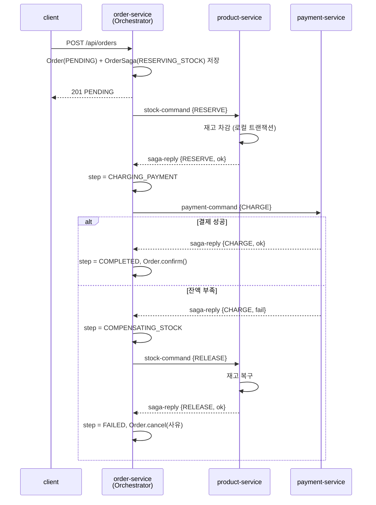

# Phase 8 — Saga 오케스트레이션 전환 설계

작성일: 2026-08-09
대상 저장소: `springboot-simple-msa`
선행 상태: Phase 7 (코레오그래피 Saga + 멱등 소비) 완료, 커밋 `984c313`

---

## 1. 배경

현재 저장소는 Saga 패턴을 **코레오그래피(choreography)** 방식으로 구현하고 있습니다. 코레오그래피란 중앙에 지시자를 두지 않고, 각 서비스가 남이 발행한 이벤트를 듣고 자기 판단으로 다음 행동을 하는 방식입니다.

```
order-service ──OrderCreated──▶ product-service
              ◀──StockResult──
```

이 구조에는 두 가지 한계가 있습니다.

**첫째, 흐름이 코드 어디에도 적혀 있지 않습니다.** "재고를 잡은 뒤 무엇을 하는가"는 `OrderCreatedListener`와 `StockResultListener` 두 파일에 나뉘어 있고, 참여 서비스가 늘면 그만큼 더 흩어집니다. 전체 순서를 알려면 모든 리스너를 읽고 머릿속에서 이어 붙여야 합니다.

**둘째, 진행 상태를 아무도 모릅니다.** 주문이 `PENDING`에서 멈춰 있을 때, 재고 요청이 도달하지 못한 것인지 응답이 유실된 것인지 판단할 근거가 시스템 어디에도 없습니다. 따라서 "일정 시간 안에 끝나지 않으면 되돌린다"는 처리를 만들 수 없습니다.

**오케스트레이션(orchestration)** 은 다음 단계를 결정하는 주체를 한 곳에 모으는 방식입니다. 이 조정자를 오케스트레이터라고 부릅니다. 흐름이 한 파일에 모이고, 진행 상태가 한 테이블에 남습니다.

## 2. 목표와 비목표

### 목표

1. 다음 단계 결정 로직을 오케스트레이터 한 곳에 모은다.
2. 참여 단계를 둘(재고 확보 → 결제)로 늘려, 실패 시 **앞 단계를 되돌리는 보상 명령**이 실제로 오가는 것을 만든다.
3. Saga 진행 상태를 영속화하고, 이를 근거로 타임아웃 보상을 구현한다.
4. 위 셋을 학습 노트에 코레오그래피와 대비해 기록한다.

### 비목표

- 여러 종류의 Saga를 다루는 범용 프레임워크. 주문 Saga 하나만 있으면 됩니다.
- 오케스트레이터의 독립 서비스 분리. 3절에서 이유를 설명합니다.
- Outbox 패턴. 6.4절에서 한계로만 언급합니다.
- 코레오그래피 구현과의 런타임 병존. 교체하며, 비교는 문서와 git 히스토리로 합니다.

## 3. 설계 결정

| 결정 | 선택 | 근거 |
|---|---|---|
| 참여 단계 수 | 2단계 (재고 → 결제) | 1단계면 되돌릴 앞 단계가 없어 보상 명령이 등장하지 않습니다. 3단계는 도커·테스트·문서 부담만 늘고 배우는 것은 2단계와 같습니다 |
| 오케스트레이터 위치 | `order-service` 내부 컴포넌트 | 3.1절 |
| 메시지 토폴로지 | 참여자별 명령 토픽 + 공용 응답 토픽 | 3.2절 |
| 기존 코레오그래피 | 교체(삭제) | 코드가 한 가지 방식만 말하도록 합니다. 비교 대상은 커밋 `984c313`과 학습 노트에 남습니다 |
| 결제 실패 조건 | 계좌 잔액 부족 | 재고와 같은 모양이라 새로 배울 개념이 없고, 주문 금액을 잔액보다 크게 잡으면 실패를 결정적으로 재현할 수 있습니다 |

### 3.1 오케스트레이터를 별도 서비스로 두지 않는 이유

오케스트레이션의 정의는 "다음 단계를 결정하는 주체가 하나인가"이지, "그 주체가 별도 프로세스인가"가 아닙니다. 별도 모듈로 분리하면 다음 비용이 생깁니다.

- 모듈·이미지·도커 서비스·DB가 하나씩 늘어납니다.
- Saga 상태와 주문 상태가 **다른 DB로 갈라집니다.** 그러면 "Saga를 COMPLETED로 옮기고 주문을 CONFIRMED로 바꾸는" 두 쓰기를 한 트랜잭션으로 묶을 수 없어, 둘이 어긋난 상태를 따로 다뤄야 합니다.
- 주문 상태를 바꾸려면 오케스트레이터가 order-service에 다시 명령을 보내야 하므로 왕복이 한 번 더 늘어납니다.

Saga를 시작한 서비스가 그 Saga의 상태 머신도 소유하는 배치는 실무에서도 흔합니다. 오케스트레이터를 분리할 실익은 **여러 종류의 Saga가 생겨 조정 로직 자체가 하나의 관심사가 될 때** 나타나며, 지금은 그 시점이 아닙니다.

### 3.2 메시지 토폴로지

```
                    ┌──── stock-command ────▶ product-service
order-service       │
 (Orchestrator) ────┤
                    └──── payment-command ──▶ payment-service

order-service ◀──────── saga-reply ────────── (두 참여자 모두 이 토픽으로 답한다)
```

토픽은 셋입니다. 명령 메시지에 `action` 필드를 두어 실행과 보상을 구분합니다.

| 토픽 | 발신 | 수신 | `action` 값 |
|---|---|---|---|
| `stock-command` | order-service | product-service | `RESERVE`, `RELEASE` |
| `payment-command` | order-service | payment-service | `CHARGE` |
| `saga-reply` | 참여자 전체 | order-service | (해당 없음) |

동작마다 토픽을 따로 두는 방식(`stock-reserve`, `stock-release`, …)을 택하지 않은 이유는 **순서 보장** 때문입니다. Kafka는 같은 토픽의 같은 파티션 안에서만 순서를 보장합니다. 실행과 보상이 다른 토픽으로 가면 "되돌려라"가 "확보하라"보다 먼저 도착하는 경합을 애플리케이션이 직접 막아야 합니다. 한 토픽에 넣고 **`orderId`를 메시지 키로** 지정하면 같은 주문의 명령들이 같은 파티션에 들어가 순서가 유지됩니다.

단일 토픽에 헤더로 대상을 구분하는 방식도 택하지 않았습니다. Kafka는 헤더 기준으로 소비를 거를 수 없어, 모든 참여자가 남의 명령까지 받아 애플리케이션 코드로 버려야 합니다.

`CHARGE`에 대응하는 `REFUND`는 이번 범위에 넣지 않습니다. 결제가 마지막 단계라 그 뒤에 실패할 단계가 없어 호출될 경로가 없기 때문입니다. 뒤에 배송 단계를 붙이는 시점에 추가합니다.

## 4. 흐름



코레오그래피와 갈리는 지점은 **아래로 향하는 화살표가 전부 오케스트레이터에서 나간다**는 것입니다. product-service는 자기 다음에 결제 단계가 있다는 사실을 모르고, payment-service는 앞에 재고 단계가 있었다는 사실을 모릅니다. 참여자는 "시키는 일을 하고 결과를 답한다"만 합니다. 그래서 단계 순서를 바꾸거나 단계를 끼워 넣을 때 참여자 코드는 건드리지 않습니다.

## 5. 데이터 모델

### 5.1 order-service — `OrderSaga`

```java
enum SagaStep {
    RESERVING_STOCK,      // 재고 확보 명령을 보내고 응답 대기
    CHARGING_PAYMENT,     // 결제 명령을 보내고 응답 대기
    COMPENSATING_STOCK,   // 재고 복구 명령을 보내고 응답 대기
    COMPLETED,            // 모든 단계 성공
    FAILED                // 보상까지 끝난 최종 실패
}
```

```java
@Entity
class OrderSaga {
    @Id Long orderId;       // 주문과 1:1. 별도 sagaId를 두지 않는다
    SagaStep step;
    String failReason;      // 최종 실패 사유. Order.cancelReason 으로 옮겨진다
    Instant updatedAt;      // 타임아웃 판정 기준
}
```

**완료한 단계의 목록을 따로 저장하지 않습니다.** 단계가 선형이므로 "지금 어느 단계인가" 하나로 되돌릴 대상이 결정됩니다. `CHARGING_PAYMENT`에서 실패했다면 그보다 앞선 단계는 재고 확보뿐입니다. 단계가 분기하거나 병렬로 갈라지는 Saga에서는 완료 목록이 필요해지지만, 그때 도입하면 됩니다.

`orderId`를 그대로 기본키로 씁니다. 주문 하나에 Saga 하나이므로 별도 식별자는 대응 관계만 늘립니다.

### 5.2 payment-service — `Account`

```java
@Entity
class Account {
    @Id Long userId;
    BigDecimal balance;
}
```

초기 데이터는 `product-service`와 같이 `src/main/resources/data.sql`로 넣습니다. auth-service가 `user`, `admin` 순으로 저장하고 id가 자동 증가이므로 uid는 각각 1과 2입니다.

```sql
insert into account (user_id, balance) values (1, 1000000);
insert into account (user_id, balance) values (2, 1000000);
```

이 값과 기존 상품 데이터의 조합이 검증 시나리오를 만듭니다. `모니터`(320,000원, 재고 12개)를 **4개 주문하면 1,280,000원**이 되어 재고 단계는 통과하고 결제 단계에서만 실패합니다. 8절 3번이 이 조합을 씁니다.

### 5.3 멱등 기록 — 키를 `(orderId, action)`으로 변경

현행 `ProcessedOrderEvent`는 `orderId`를 단독 기본키로 씁니다. 오케스트레이션에서는 같은 주문에 대해 `RESERVE`와 `RELEASE`가 모두 오므로, 키가 `orderId`뿐이면 **보상 명령이 "이미 처리함"으로 무시되어 재고가 영영 복구되지 않습니다.**

```java
@Entity
class ProcessedCommand {
    @EmbeddedId ProcessedCommandId id;   // (orderId, action)
    boolean success;
    String reason;
    Instant processedAt;
}
```

payment-service도 같은 구조를 씁니다. 두 서비스가 각자의 DB에 각자의 테이블을 두며, 공통 모듈로 묶지 않습니다. 이는 서비스 간 코드 공유를 두지 않는 이 저장소의 기존 방침과 일치합니다.

결과(`success`, `reason`)까지 남기는 이유는 재전송 시 **같은 결론을 다시 발행**하기 위해서입니다. 중복을 건너뛰기만 하면, 최초 처리에서 응답 발행이 실패한 경우 Saga가 영원히 대기 상태로 남습니다. 이 판단은 현행 `StockReservationService`와 동일합니다.

## 6. 실패 처리

### 6.1 실패 경로 요약

| 상황 | 실패 시점 | 처리 |
|---|---|---|
| 상품 없음 / 재고 부족 | `RESERVING_STOCK` | 되돌릴 앞 단계가 없음 → 즉시 `FAILED`, 주문 `CANCELLED` |
| 잔액 부족 | `CHARGING_PAYMENT` | `COMPENSATING_STOCK`으로 이동 → `RELEASE` 발행 → 응답 확인 후 `FAILED` |
| 참여자 무응답 | 대기 중인 모든 단계 | 6.2절 |
| 보상 자체가 실패 | `COMPENSATING_STOCK` | 6.3절 |

### 6.2 타임아웃

`@Scheduled`로 10초마다, `updatedAt`이 30초 이상 갱신되지 않은 채 대기 중인(`RESERVING_STOCK`, `CHARGING_PAYMENT`, `COMPENSATING_STOCK`) Saga를 조회합니다.

- `RESERVING_STOCK`에서 멈춤 → 되돌릴 것이 없으므로 즉시 `FAILED`
- `CHARGING_PAYMENT`에서 멈춤 → `COMPENSATING_STOCK`으로 이동해 `RELEASE` 발행
- `COMPENSATING_STOCK`에서 멈춤 → `RELEASE` 재발행 (참여자 쪽이 멱등하므로 안전)

세 번째 경우는 참여자가 살아날 때까지 30초마다 계속 재발행됩니다. 횟수 상한을 두지 않는 것은 의도입니다. **보상은 포기하면 재고가 영영 묶인 채 남으므로, 끝까지 시도하는 편이 옳습니다.** 반면 참여자가 "복구할 수 없다"고 명시적으로 실패 응답을 보낸 경우는 재시도로 풀리지 않으므로 6.3절의 경로로 갑니다.

**이 기능은 코레오그래피에서는 만들 수 없었던 것입니다.** 진행 상태를 한 곳에 모았기 때문에 비로소 "어디서 멈췄는가"를 질의할 수 있습니다. 오케스트레이션이 무엇을 사는지 가장 직접적으로 보여주는 지점이므로 범위에 포함합니다.

타임아웃 뒤에 늦게 도착한 응답은 무시합니다. 오케스트레이터는 응답을 받을 때 **현재 단계와 응답의 단계가 일치하는지 확인**하고, 어긋나면 경고 로그만 남기고 버립니다. 이 검사가 없으면 이미 `FAILED`로 끝난 Saga가 뒤늦은 성공 응답으로 되살아납니다.

30초는 학습용으로 짧게 잡은 값이며, 설정으로 뺍니다.

### 6.3 보상이 실패하면

보상 명령의 실패는 자동으로 해결할 수 없습니다. 재고를 되돌리지 못했는데 또 무엇을 되돌린다는 것이 성립하지 않기 때문입니다. 이 프로젝트에서는 **경고 로그를 남기고 `FAILED`로 종료**하며, 사람의 개입이 필요한 상태로 둡니다.

실무에서는 이 지점이 DLQ(Dead Letter Queue, 처리에 반복 실패한 메시지를 따로 모아 두는 대기열)와 운영 알림이 붙는 자리입니다. 이번 범위에는 넣지 않고 학습 노트에 다음 주제로 기록합니다.

### 6.4 알려진 한계 — 상태 저장과 메시지 발행의 원자성

`OrderSaga` 저장은 DB 트랜잭션이고 Kafka 발행은 그 바깥입니다. 저장 직후 발행 전에 프로세스가 죽으면 **명령이 나가지 않은 채 대기 상태로 남는** Saga가 생깁니다.

이 프로젝트에서는 6.2절의 타임아웃 스위퍼가 이 상황을 걷어냅니다. 근본 해법은 Outbox 패턴(메시지를 같은 DB의 테이블에 트랜잭션으로 함께 저장하고, 별도 프로세스가 읽어 발행하는 방식)이며, 범위 밖으로 두고 학습 노트에 기록합니다.

## 7. 변경 대상

### 7.1 신규 모듈 — `payment-service`

기존 `product-service`의 구조를 그대로 따릅니다.

```
payment-service/
  build.gradle
  src/main/java/com/example/msa/payment/
    PaymentServiceApplication.java
    Account.java, AccountRepository.java
    PaymentCommand.java, SagaReply.java          # 메시지 타입 (각 서비스가 자기 것을 정의)
    PaymentCommandListener.java                  # 명령 수신 → 서비스 호출 → 응답 발행
    PaymentService.java                          # @Transactional 잔액 차감 + 멱등 기록
    ProcessedCommand.java, ProcessedCommandId.java, ProcessedCommandRepository.java
    SecurityConfig.java
  src/main/resources/application.yml
  src/test/java/...
```

`PaymentService`를 리스너와 별개 빈으로 두는 것은 현행 `StockReservationService`와 같은 이유입니다. `@Transactional`은 스프링 프록시를 거쳐야 동작하므로, 같은 클래스 안에서 자기 메서드를 호출하면 트랜잭션이 걸리지 않습니다(self-invocation).

HTTP 엔드포인트는 두지 않습니다. Kafka 명령만 받습니다. 다만 Eureka 등록과 헬스체크를 위해 웹 서버는 띄웁니다.

### 7.2 `order-service`

**추가**

| 파일 | 역할 |
|---|---|
| `SagaStep.java` | 단계 열거형 |
| `OrderSaga.java`, `OrderSagaRepository.java` | Saga 상태 영속화 |
| `OrderSagaOrchestrator.java` | 상태 전이와 다음 명령 결정. **흐름 전체가 이 한 파일에 있다** |
| `SagaReplyListener.java` | `saga-reply` 수신 → 오케스트레이터 호출 |
| `SagaTimeoutSweeper.java` | `@Scheduled` 타임아웃 감지 |
| `StockCommand.java`, `PaymentCommand.java`, `SagaReply.java` | 메시지 타입 |

**삭제**: `OrderCreatedEvent.java`, `StockResultEvent.java`, `StockResultListener.java`, `StockResultListenerTest.java`

**수정**: `OrderController.create()` — 이벤트 직접 발행 대신 `orchestrator.start(order)` 호출. 컨트롤러가 메시지 발행을 알 필요가 없어집니다.

**설정**: 컨슈머 기본 타입을 `SagaReply`로 변경, `@EnableScheduling` 추가.

### 7.3 `product-service`

**추가**: `StockCommandListener.java`(`OrderCreatedListener` 대체), `StockCommand.java`, `ProcessedCommand.java` 및 복합키 관련 파일

**수정**: `StockReservationService` — `reserve`에 더해 `release(command)` 추가. 멱등 키를 `(orderId, action)`으로 변경. `Product`에 `increaseStock` 추가.

**삭제**: `OrderCreatedEvent.java`, `OrderCreatedListener.java`, `StockResultEvent.java`, `ProcessedOrderEvent.java`, `OrderCreatedListenerTest.java`

### 7.4 그 외

- `settings.gradle` — `payment-service` 추가
- `docker-compose.yml` — `payment-service` 항목 추가 (product-service와 같은 형태, 호스트 포트 없음)
- `README.md` — 아키텍처 다이어그램, 모듈 표, 로드맵에 Phase 8 추가, 장애 재현 절에 결제 실패 시나리오 추가
- `docs/msa-learning-note.md` — 10절을 코레오그래피/오케스트레이션 대비 구조로 개편, 12절에서 DLQ·Outbox 항목 갱신

## 8. 검증 기준

Phase 8이 끝났다고 말할 수 있는 조건입니다.

1. **정상 경로** — 잔액 안쪽 금액으로 주문하면 `PENDING` → 잠시 뒤 `CONFIRMED`. 재고가 차감되고 잔액이 줄어든다.
2. **1단계 실패** — 재고를 넘는 수량으로 주문하면 `CANCELLED`, 사유는 재고 부족. 잔액은 그대로.
3. **2단계 실패 후 보상** — `모니터`(productId 2)를 4개 주문하면 총액 1,280,000원으로 잔액 1,000,000원을 넘는다. 재고 12개는 충분하므로 1단계는 통과하고 2단계에서 실패한다. 결과는 `CANCELLED`, 사유는 잔액 부족. **재고가 12개로 돌아와 있다.** 로그에 `RELEASE` 명령과 그 응답이 남는다.
4. **멱등** — 같은 `stock-command{RESERVE}`를 3회 발행해도 재고는 한 번만 차감된다. `RELEASE`도 마찬가지.
5. **타임아웃** — `docker compose stop payment-service` 상태에서 주문하면, 30초 뒤 스위퍼가 감지해 재고를 복구하고 주문을 `CANCELLED`로 만든다.
6. **늦은 응답 무시** — 5번 직후 payment-service를 다시 띄워 늦은 성공 응답이 도착해도 주문은 `CANCELLED`를 유지한다.
7. `./gradlew build` 통과.

## 9. 테스트 계획

기존 방식을 따릅니다. `@SpringBootTest`에 Eureka·Kafka·추적을 끈 테스트 속성을 씁니다.

| 대상 | 확인 |
|---|---|
| `OrderSagaOrchestrator` | 각 응답에 대해 다음 단계 전이와 발행 명령이 맞는가. 성공/1단계 실패/2단계 실패 세 경로 |
| `OrderSagaOrchestrator` | 현재 단계와 어긋난 응답이 오면 상태가 바뀌지 않는가 |
| `SagaTimeoutSweeper` | `updatedAt`을 과거로 밀어 둔 Saga를 집어내고, 단계별로 옳은 처리를 하는가 |
| `StockReservationService` | `reserve`/`release` 각각 멱등한가. `(orderId, action)` 키가 서로를 막지 않는가 |
| `PaymentService` | 잔액 부족 시 거절하고 잔액을 건드리지 않는가. 멱등한가 |
| `OrderControllerTest` | 기존 테스트가 새 구조에서도 통과하는가 |

커버리지가 목적이 아니라 8절의 검증 기준이 실제로 통과하는지 확인하는 것이 목적입니다.

## 10. 구현 순서

각 단계가 끝날 때마다 빌드가 통과하는 것을 원칙으로 합니다.

1. `payment-service` 모듈 신설 — 계좌·잔액 차감·멱등 기록까지. 아직 아무도 명령을 보내지 않으므로 단위 테스트로만 검증합니다.
2. `product-service`를 명령/응답 방식으로 전환 — `RESERVE`/`RELEASE`, 멱등 키 변경.
3. `order-service`에 오케스트레이터와 Saga 상태 도입 — 코레오그래피 리스너 제거.
4. 타임아웃 스위퍼 추가.
5. `docker-compose.yml`, 통합 확인(8절 1~6번 수동 검증).
6. `README.md`, `docs/msa-learning-note.md` 갱신.

1번과 2번은 서로 의존하지 않으므로 순서를 바꿔도 됩니다. 3번은 둘 다 끝난 뒤에 시작합니다.
